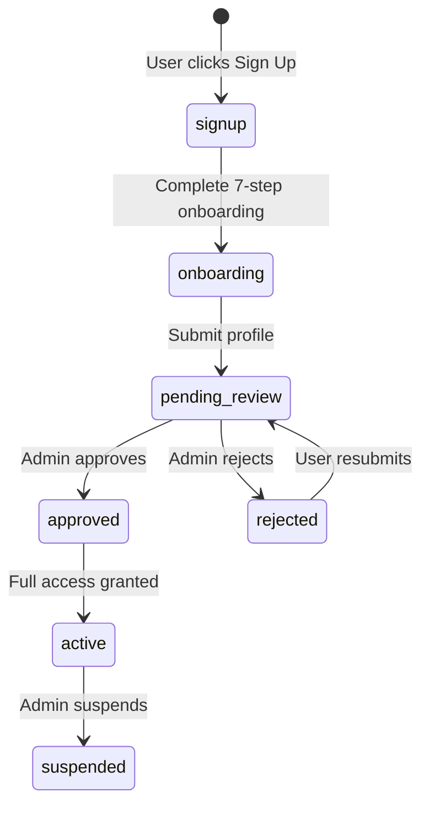
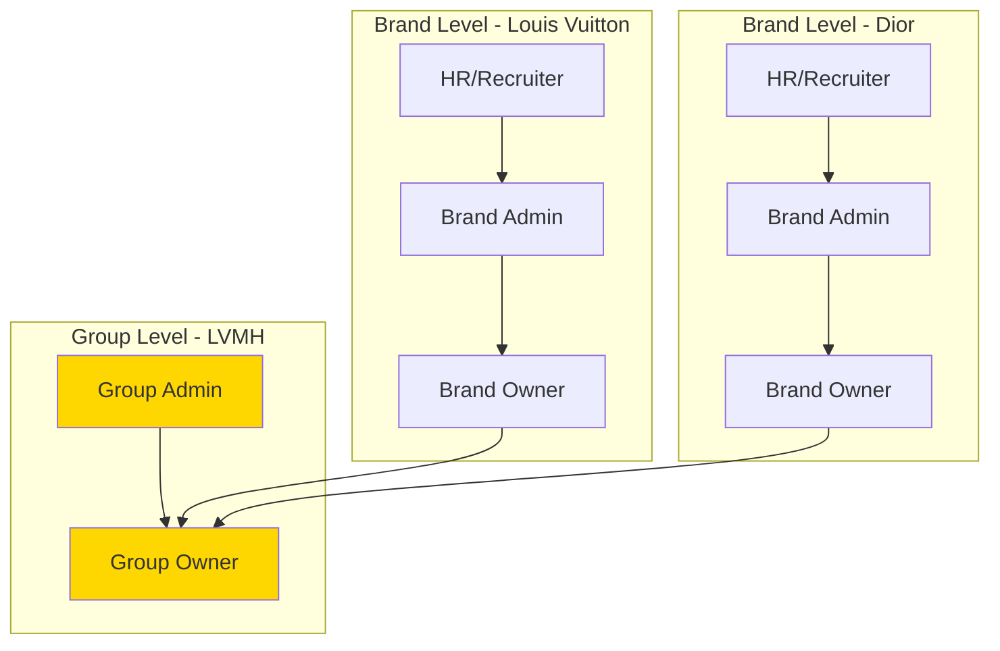
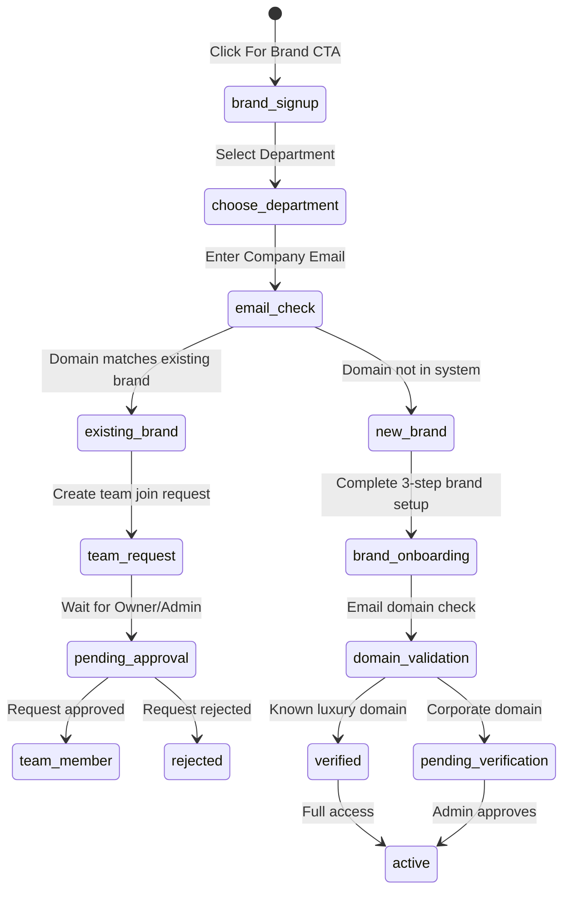
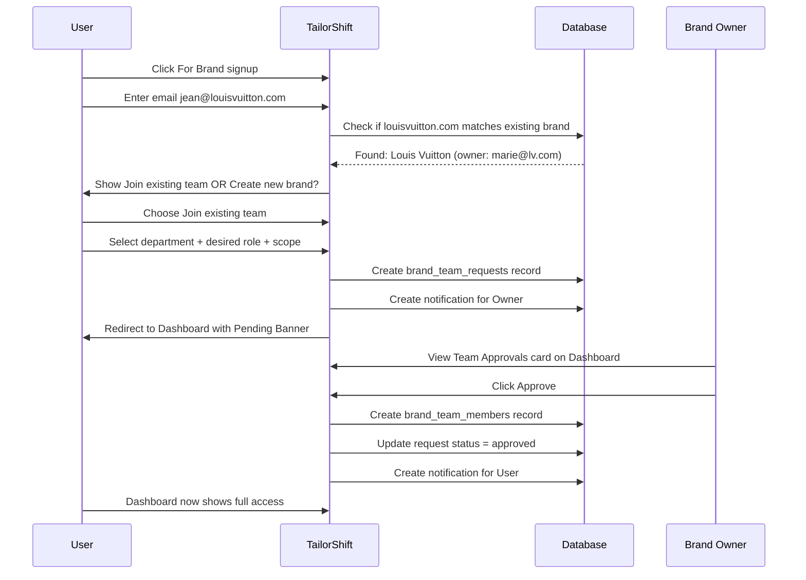

# Account Validation & Approval Architecture

## Overview

This document defines the account validation flow for TailorShift V7, covering:
1. Talent account validation (admin-approved)
2. Brand account validation (domain-based + admin review)
3. Brand team member approval workflow (hierarchical)
4. Feature restrictions for pending accounts

---

## 1. User Flows

### 1.1 Talent Flow



**Dashboard States:**
- `onboarding` → Redirect to `/talent/onboarding`
- `pending_review` → Dashboard with **Pending Validation Banner** (read-only)
- `approved` → Full dashboard access
- `rejected` → Dashboard with **Rejection Banner** + edit & resubmit option

### 1.2 Luxury Group Hierarchy

For luxury conglomerates (LVMH, Kering, Richemont, etc.), there's an additional **Group-level** authority that supersedes individual brand ownership:



**Group-Level Roles:**

| Role | Scope | Authority |
|------|-------|-----------|
| `group_owner` | All brands in group | Supreme authority, can override brand decisions |
| `group_admin` | All brands in group | Cross-brand management, validate brand owners |
| `group_hr` | All brands in group | Cross-brand recruitment visibility |

**Approval Chain:**
1. When a new user signs up for a brand within a group (e.g., `jean@louisvuitton.com`)
2. If a Group account exists for LVMH → **Group Admin** can also see/approve the request
3. Brand Owner approval is required, but Group Admin can override or expedite
4. Group Admin can also demote or reassign brand-level team members

**Use Cases:**
- LVMH HR Director wants visibility across all maisons → `group_hr` role
- Kering wants central control over who becomes Brand Owner → Group approves brand owners
- Richemont wants to transfer talent between maisons → Group-level access

### 1.3 Brand Flow (First User = Owner)



### 1.3 Brand Team Join Flow (Subsequent Users)



---

## 2. Brand Signup Specific Fields

### 2.1 Department Selection

The brand signup page must collect the user's department to determine appropriate default role:

| Department | Description | Default Role | Typical Scope |
|------------|-------------|--------------|---------------|
| **Direction** | C-level, Brand Directors | `admin_global` | Global |
| **HR** | Human Resources, Talent Acquisition | `hr_global` or `hr_regional` | Global/Regional |
| **Operations** | Retail Operations, Area Managers | `manager_store` or `recruiter` | Regional/Store |
| **Business** | Commercial, Merchandising | `viewer` | Regional |

### 2.2 Role & Scope Selection

When joining an existing team, users can request:

1. **Desired Role** (will be validated/adjusted by approver):
   - `recruiter` - Recommend for most HR/Operations users
   - `hr_regional` - For regional HR leads
   - `manager_store` - For store managers
   - `viewer` - For observers/business partners

2. **Geographic Scope**:
   - Global
   - Regional (select regions: EMEA, Americas, APAC, Middle East)
   - Local (specific country/city)

3. **Division Scope** (optional):
   - All divisions
   - Selected divisions (Fashion, Leather Goods, etc.)

---

## 3. Database Schema

### 3.1 Luxury Group Extension

```sql
-- Extend luxury_groups table to support group-level administration
ALTER TABLE luxury_groups ADD COLUMN IF NOT EXISTS
  status VARCHAR(20) DEFAULT 'active' CHECK (status IN ('active', 'inactive'));

-- Create group_team_members table for group-level roles
CREATE TABLE IF NOT EXISTS group_team_members (
  id UUID PRIMARY KEY DEFAULT gen_random_uuid(),
  group_id UUID NOT NULL REFERENCES luxury_groups(id) ON DELETE CASCADE,
  profile_id UUID NOT NULL REFERENCES profiles(id) ON DELETE CASCADE,
  
  -- Role hierarchy: group_owner > group_admin > group_hr > group_viewer
  role VARCHAR(30) NOT NULL CHECK (role IN (
    'group_owner',    -- Supreme authority over all brands in group
    'group_admin',    -- Can validate brand owners, cross-brand management
    'group_hr',       -- Cross-brand recruitment visibility
    'group_viewer'    -- Read-only across all brands
  )),
  
  role_scope JSONB DEFAULT '{"brands": ["all"], "permissions": ["view"]}',
  
  invited_by UUID REFERENCES profiles(id),
  invited_at TIMESTAMPTZ DEFAULT NOW(),
  accepted_at TIMESTAMPTZ,
  status VARCHAR(20) DEFAULT 'pending' CHECK (status IN ('pending', 'active', 'deactivated')),
  
  created_at TIMESTAMPTZ DEFAULT NOW(),
  updated_at TIMESTAMPTZ DEFAULT NOW(),
  
  UNIQUE(group_id, profile_id)
);

-- Link brands to groups (modify existing relationship)
ALTER TABLE brands ADD COLUMN IF NOT EXISTS
  group_id UUID REFERENCES luxury_groups(id);

-- Add group approval requirement flag
ALTER TABLE brands ADD COLUMN IF NOT EXISTS
  requires_group_approval BOOLEAN DEFAULT false;

-- Indexes for group queries
CREATE INDEX IF NOT EXISTS idx_group_members_group ON group_team_members(group_id);
CREATE INDEX IF NOT EXISTS idx_group_members_profile ON group_team_members(profile_id);
CREATE INDEX IF NOT EXISTS idx_brands_group ON brands(group_id);
```

### 3.2 New Table: brand_team_requests

```sql
CREATE TABLE brand_team_requests (
  id UUID PRIMARY KEY DEFAULT gen_random_uuid(),
  brand_id UUID NOT NULL REFERENCES brands(id) ON DELETE CASCADE,
  profile_id UUID NOT NULL REFERENCES profiles(id) ON DELETE CASCADE,
  
  -- Request details
  email VARCHAR(255) NOT NULL,
  department VARCHAR(50) NOT NULL CHECK (department IN ('direction', 'hr', 'operations', 'business')),
  requested_role VARCHAR(50) NOT NULL,
  requested_scope JSONB DEFAULT '{"geographic": "global", "divisions": ["all"]}',
  
  -- Optional context
  job_title VARCHAR(255),
  request_message TEXT,
  
  -- Review workflow
  status VARCHAR(20) DEFAULT 'pending' CHECK (status IN ('pending', 'approved', 'rejected', 'expired')),
  
  -- Who reviewed (can be brand owner/admin OR group admin)
  reviewed_by UUID REFERENCES profiles(id),
  reviewed_at TIMESTAMPTZ,
  review_notes TEXT,
  reviewer_level VARCHAR(20), -- 'brand' or 'group' to track who approved
  
  assigned_role VARCHAR(50), -- May differ from requested
  assigned_scope JSONB,
  
  -- Group escalation (if brand requires group approval)
  requires_group_approval BOOLEAN DEFAULT false,
  group_approved_by UUID REFERENCES profiles(id),
  group_approved_at TIMESTAMPTZ,
  
  -- Timestamps
  created_at TIMESTAMPTZ DEFAULT NOW(),
  updated_at TIMESTAMPTZ DEFAULT NOW(),
  expires_at TIMESTAMPTZ DEFAULT (NOW() + INTERVAL '30 days'),
  
  UNIQUE(brand_id, profile_id)
);

-- Index for finding pending requests
CREATE INDEX idx_team_requests_brand_pending
ON brand_team_requests(brand_id, status)
WHERE status = 'pending';

-- Index for user's pending requests
CREATE INDEX idx_team_requests_profile
ON brand_team_requests(profile_id, status);

-- Index for group-level pending approvals
CREATE INDEX idx_team_requests_group_pending
ON brand_team_requests(requires_group_approval, status)
WHERE requires_group_approval = true AND status = 'pending';
```

### 3.2 Profile Extension: Account Status

```sql
-- Add unified account status to profiles
ALTER TABLE profiles ADD COLUMN IF NOT EXISTS account_status VARCHAR(20) 
DEFAULT 'pending' CHECK (account_status IN ('pending', 'active', 'suspended'));

-- Add pending_team_request_id for brand users awaiting approval
ALTER TABLE profiles ADD COLUMN IF NOT EXISTS pending_team_request_id UUID 
REFERENCES brand_team_requests(id);
```

### 3.3 Notification Types

```sql
-- Add new notification types
-- type values to support:
-- 'team_request_received' - Sent to brand owner/admin
-- 'team_request_approved' - Sent to requester
-- 'team_request_rejected' - Sent to requester
-- 'account_validated' - Sent when admin validates account
-- 'account_rejected' - Sent with resubmit instructions
```

---

## 4. UI Components

### 4.1 PendingValidationBanner

```tsx
// components/ui/pending-validation-banner.tsx

interface PendingValidationBannerProps {
  type: 'talent_pending' | 'talent_rejected' | 'brand_pending' | 'team_request_pending'
  message?: string
  onResubmit?: () => void
}

// Renders warning banner at top of dashboard
// Yellow for pending, Red for rejected
// Shows appropriate message and action button
```

**Banner Messages:**

| Type | Message | Action |
|------|---------|--------|
| `talent_pending` | "Your profile is under review. We'll notify you within 48h." | None |
| `talent_rejected` | "Your profile needs adjustments. {reason}" | "Edit & Resubmit" |
| `brand_pending` | "Your brand account is being verified." | None |
| `team_request_pending` | "Your request to join {Brand} is pending approval." | "Contact Admin" |

### 4.2 PendingTeamApprovals Card

```tsx
// Shows on brand owner/admin dashboard when there are pending requests

interface PendingApprovalsCardProps {
  requests: TeamRequest[]
  onApprove: (id: string, assignedRole: string, scope: Scope) => void
  onReject: (id: string, reason: string) => void
}

// Features:
// - Count badge in header: "3 pending"
// - List of requests with user info, requested role, department
// - Expand to see request message
// - Quick approve with default role
// - Expand to customize role & scope before approve
// - Reject with reason (required)
```

### 4.3 Brand Signup Page

```
/signup/brand - New dedicated route

Layout:
┌─────────────────────────────────────────────────────┐
│ Logo                                                │
├─────────────────────────────────────────────────────┤
│                                                     │
│  Join TailorShift for Brands                        │
│  Find exceptional retail talent                     │
│                                                     │
│  ┌─────────────────────────────────────────────┐   │
│  │ Work Email *                                 │   │
│  │ [jean.dupont@louisvuitton.com            ]  │   │
│  └─────────────────────────────────────────────┘   │
│                                                     │
│  Your Department *                                  │
│  ┌──────────────┐ ┌──────────────┐                 │
│  │  Direction   │ │     HR       │                 │
│  │   C-level    │ │  Recrutement │                 │
│  └──────────────┘ └──────────────┘                 │
│  ┌──────────────┐ ┌──────────────┐                 │
│  │  Operations  │ │   Business   │                 │
│  │ Area Manager │ │ Commercial   │                 │
│  └──────────────┘ └──────────────┘                 │
│                                                     │
│  [After email validation, show if brand exists:]    │
│                                                     │
│  ⚠️ Louis Vuitton is already on TailorShift         │
│                                                     │
│  ○ Request to join Louis Vuitton team              │
│    Your request will be sent to the account owner   │
│                                                     │
│  ○ Create a separate brand account                 │
│    For independent brands/boutiques                 │
│                                                     │
│  [If joining team, show role selection:]           │
│                                                     │
│  Requested Role                                     │
│  [Recruiter               ▼]                       │
│                                                     │
│  Geographic Scope                                   │
│  [x] France  [ ] UK  [ ] Italy  [ ] Germany        │
│                                                     │
│  Message to Brand Owner (optional)                 │
│  [Je suis la nouvelle RRH région Paris...       ]  │
│                                                     │
│  [           Request to Join             ]         │
│                                                     │
└─────────────────────────────────────────────────────┘
```

### 4.4 RestrictedFeatureGate

```tsx
// components/ui/restricted-feature-gate.tsx

interface RestrictedFeatureGateProps {
  requiredStatus: 'active' | 'approved' | 'verified'
  currentStatus: string
  children: React.ReactNode
  fallback?: React.ReactNode
}

// Usage:
<RestrictedFeatureGate 
  requiredStatus="approved" 
  currentStatus={talent.status}
  fallback={<Button disabled>Complete validation to apply</Button>}
>
  <Button onClick={handleApply}>Express Interest</Button>
</RestrictedFeatureGate>
```

---

## 5. API Endpoints

### 5.1 Team Request Management

```typescript
// POST /api/brand/team-requests
// Create a new team join request
{
  email: string
  department: 'direction' | 'hr' | 'operations' | 'business'
  requested_role: string
  requested_scope: { geographic: string, divisions: string[] }
  job_title?: string
  request_message?: string
}

// GET /api/brand/team-requests/pending
// Get pending requests for current user's brand (owner/admin only)

// POST /api/brand/team-requests/:id/approve
// Approve request with optional role/scope adjustment
{
  assigned_role: string
  assigned_scope: { geographic: string, divisions: string[] }
}

// POST /api/brand/team-requests/:id/reject
// Reject request with reason
{
  reason: string
}
```

### 5.2 Domain Detection

```typescript
// GET /api/brand/check-domain?email=jean@louisvuitton.com
// Returns:
{
  email_valid: true,
  domain: "louisvuitton.com",
  existing_brand: {
    id: "uuid",
    name: "Louis Vuitton",
    logo_url: "...",
    team_size: 12
  } | null,
  domain_trusted: true, // Known luxury/corporate domain
  requires_manual_review: false
}
```

---

## 6. Feature Restriction Matrix

| Feature | pending_review | approved/active | rejected |
|---------|---------------|-----------------|----------|
| View Dashboard | ✅ Limited | ✅ Full | ✅ Limited |
| Edit Profile | ✅ | ✅ | ✅ |
| View Opportunities | ❌ | ✅ | ❌ |
| Express Interest | ❌ | ✅ | ❌ |
| Send Messages | ❌ | ✅ | ❌ |
| View Matches | ❌ | ✅ | ❌ |
| Post Opportunity (Brand) | ❌ | ✅ | ❌ |
| Invite Team (Brand) | ❌ | ✅ Owner/Admin | ❌ |

---

## 7. Implementation Priority

### Phase 1: Pending Banner UI (Quick Win)
1. Create `PendingValidationBanner` component
2. Integrate into Talent Dashboard (check `talent.status`)
3. Integrate into Brand Dashboard (check `brand.status`)
4. Add feature restriction gate (`RestrictedFeatureGate` component)

### Phase 2: Brand-Specific Signup
1. Create `/signup/brand` page with dedicated flow
2. Add department selection (Direction, HR, Operations, Business)
3. Implement domain detection API (`/api/brand/check-domain`)
4. Show existing brand detection UI with join/create choice

### Phase 3: Team Request Workflow
1. Run migration: `brand_team_requests` + `group_team_members` tables
2. Implement team request creation flow
3. Add `PendingTeamApprovals` card to brand owner dashboard
4. Implement approve/reject endpoints with role adjustment

### Phase 4: Group-Level Authority
1. Create group admin dashboard view
2. Link brands to groups (`brands.group_id`)
3. Add group approval escalation for configured brands
4. Group admin can see/approve pending requests across all brands
5. Implement cross-brand visibility for `group_hr` role

### Phase 5: Notifications
1. Add notification types for all approval workflows
2. Notify owner/group on new request
3. Notify user on approval/rejection
4. Optional: Email notifications via Supabase Edge Functions

---

## 8. Security Considerations

1. **Domain Spoofing**: Verify email ownership via confirmation link before creating team request
2. **Rate Limiting**: Max 3 team requests per email per day
3. **Auto-Expiration**: Requests expire after 30 days
4. **RLS Policies**: 
   - Team requests visible only to brand owner/admin + requester
   - Only owner/admin can approve/reject
5. **Audit Trail**: Log all approval/rejection actions

---

## Document Version

| Version | Date | Author | Changes |
|---------|------|--------|---------|
| 1.0 | 2024-12-04 | TailorShift | Initial architecture |