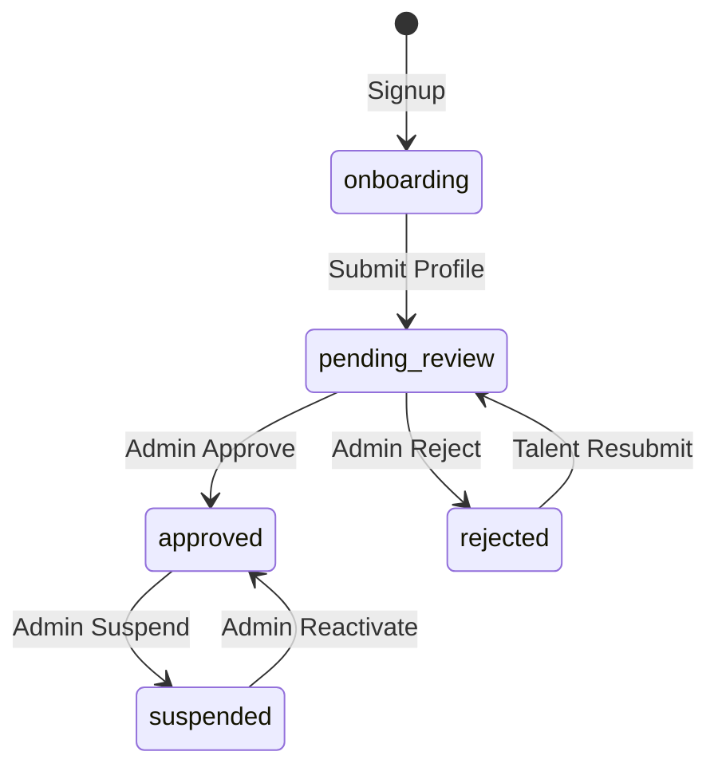

# TailorShift V7 - Architecture Interface Admin

## 1. Vue d'ensemble

### 1.1 Objectif
L'interface Admin permet à l'équipe TailorShift de :
- **Valider** les profils talents avant qu'ils ne soient visibles aux brands
- **Modérer** les contenus (opportunités, marques)
- **Superviser** l'activité de la plateforme
- **Configurer** les paramètres système

### 1.2 Accès
- Route: `/admin/*`
- Protection: `user_type === 'admin'` dans profiles
- Création admin: Via script SQL (pas d'auto-inscription admin)

---

## 2. Structure des routes Admin

```
/admin
├── /dashboard                    # Vue d'ensemble KPIs
├── /talents                      
│   ├── (list)                    # Liste tous les talents
│   ├── /pending                  # Talents en attente de validation
│   └── /[id]                     # Détail talent + actions
├── /brands
│   ├── (list)                    # Liste toutes les marques
│   └── /[id]                     # Détail marque + actions
├── /opportunities
│   ├── (list)                    # Toutes les opportunités
│   └── /[id]                     # Détail + modération
├── /matches
│   └── (list)                    # Statistiques matching
├── /reports
│   ├── /users                    # Croissance utilisateurs
│   ├── /matches                  # Performance matching
│   └── /exports                  # Exports de données
└── /settings
    ├── /general                  # Config générale
    └── /team                     # Gestion des admins
```

---

## 3. Pages détaillées

### 3.1 Dashboard Admin (`/admin/dashboard`)

**KPIs principaux :**

| Métrique | Source | Affichage |
|----------|--------|-----------|
| Talents totaux | `COUNT(talents)` | Nombre + variation semaine |
| Talents pending | `COUNT(talents WHERE status='pending_review')` | Badge alerte |
| Talents approuvés | `COUNT(talents WHERE status='approved')` | % du total |
| Brands vérifiées | `COUNT(brands WHERE verified=true)` | Nombre |
| Opportunités actives | `COUNT(opportunities WHERE status='active')` | Nombre |
| Matches cette semaine | `COUNT(matches WHERE created_at > now()-7d)` | Graph |

**Actions rapides :**
- 🔴 "X talents en attente" → Lien vers `/admin/talents/pending`
- 📊 "Voir les rapports" → Lien vers `/admin/reports`

**Layout :**
```
┌─────────────────────────────────────────────────────────────────┐
│ Admin Dashboard                                    [Settings ⚙️] │
├─────────────────────────────────────────────────────────────────┤
│                                                                 │
│  ┌─────────┐  ┌─────────┐  ┌─────────┐  ┌─────────┐            │
│  │   245   │  │   12🔴  │  │   89%   │  │   34    │            │
│  │ Talents │  │ Pending │  │Approved │  │ Brands  │            │
│  └─────────┘  └─────────┘  └─────────┘  └─────────┘            │
│                                                                 │
│  ┌──────────────────────────────┬──────────────────────────┐   │
│  │ Recent Signups               │  Validation Queue        │   │
│  │ ├─ Marie D. (2h ago)         │  ├─ Pierre L. [Review]   │   │
│  │ ├─ Jean P. (5h ago)          │  ├─ Sophie M. [Review]   │   │
│  │ └─ View all →                │  └─ View all pending →   │   │
│  └──────────────────────────────┴──────────────────────────┘   │
│                                                                 │
└─────────────────────────────────────────────────────────────────┘
```

---

### 3.2 Validation Talents (`/admin/talents/pending`)

**Workflow de validation :**



**Interface de review :**

```
┌─────────────────────────────────────────────────────────────────┐
│ Talent Review: Pierre Lefebvre                                  │
├─────────────────────────────────────────────────────────────────┤
│                                                                 │
│ ┌─────────────────────────────────────────────────────────────┐ │
│ │ Profile Summary                                             │ │
│ │ • Name: Pierre Lefebvre                                     │ │
│ │ • Role Level: L3 (Team Lead)                                │ │
│ │ • Location: Paris, France                                   │ │
│ │ • Years in Luxury: 6                                        │ │
│ │ • Current Employer: Louis Vuitton                           │ │
│ │ • LinkedIn: linkedin.com/in/pierrelf ✓ Vérifié              │ │
│ └─────────────────────────────────────────────────────────────┘ │
│                                                                 │
│ ┌─────────────────────────────────────────────────────────────┐ │
│ │ Assessment Scores                  6D Radar Chart           │ │
│ │ • Product Knowledge: 78/100        [      ◆       ]         │ │
│ │ • Clienteling: 85/100              [   ◆     ◆    ]         │ │
│ │ • Cultural Fluency: 72/100         [  ◆       ◆   ]         │ │
│ │ • Sales Performance: 80/100        [   ◆     ◆    ]         │ │
│ │ • Leadership: 65/100               [      ◆       ]         │ │
│ │ • Operations: 58/100                                        │ │
│ └─────────────────────────────────────────────────────────────┘ │
│                                                                 │
│ ┌─────────────────────────────────────────────────────────────┐ │
│ │ Eligibility Flags                                           │ │
│ │ ⚠️ No LinkedIn profile provided                             │ │
│ │ ✓ Email verified                                            │ │
│ │ ✓ Profile >80% complete                                     │ │
│ └─────────────────────────────────────────────────────────────┘ │
│                                                                 │
│ ┌─────────────────────────────────────────────────────────────┐ │
│ │ Admin Notes                                                 │ │
│ │ [                                                         ] │ │
│ │ [                                                         ] │ │
│ └─────────────────────────────────────────────────────────────┘ │
│                                                                 │
│       [❌ Reject]      [Request More Info]      [✅ Approve]    │
│                                                                 │
└─────────────────────────────────────────────────────────────────┘
```

**Champs talent utilisés pour la validation :**

| Champ | Colonne DB | Usage |
|-------|------------|-------|
| Status | `talents.status` | État actuel |
| Eligibility Score | `talents.eligibility_score` | Score auto-calculé |
| Eligibility Flags | `talents.eligibility_flags` | Alertes automatiques |
| Review Notes | `talents.review_notes` | Notes admin |
| Reviewed At | `talents.reviewed_at` | Date review |
| Reviewed By | `talents.reviewed_by` | Admin qui a validé |
| Rejection Reason | `talents.rejection_reason` | Si rejeté |
| Resubmit Count | `talents.resubmit_count` | Nb de soumissions |

---

### 3.3 Liste Brands (`/admin/brands`)

**Colonnes affichées :**
- Logo + Nom
- Segment (Ultra Luxury, Luxury, Premium, Accessible)
- Verified status (✓ / ✗)
- Nb opportunités actives
- Date création
- Actions (Verify, Edit, Deactivate)

**Actions :**
- **Vérifier brand** : Set `verified = true`
- **Voir détails** : `/admin/brands/[id]`
- **Voir opportunités** : Filtre par brand

---

### 3.4 Gestion Opportunités (`/admin/opportunities`)

**Filtres :**
- Par brand
- Par status (draft, active, paused, filled, cancelled)
- Par date

**Actions de modération :**
- Pause opportunité (si contenu inapproprié)
- Supprimer opportunité
- Contacter brand

---

## 4. Composants UI réutilisables

### 4.1 Admin Layout

```tsx
// components/admin/AdminLayout.tsx
- Header avec navigation admin
- Sidebar avec menu
- Main content area
- Footer avec version
```

### 4.2 Data Tables

```tsx
// components/admin/DataTable.tsx
- Tri par colonnes
- Filtres
- Pagination
- Actions bulk (select multiple)
```

### 4.3 Stats Cards

```tsx
// components/admin/StatCard.tsx
- Icône
- Valeur principale
- Label
- Badge variation (+12% cette semaine)
```

---

## 5. Sécurité

### 5.1 Middleware Admin

```typescript
// middleware.ts - à ajouter
const adminRoutes = ['/admin']

if (pathname.startsWith('/admin')) {
  // Vérifier que user_type === 'admin'
  const profile = await supabase.from('profiles').select('user_type')...
  if (profile.user_type !== 'admin') {
    return redirect('/login')
  }
}
```

### 5.2 RLS Policies pour Admin

```sql
-- Permettre aux admins de lire tous les talents
CREATE POLICY "Admins can view all talents" ON talents
FOR SELECT USING (
  EXISTS (
    SELECT 1 FROM profiles 
    WHERE profiles.id = auth.uid() 
    AND profiles.user_type = 'admin'
  )
);

-- Permettre aux admins de modifier le status des talents
CREATE POLICY "Admins can update talent status" ON talents
FOR UPDATE USING (
  EXISTS (
    SELECT 1 FROM profiles 
    WHERE profiles.id = auth.uid() 
    AND profiles.user_type = 'admin'
  )
);
```

---

## 6. Plan d'implémentation

### Phase 1 : Foundation (Priorité Haute)
1. ✅ Définir architecture (ce document)
2. [ ] Créer migration SQL pour RLS admin
3. [ ] Créer composant AdminLayout
4. [ ] Créer `/admin/dashboard` avec KPIs basiques
5. [ ] Mettre à jour middleware pour protéger `/admin/*`

### Phase 2 : Validation Talents (Priorité Haute)
1. [ ] Créer `/admin/talents/page.tsx` (liste)
2. [ ] Créer `/admin/talents/pending/page.tsx` (queue validation)
3. [ ] Créer `/admin/talents/[id]/page.tsx` (détail + actions)
4. [ ] Implémenter actions: Approve, Reject, Request Info

### Phase 3 : Gestion Brands (Priorité Moyenne)
1. [ ] Créer `/admin/brands/page.tsx` (liste)
2. [ ] Créer `/admin/brands/[id]/page.tsx` (détail)
3. [ ] Implémenter action: Verify Brand

### Phase 4 : Reporting (Priorité Basse)
1. [ ] Créer `/admin/reports/page.tsx`
2. [ ] Graphiques de croissance utilisateurs
3. [ ] Export CSV des données

---

## 7. Création d'un compte Admin

**Script SQL pour créer le premier admin :**

```sql
-- Après qu'un utilisateur s'est inscrit normalement, promouvoir en admin
UPDATE profiles 
SET user_type = 'admin'
WHERE email = 'admin@tailorshift.com';
```

**Alternative - Création directe :**
```sql
-- Créer via Supabase Dashboard > Authentication > Users
-- Puis mettre à jour le profile
```

---

*Document créé le 04/12/2024*
*Version: 1.0*