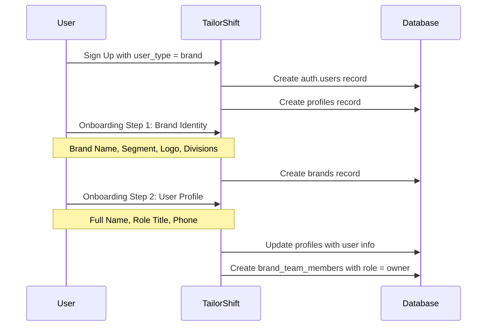
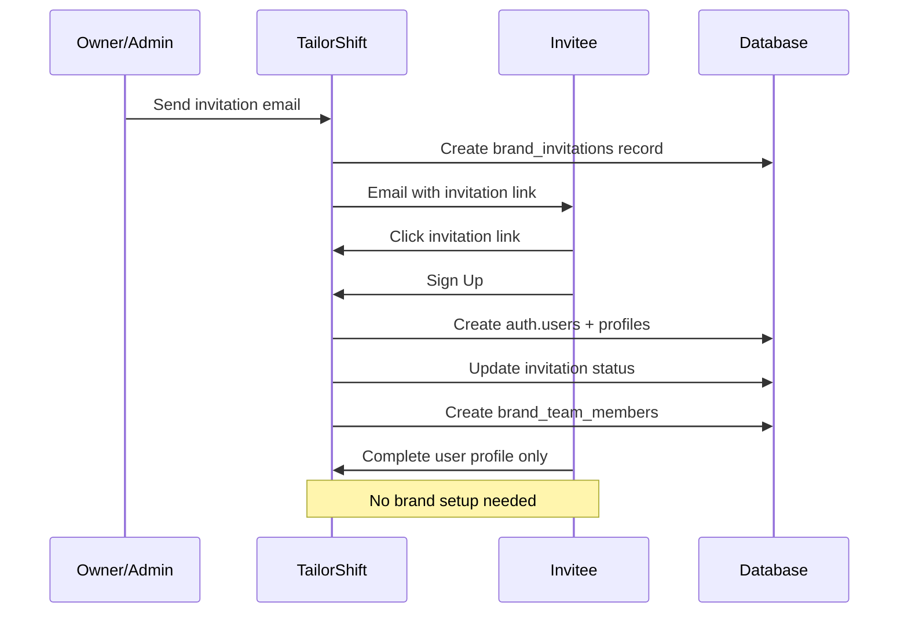
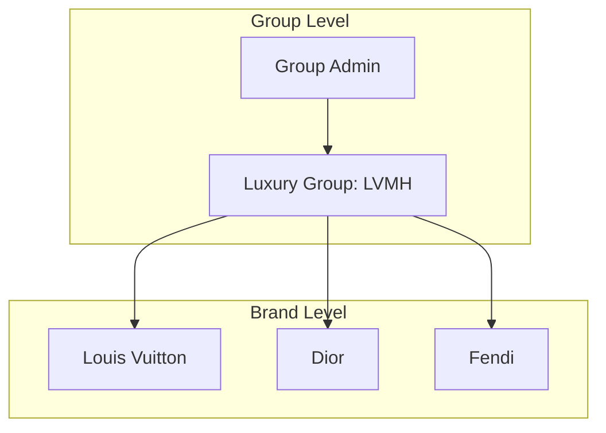

# TailorShift Brand RBAC Architecture

## Overview

This document defines the Role-Based Access Control (RBAC) architecture for Brand accounts in TailorShift. It covers team structure, permissions, and multi-user scenarios within a single Brand/Maison.

---

## 1. User Registration Flow

### 1.1 First User (Brand Creator)



### 1.2 Subsequent Users (Invited)



---

## 2. Team Roles

### 2.1 Role Hierarchy

```
Owner (1 per brand)
  └── Admin (multiple)
        └── Recruiter (multiple)
              └── Viewer (multiple)
```

### 2.2 Role Definitions

| Role | Description | Count | Who Can Assign |
|------|-------------|-------|----------------|
| **Owner** | Full account control, billing, deletion | 1 | System (creator) |
| **Admin** | Full access except deletion and ownership transfer | Multiple | Owner |
| **Recruiter** | Day-to-day recruiting operations | Multiple | Owner, Admin |
| **Viewer** | Read-only access to pipeline and candidates | Multiple | Owner, Admin |

---

## 3. Permission Matrix

### 3.1 Brand Management

| Permission | Owner | Admin | Recruiter | Viewer |
|------------|:-----:|:-----:|:---------:|:------:|
| Edit Brand Profile | ✅ | ✅ | ❌ | ❌ |
| Upload Brand Logo | ✅ | ✅ | ❌ | ❌ |
| Edit Brand Settings | ✅ | ✅ | ❌ | ❌ |
| Delete Brand Account | ✅ | ❌ | ❌ | ❌ |
| View Brand Analytics | ✅ | ✅ | ✅ | ✅ |

### 3.2 Team Management

| Permission | Owner | Admin | Recruiter | Viewer |
|------------|:-----:|:-----:|:---------:|:------:|
| Invite Team Members | ✅ | ✅ | ❌ | ❌ |
| Remove Team Members | ✅ | ✅* | ❌ | ❌ |
| Change Member Roles | ✅ | ✅** | ❌ | ❌ |
| Transfer Ownership | ✅ | ❌ | ❌ | ❌ |
| View Team Members | ✅ | ✅ | ✅ | ✅ |

*Admin cannot remove other Admins or Owner
**Admin cannot promote to Admin or Owner

### 3.3 Store Management

| Permission | Owner | Admin | Recruiter | Viewer |
|------------|:-----:|:-----:|:---------:|:------:|
| Add Stores | ✅ | ✅ | ❌ | ❌ |
| Edit Stores | ✅ | ✅ | ❌ | ❌ |
| Delete Stores | ✅ | ✅ | ❌ | ❌ |
| View All Stores | ✅ | ✅ | ⚡ | ⚡ |

⚡ = Filtered by assigned scope (Region/Division)

### 3.4 Opportunities & Recruiting

| Permission | Owner | Admin | Recruiter | Viewer |
|------------|:-----:|:-----:|:---------:|:------:|
| Create Opportunities | ✅ | ✅ | ✅ | ❌ |
| Edit Opportunities | ✅ | ✅ | ✅ | ❌ |
| Delete Opportunities | ✅ | ✅ | ❌ | ❌ |
| Publish Opportunities | ✅ | ✅ | ✅ | ❌ |
| View Candidate Profiles | ✅ | ✅ | ✅ | ✅ |
| Review Candidates | ✅ | ✅ | ✅ | ❌ |
| Move Pipeline Stage | ✅ | ✅ | ✅ | ❌ |
| Add Pipeline Notes | ✅ | ✅ | ✅ | ❌ |

### 3.5 Messaging

| Permission | Owner | Admin | Recruiter | Viewer |
|------------|:-----:|:-----:|:---------:|:------:|
| Send Messages to Talents | ✅ | ✅ | ✅ | ❌ |
| View Message History | ✅ | ✅ | ✅ | ✅ |
| Delete Messages | ✅ | ✅ | ❌ | ❌ |

### 3.6 Brand Assessments

| Permission | Owner | Admin | Recruiter | Viewer |
|------------|:-----:|:-----:|:---------:|:------:|
| Create Assessments | ✅ | ✅ | ❌ | ❌ |
| Edit Assessments | ✅ | ✅ | ❌ | ❌ |
| Assign to Opportunities | ✅ | ✅ | ✅ | ❌ |
| View Assessment Results | ✅ | ✅ | ✅ | ✅ |

---

## 4. Scope-Based Filtering

### 4.1 Regional Scope

Some users may be restricted to certain regions:

```typescript
interface TeamMemberScope {
  regions?: Region[] // e.g., ['EMEA', 'APAC']
  divisions?: Division[] // e.g., ['fashion', 'watches']
  stores?: string[] // Specific store IDs
}
```

### 4.2 Scope Application Rules

| Scope Level | Applies To | Effect |
|-------------|------------|--------|
| **All Regions** | Owner, Admin | Full visibility |
| **Specific Regions** | Recruiter, Viewer | See only matching stores/opportunities |
| **All Divisions** | Owner, Admin | Full visibility |
| **Specific Divisions** | Recruiter, Viewer | See only matching opportunities |
| **All Stores** | Owner, Admin | Full visibility |
| **Specific Stores** | Recruiter, Viewer | Filtered by store assignment |

### 4.3 Scope Example

```json
{
  "brand_team_member": {
    "user_id": "uuid",
    "brand_id": "uuid",
    "role": "recruiter",
    "scope": {
      "regions": ["EMEA"],
      "divisions": ["fashion", "leather_goods"],
      "stores": null  // null = all stores in region/division
    }
  }
}
```

---

## 5. Database Schema Updates

### 5.1 Enhanced brand_team_members Table

```sql
ALTER TABLE brand_team_members 
ADD COLUMN scope JSONB DEFAULT '{
  "regions": null,
  "divisions": null,
  "stores": null
}'::jsonb;

-- Add constraint for scope validation
ALTER TABLE brand_team_members
ADD CONSTRAINT valid_scope CHECK (
  scope IS NULL OR (
    jsonb_typeof(scope) = 'object'
  )
);
```

### 5.2 New: brand_audit_log Table

Track who did what within the brand:

```sql
CREATE TABLE brand_audit_log (
  id UUID PRIMARY KEY DEFAULT gen_random_uuid(),
  brand_id UUID NOT NULL REFERENCES brands(id) ON DELETE CASCADE,
  user_id UUID NOT NULL REFERENCES profiles(id),
  action TEXT NOT NULL,
  entity_type TEXT, -- 'opportunity', 'candidate', 'team_member', etc.
  entity_id UUID,
  details JSONB DEFAULT '{}',
  ip_address INET,
  created_at TIMESTAMPTZ DEFAULT NOW()
);

CREATE INDEX idx_audit_brand ON brand_audit_log(brand_id);
CREATE INDEX idx_audit_user ON brand_audit_log(user_id);
CREATE INDEX idx_audit_created ON brand_audit_log(created_at DESC);
```

---

## 6. Multi-Maison Consolidation

### 6.1 Problem Statement

Large luxury groups (LVMH, Kering, Richemont) have multiple maisons. Users at group level may need cross-maison visibility.

### 6.2 Future Enhancement: Brand Groups



### 6.3 Database Extension (Future)

```sql
-- Link brands to parent groups
ALTER TABLE brands
ADD COLUMN group_id UUID REFERENCES luxury_groups(id);

-- Group-level admins
CREATE TABLE group_team_members (
  id UUID PRIMARY KEY DEFAULT gen_random_uuid(),
  group_id UUID NOT NULL REFERENCES luxury_groups(id),
  profile_id UUID NOT NULL REFERENCES profiles(id),
  role TEXT CHECK (role IN ('group_admin', 'group_viewer')),
  created_at TIMESTAMPTZ DEFAULT NOW(),
  UNIQUE(group_id, profile_id)
);
```

---

## 7. Implementation Phases

### Phase 1: Core RBAC (MVP)
- [ ] Implement 4 base roles (Owner, Admin, Recruiter, Viewer)
- [ ] First user becomes Owner automatically
- [ ] Basic permission checks on API routes
- [ ] Team management UI for Owner/Admin

### Phase 2: Invitation System
- [ ] Email invitation flow
- [ ] Invitation expiration (7 days)
- [ ] Role assignment on invite
- [ ] Accept/decline invitation UI

### Phase 3: Scope-Based Filtering
- [ ] Add scope column to brand_team_members
- [ ] Region-based filtering
- [ ] Division-based filtering
- [ ] Store-level assignment

### Phase 4: Audit & Compliance
- [ ] Audit log for all brand actions
- [ ] Activity feed in dashboard
- [ ] Export audit log

### Phase 5: Group-Level Management
- [ ] Link brands to luxury_groups
- [ ] Group admin role
- [ ] Cross-brand visibility for group admins

---

## 8. API Permission Middleware

```typescript
// lib/permissions/brand.ts

type BrandPermission = 
  | 'brand:edit'
  | 'brand:delete'
  | 'team:view'
  | 'team:invite'
  | 'team:remove'
  | 'team:change_role'
  | 'store:create'
  | 'store:edit'
  | 'opportunity:create'
  | 'opportunity:publish'
  | 'candidate:view'
  | 'candidate:review'
  | 'message:send'
  | 'assessment:create'

const ROLE_PERMISSIONS: Record<TeamRole, BrandPermission[]> = {
  owner: [/* all permissions */],
  admin: [/* all except delete and transfer */],
  recruiter: ['opportunity:create', 'opportunity:publish', 'candidate:view', 'candidate:review', 'message:send'],
  viewer: ['candidate:view', 'team:view']
}

export async function checkBrandPermission(
  userId: string,
  brandId: string,
  permission: BrandPermission
): Promise<boolean> {
  // Implementation
}
```

---

## 9. UI Components Needed

| Component | Description | Used By |
|-----------|-------------|---------|
| TeamMembersList | List all team members with roles | Owner, Admin |
| InviteMemberModal | Form to invite by email | Owner, Admin |
| RoleSelector | Dropdown to change member role | Owner, Admin (restricted) |
| ScopeEditor | Region/Division/Store assignment | Owner, Admin |
| AuditLogTable | Activity history | Owner, Admin |
| PermissionGate | Wrapper to conditionally render UI | All roles |

---

## 10. RLS Policy Updates

```sql
-- Team members can view their own brand's team
CREATE POLICY "Team members view team"
ON brand_team_members FOR SELECT
USING (
  EXISTS (
    SELECT 1 FROM brand_team_members btm
    WHERE btm.brand_id = brand_team_members.brand_id
    AND btm.profile_id = auth.uid()
  )
);

-- Only Owner/Admin can insert team members
CREATE POLICY "Owner/Admin add team members"
ON brand_team_members FOR INSERT
WITH CHECK (
  EXISTS (
    SELECT 1 FROM brand_team_members btm
    WHERE btm.brand_id = brand_team_members.brand_id
    AND btm.profile_id = auth.uid()
    AND btm.role IN ('owner', 'admin')
  )
);
```

---

## Document Version

| Version | Date | Author | Changes |
|---------|------|--------|---------|
| 1.0 | 2024-12-03 | TailorShift | Initial RBAC architecture |
