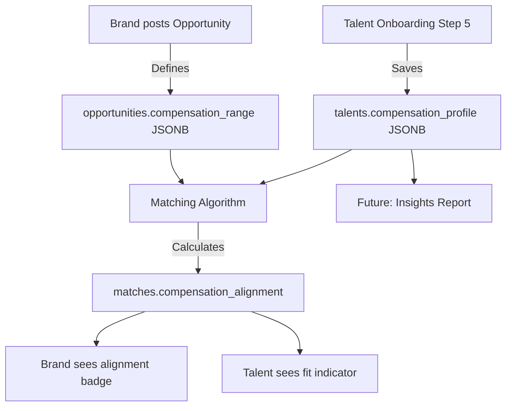

# Compensation Collection Architecture - Simplified Plan

## Executive Summary

This document outlines the implementation plan for activating the **existing compensation data model** in TailorShift. The structures already exist in the database and TypeScript types - we just need to:

1. **Collect the data** in talent onboarding  
2. **Display alignment** in matching views
3. **Calculate alignment** in the algorithm

**Target: 3 implementation phases over 2-3 days**

---

## 1. Current State Analysis

### 1.1 Existing Data Models (Already Defined!)

**Talent Side** ([`lib/types/database.ts:53-58`](lib/types/database.ts:53))
```typescript
export interface CompensationProfile {
  current_base: number | null       // Annual gross base salary
  current_variable: number | null   // Annual variable/bonus amount
  currency: string                  // EUR, USD, GBP, etc.
  expectations: number | null       // Target total package
}
```

**Opportunity Side** ([`lib/types/database.ts:278-283`](lib/types/database.ts:278))
```typescript
export interface CompensationRange {
  min_base: number | null          // Minimum package
  max_base: number | null          // Maximum package  
  variable_pct: number | null      // Variable % offered
  currency: string                 // Currency
}
```

**Match Side** ([`lib/types/database.ts:337`](lib/types/database.ts:337))
```typescript
compensation_alignment: 'within_range' | 'above_range' | 'below_range' | 'unknown' | null
```

### 1.2 Problem Statement

| Aspect | Status |
|--------|--------|
| Data structures defined | ✅ Done |
| Collected in onboarding | ❌ Not implemented |
| Displayed in matches | ❌ Not implemented |
| Calculated in algorithm | ❌ Not implemented |

---

## 2. Architecture



---

## 3. Implementation Plan

### Phase 1: Collection (Talent Onboarding)

**Objective**: Add Step 5 "Your Compensation" to the onboarding wizard

#### 3.1.1 Step 5 Form Structure

```
Step 5: Your compensation (optional but recommended)
├── Current Package
│   ├── Annual base salary (numeric input)
│   ├── Annual variable/bonus (numeric input, optional)
│   └── Currency (dropdown, EUR default)
├── Expectations  
│   ├── Target total package (numeric input or slider)
│   └── Flexibility (radio: "willing to discuss" / "firm")
└── Privacy
    └── Checkbox: "Never show my exact figures to brands"
```

#### 3.1.2 New OnboardingData Fields

```typescript
// Add to OnboardingData interface in app/talent/onboarding/page.tsx
interface OnboardingData {
  // ... existing fields ...
  
  // Step 5: Compensation
  current_base: number | null
  current_variable: number | null  
  currency: string
  expectations: number | null
  salary_flexibility: 'flexible' | 'firm'
  hide_exact_figures: boolean
}
```

#### 3.1.3 Files to Create/Modify

| File | Action | Description |
|------|--------|-------------|
| [`app/talent/onboarding/steps/step-compensation.tsx`](app/talent/onboarding/steps/step-compensation.tsx) | CREATE | New step component |
| [`app/talent/onboarding/page.tsx`](app/talent/onboarding/page.tsx:13) | MODIFY | Add Step 5, update STEPS array |
| [`lib/types/database.ts`](lib/types/database.ts:53) | OPTIONAL | Add flexibility field if needed |

#### 3.1.4 UI Mockup

```
┌─────────────────────────────────────────────────────┐
│ Step 5 of 5: Your compensation                      │
│ Help us match you with the right opportunities      │
├─────────────────────────────────────────────────────┤
│                                                     │
│ 💰 Current Package                                  │
│ ┌─────────────────────────────────────────────────┐ │
│ │ Annual base salary (gross)                      │ │
│ │ ┌──────────────────────────┐  ┌───────────────┐ │ │
│ │ │ 45000                    │  │ EUR        ▼  │ │ │
│ │ └──────────────────────────┘  └───────────────┘ │ │
│ │                                                 │ │
│ │ Annual variable/bonus (optional)               │ │
│ │ ┌──────────────────────────┐                   │ │
│ │ │ 8000                     │                   │ │
│ │ └──────────────────────────┘                   │ │
│ └─────────────────────────────────────────────────┘ │
│                                                     │
│ 🎯 Your Expectations                               │
│ ┌─────────────────────────────────────────────────┐ │
│ │ Target total package                           │ │
│ │ ┌──────────────────────────┐                   │ │
│ │ │ 60000                    │                   │ │
│ │ └──────────────────────────┘                   │ │
│ │                                                 │ │
│ │ How flexible are you?                          │ │
│ │ ○ Willing to discuss for the right role        │ │
│ │ ● This is my minimum                           │ │
│ └─────────────────────────────────────────────────┘ │
│                                                     │
│ 🔒 Privacy                                         │
│ ┌─────────────────────────────────────────────────┐ │
│ │ ☑ Never show my exact figures to brands        │ │
│ │   (They'll only see "Within range" or not)     │ │
│ └─────────────────────────────────────────────────┘ │
│                                                     │
│ ℹ️ This information is confidential and used      │
│    only for matching accuracy.                     │
│                                                     │
├─────────────────────────────────────────────────────┤
│ [← Back]                           [Complete →]    │
└─────────────────────────────────────────────────────┘
```

---

### Phase 2: Display in Matching

**Objective**: Show compensation alignment to both brands and talents

#### 3.2.1 Alignment Calculation Logic

```typescript
function calculateCompensationAlignment(
  talentExpectations: number | null,
  opportunityMin: number | null,
  opportunityMax: number | null
): CompensationAlignment {
  if (!talentExpectations || !opportunityMin || !opportunityMax) {
    return 'unknown'
  }
  
  if (talentExpectations <= opportunityMax && talentExpectations >= opportunityMin) {
    return 'within_range'
  }
  
  if (talentExpectations > opportunityMax) {
    return 'above_range'
  }
  
  if (talentExpectations < opportunityMin) {
    return 'below_range'
  }
  
  return 'unknown'
}
```

#### 3.2.2 Brand View (Pipeline/Matches)

Display badge on each talent match card:

| Alignment | Badge | Color |
|-----------|-------|-------|
| `within_range` | 🟢 Within range | Green |
| `above_range` | 🟡 Above range (+X%) | Yellow |
| `below_range` | 🔵 Below range | Blue (rare) |
| `unknown` | ⚪ Unknown | Grey |

**Example display:**
```
┌─────────────────────────────────────┐
│ Marie D. - Senior Sales Associate   │
│ 🟢 Within range                     │
│ L3 · Watches · Paris · 92% match   │
└─────────────────────────────────────┘
```

#### 3.2.3 Talent View (Opportunities)

Display fit indicator on each opportunity card:

```
┌─────────────────────────────────────┐
│ Senior Sales Advisor - Dior         │
│ 💰 This role is within your range   │
│ L3 · Fashion · Paris                │
└─────────────────────────────────────┘

┌─────────────────────────────────────┐
│ Sales Associate - Chanel            │
│ ⚠️ This role may be below your exp. │
│ L2 · Fashion · Lyon                 │
└─────────────────────────────────────┘
```

#### 3.2.4 Files to Modify

| File | Changes |
|------|---------|
| [`app/brand/pipeline/page.tsx`](app/brand/pipeline/page.tsx) | Add alignment badge to match cards |
| [`app/talent/opportunities/page.tsx`](app/talent/opportunities/page.tsx) | Add fit indicator to opportunity cards |
| [`lib/matching/algorithm.ts`](lib/matching/algorithm.ts) | Add compensation alignment calculation |

---

### Phase 3: Future - Market Positioning Report

**Target page**: `app/talent/insights/compensation/page.tsx`

**Features:**
- Position vs market (percentile)
- Anonymized benchmark by:
  - Role Level (L1-L8)
  - Region (EMEA/Americas/APAC)
  - Division (Fashion/Watches/etc.)
- Visual: "You are in the 65th percentile for Senior Sales Associates in EMEA Fashion"

**Note**: This requires aggregated market data and is out of scope for initial implementation.

---

## 4. Technical Considerations

### 4.1 Database

No migration needed - the JSONB columns already exist:
- `talents.compensation_profile` (JSONB)
- `opportunities.compensation_range` (JSONB)
- `matches.compensation_alignment` (TEXT enum)

### 4.2 Privacy

- Exact salary figures are **never** exposed to brands
- Brands only see the alignment status (within/above/below range)
- Talents can optionally check "hide exact figures" for extra privacy assurance

### 4.3 Currency Handling

For MVP, assume same currency for comparison. Future enhancement:
- Add currency conversion using daily rates
- Store amounts in base currency (EUR) for comparison

### 4.4 Optional vs Required

Step 5 should be **optional but recommended**:
- Talents can skip and complete later
- Show "Complete your profile" prompt if compensation not filled
- Profile completion % adjusted accordingly

---

## 5. Success Metrics

| Metric | Target |
|--------|--------|
| Step 5 completion rate | >60% |
| Compensation data fill rate | >70% of approved talents |
| Match accuracy improvement | +15% (measured by hire success) |

---

## 6. Implementation Checklist

### Phase 1: Collection ✅ COMPLETED
- [x] Create `step-compensation.tsx` component
- [x] Add Step 5 to onboarding wizard
- [x] Update `OnboardingData` interface
- [x] Save `compensation_profile` to database
- [x] Privacy checkbox to hide exact figures

### Phase 2: Display ✅ COMPLETED
- [x] Add `calculateCompensationAlignment` function in `lib/matching/algorithm.ts`
- [x] Add `getCompensationBadgeInfo` helper function
- [x] Display badge on brand pipeline view (`app/brand/pipeline/page.tsx`)
- [x] Display fit indicator on talent opportunities (`app/talent/opportunities/page.tsx`)
- [x] Prompt to add salary expectations if not set

### Phase 3: Future 🔮
- [ ] Design insights page mockup
- [ ] Gather market benchmark data
- [ ] Build percentile calculation
- [ ] Create visualization components

---

*Document Version: 2.0 (Simplified)*
*Created: December 2024*
*For: TailorShift V7 Platform*