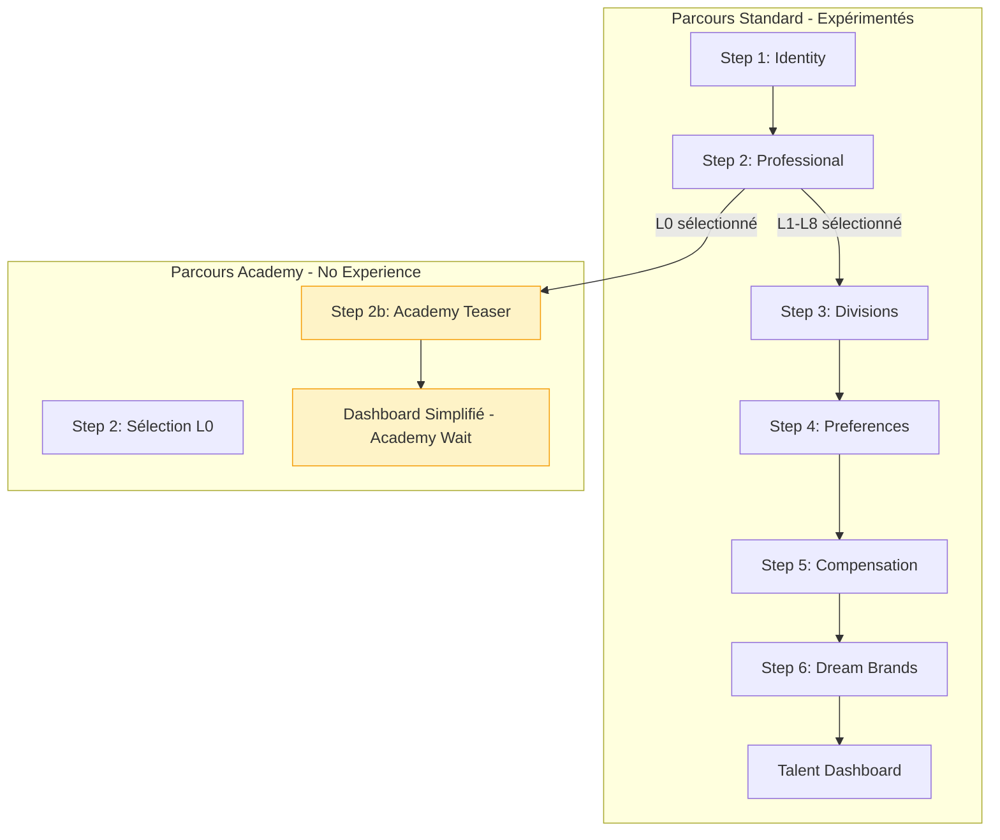
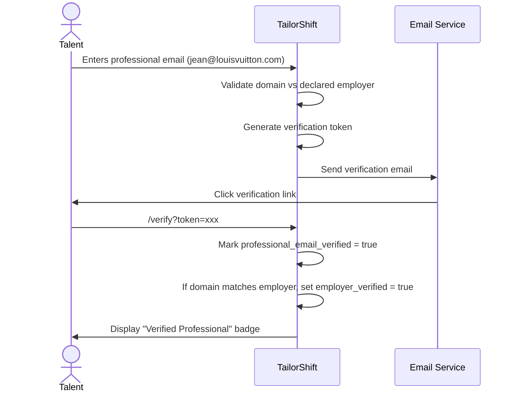

# Phase 2: Academy Path & No-Experience Talent Onboarding

> **Document de référence** : `PHASE2_ACADEMY_ARCHITECTURE.md`
> 
> Ce document détaille l'architecture pour gérer les talents sans expérience retail qui souhaitent intégrer le secteur via TailorShift Academy.

---

## Table des Matières

1. [Vision & Objectifs](#1-vision)
2. [Architecture du Parcours "No Experience"](#2-no-experience-path)
3. [Schema Base de Données](#3-database-schema)
4. [Flow Onboarding Modifié](#4-onboarding-flow)
5. [Academy Teaser Experience](#5-academy-teaser)
6. [Phase Ultérieure: Vérification Identité Talent](#6-identity-verification)
7. [Roadmap d'Implémentation](#7-implementation-roadmap)

---

## 1. Vision & Objectifs {#1-vision}

### 1.1 Contexte

TailorShift cible principalement des professionnels **expérimentés** du retail luxe. Cependant, une part significative de visiteurs sont des personnes **sans expérience** mais **aspirant** à travailler dans ce secteur.

**Problème actuel** : Ces profils ne peuvent pas compléter l'onboarding standard (qui requiert une expérience préalable) et abandonnent.

**Opportunité** : Capturer ces profils pour :
- Les préparer via **TailorShift Academy**
- Les convertir en candidats qualifiés à moyen terme
- Créer un vivier de talents "pré-formés" pour les marques

### 1.2 Objectifs Phase 2

| Objectif | Mesure de succès |
|----------|------------------|
| Capturer 100% des profils "no experience" | Taux d'abandon Step 2 → 0% |
| Labelliser pour outreach Academy | 100% des profils "no experience" taguésd |
| Communiquer la proposition de valeur | Message Academy vu par 100% |
| Préparer l'infrastructure Academy | Schema DB prêt pour Phase 3 |

---

## 2. Architecture du Parcours "No Experience" {#2-no-experience-path}

### 2.1 Détection du Profil "No Experience"

**Critères de détection** (Step 2 - Professional) :

```typescript
const isNoExperienceProfile = (data: OnboardingData): boolean => {
  // Option 1: L'utilisateur sélectionne explicitement "No experience"
  if (data.current_role_level === 'L0_NO_EXPERIENCE') return true
  
  // Option 2: Détection implicite
  const hasNoExperience = 
    data.years_in_luxury === 0 &&
    data.store_tier_experience.length === 0 &&
    !data.current_employer
    
  return hasNoExperience
}
```

### 2.2 Nouveau Niveau de Rôle: L0

Ajouter un niveau "aspirant" avant L1 :

```typescript
const ROLE_LEVELS = [
  { 
    id: 'L0', 
    name: 'Aspiring Retail Professional', 
    desc: 'No experience yet, eager to learn',
    isNoExperience: true  // Flag pour branching
  },
  { id: 'L1', name: 'Sales Associate', desc: 'Entry-level, 0-2 years' },
  // ... autres niveaux
]
```

### 2.3 Parcours Branché



### 2.4 Données Collectées pour Profils "No Experience"

| Champ | Standard | No Experience | Notes |
|-------|----------|---------------|-------|
| first_name, last_name | ✅ | ✅ | Identité |
| phone, linkedin | ✅ | ✅ | Contact |
| current_role_level | L1-L8 | L0 | Flag clé |
| years_in_luxury | 0+ | 0 | Toujours 0 |
| divisions_expertise | ✅ | ❌ Skip | Pas encore |
| target_divisions | ✅ | ✅ Simplifié | Centres d'intérêt |
| compensatio | ✅ | ❌ Skip | Non pertinent |
| target_brands | ✅ | ✅ | Dream Brands |
| academy_interest | N/A | ✅ | Nouveau champ |
| academy_motivation | N/A | ✅ | Texte libre optionnel |

---

## 3. Schema Base de Données {#3-database-schema}

### 3.1 Modifications Table `talents`

```sql
-- Migration 004: Academy-ready talent fields
-- Add fields to support no-experience talents and Academy preparation

-- Extend role_level enum to include L0
-- Note: We'll use 'L0' as a string value since current_role_level is VARCHAR

-- New fields for Academy pipeline
ALTER TABLE talents ADD COLUMN IF NOT EXISTS 
  is_academy_candidate BOOLEAN DEFAULT FALSE;

ALTER TABLE talents ADD COLUMN IF NOT EXISTS 
  academy_interest_declared_at TIMESTAMP WITH TIME ZONE;

ALTER TABLE talents ADD COLUMN IF NOT EXISTS 
  academy_motivation TEXT;

ALTER TABLE talents ADD COLUMN IF NOT EXISTS 
  academy_status VARCHAR(30) DEFAULT NULL;
  -- Values: 'interested', 'enrolled', 'in_progress', 'graduated', 'dropped'

ALTER TABLE talents ADD COLUMN IF NOT EXISTS 
  academy_enrolled_at TIMESTAMP WITH TIME ZONE;

ALTER TABLE talents ADD COLUMN IF NOT EXISTS 
  academy_graduation_date TIMESTAMP WITH TIME ZONE;

-- Index for Academy queries
CREATE INDEX IF NOT EXISTS idx_talents_academy_candidate 
  ON talents(is_academy_candidate) 
  WHERE is_academy_candidate = TRUE;

CREATE INDEX IF NOT EXISTS idx_talents_academy_status 
  ON talents(academy_status) 
  WHERE academy_status IS NOT NULL;

-- Comment for documentation
COMMENT ON COLUMN talents.is_academy_candidate IS 
  'True if talent declared no retail experience but interest in entering the field';
COMMENT ON COLUMN talents.academy_status IS 
  'Academy pipeline status: interested → enrolled → in_progress → graduated/dropped';
```

### 3.2 Nouvelle Table `academy_waitlist`

```sql
-- Table dédiée pour la waitlist Academy (gestion fine)
CREATE TABLE IF NOT EXISTS academy_waitlist (
  id UUID PRIMARY KEY DEFAULT gen_random_uuid(),
  talent_id UUID NOT NULL REFERENCES talents(id) ON DELETE CASCADE,
  
  -- Interest details
  interest_areas TEXT[] DEFAULT '{}',  -- ['fashion', 'beauty', 'jewelry', etc.]
  motivation_text TEXT,
  preferred_language VARCHAR(10) DEFAULT 'fr',
  
  -- Location for future cohorts
  city VARCHAR(100),
  country VARCHAR(100),
  timezone VARCHAR(50),
  
  -- Availability
  available_start_date DATE,
  commitment_hours_per_week INTEGER,  -- 5, 10, 20, full-time
  
  -- Communication preferences
  notify_by_email BOOLEAN DEFAULT TRUE,
  notify_by_sms BOOLEAN DEFAULT FALSE,
  
  -- Status tracking
  status VARCHAR(30) DEFAULT 'waitlisted',
  -- Values: 'waitlisted', 'invited', 'accepted', 'declined', 'expired'
  
  invited_at TIMESTAMP WITH TIME ZONE,
  responded_at TIMESTAMP WITH TIME ZONE,
  cohort_id UUID,  -- Future: link to academy_cohorts table
  
  -- Metadata
  source VARCHAR(50) DEFAULT 'onboarding',  -- 'onboarding', 'marketing', 'referral'
  utm_campaign VARCHAR(100),
  
  created_at TIMESTAMP WITH TIME ZONE DEFAULT NOW(),
  updated_at TIMESTAMP WITH TIME ZONE DEFAULT NOW(),
  
  UNIQUE(talent_id)  -- One entry per talent
);

-- Index for outreach queries
CREATE INDEX idx_academy_waitlist_status ON academy_waitlist(status);
CREATE INDEX idx_academy_waitlist_created ON academy_waitlist(created_at DESC);
```

### 3.3 Future: Table `academy_modules` (Phase 3)

```sql
-- Préparation structure Academy (à implémenter en Phase 3)
-- Documenté ici pour référence

CREATE TABLE IF NOT EXISTS academy_modules (
  id UUID PRIMARY KEY DEFAULT gen_random_uuid(),
  
  -- Module info
  slug VARCHAR(100) UNIQUE NOT NULL,
  title VARCHAR(255) NOT NULL,
  description TEXT,
  
  -- Categorization
  category VARCHAR(50) NOT NULL,
  -- 'luxury_fundamentals', 'clienteling', 'product_knowledge', 
  -- 'sales_techniques', 'brand_culture', 'operations'
  
  subcategory VARCHAR(50),
  difficulty VARCHAR(20) DEFAULT 'beginner',
  -- 'beginner', 'intermediate', 'advanced'
  
  -- Content
  content_type VARCHAR(30) NOT NULL,
  -- 'video', 'article', 'quiz', 'interactive', 'case_study'
  
  content_url VARCHAR(500),
  duration_minutes INTEGER,
  
  -- Requirements
  prerequisites UUID[],  -- Module IDs that must be completed first
  required_for_graduation BOOLEAN DEFAULT FALSE,
  
  -- Targeting
  target_divisions Division[],
  target_role_level RoleLevel DEFAULT 'L1',
  
  -- Status
  status VARCHAR(20) DEFAULT 'draft',
  -- 'draft', 'active', 'archived'
  
  published_at TIMESTAMP WITH TIME ZONE,
  created_at TIMESTAMP WITH TIME ZONE DEFAULT NOW(),
  updated_at TIMESTAMP WITH TIME ZONE DEFAULT NOW()
);

-- Academy progress tracking (Phase 3)
CREATE TABLE IF NOT EXISTS academy_progress (
  id UUID PRIMARY KEY DEFAULT gen_random_uuid(),
  talent_id UUID NOT NULL REFERENCES talents(id) ON DELETE CASCADE,
  module_id UUID NOT NULL REFERENCES academy_modules(id),
  
  status VARCHAR(20) DEFAULT 'not_started',
  -- 'not_started', 'in_progress', 'completed', 'failed'
  
  progress_pct INTEGER DEFAULT 0,
  score INTEGER,  -- Quiz score if applicable
  attempts INTEGER DEFAULT 0,
  
  started_at TIMESTAMP WITH TIME ZONE,
  completed_at TIMESTAMP WITH TIME ZONE,
  
  created_at TIMESTAMP WITH TIME ZONE DEFAULT NOW(),
  updated_at TIMESTAMP WITH TIME ZONE DEFAULT NOW(),
  
  UNIQUE(talent_id, module_id)
);
```

---

## 4. Flow Onboarding Modifié {#4-onboarding-flow}

### 4.1 Step 2: Professional - Version Modifiée

```tsx
// app/talent/onboarding/steps/step-professional.tsx

const ROLE_LEVELS = [
  // NOUVEAU: Option "No Experience"
  { 
    id: 'L0', 
    name: 'New to Retail', 
    desc: "I don't have retail experience yet",
    isNoExperience: true,
    highlight: true  // Style différent
  },
  // Separator visuel
  { id: 'divider', name: '── or select your current level ──', desc: '' },
  // Niveaux existants
  { id: 'L1', name: 'Sales Associate', desc: 'Entry-level, 0-2 years' },
  { id: 'L2', name: 'Senior Sales Associate', desc: '2-4 years experience' },
  // ... etc
]
```

**UI/UX pour l'option L0** :

```
┌─────────────────────────────────────────────────────────────────────┐
│  YOUR CURRENT EXPERIENCE                                             │
├─────────────────────────────────────────────────────────────────────┤
│                                                                     │
│  ┌─────────────────────────────────────────────────────────────┐   │
│  │  🌟 NEW TO RETAIL LUXURY?                                    │   │
│  │                                                              │   │
│  │  I don't have retail experience yet, but I'm interested     │   │
│  │  in starting a career in luxury retail.                     │   │
│  │                                                              │   │
│  │  [✓]  Select this option                                    │   │
│  │                                                              │   │
│  │  → You'll be added to TailorShift Academy waitlist          │   │
│  └─────────────────────────────────────────────────────────────┘   │
│                                                                     │
│  ─────────────── OR SELECT YOUR CURRENT LEVEL ───────────────────── │
│                                                                     │
│  ┌──────────────────────┐  ┌──────────────────────┐               │
│  │ L1 Sales Associate   │  │ L2 Senior Sales      │               │
│  │ Entry-level, 0-2y    │  │ Associate, 2-4y      │               │
│  └──────────────────────┘  └──────────────────────┘               │
│                                                                     │
└─────────────────────────────────────────────────────────────────────┘
```

### 4.2 Logique de Branching dans Onboarding

```typescript
// app/talent/onboarding/page.tsx

// Steps pour parcours standard
const STANDARD_STEPS = [
  { id: 1, name: 'About you', description: "Let's start with the essentials" },
  { id: 2, name: 'Your experience', description: 'Where you stand today' },
  { id: 3, name: 'Your expertise', description: 'The areas you know best' },
  { id: 4, name: 'Your aspirations', description: 'Where you want to move next' },
  { id: 5, name: 'Compensation', description: 'Help us match you accurately' },
  { id: 6, name: 'Dream Brands', description: 'Where would you love to work?' },
]

// Steps pour parcours Academy (no experience)
const ACADEMY_STEPS = [
  { id: 1, name: 'About you', description: "Let's start with the essentials" },
  { id: 2, name: 'Your interest', description: 'Tell us about your aspirations' },
  { id: 3, name: 'Academy', description: 'Welcome to TailorShift Academy' },
]

// Dans le composant
const [onboardingPath, setOnboardingPath] = useState<'standard' | 'academy'>('standard')

// Quand L0 est sélectionné
const handleRoleLevelChange = (level: string) => {
  updateData({ current_role_level: level })
  if (level === 'L0') {
    setOnboardingPath('academy')
  } else {
    setOnboardingPath('standard')
  }
}

const STEPS = onboardingPath === 'academy' ? ACADEMY_STEPS : STANDARD_STEPS
```

---

## 5. Academy Teaser Experience {#5-academy-teaser}

### 5.1 Step "Academy" - Contenu

Quand un utilisateur sélectionne L0, après Step 1 (Identity) et Step 2 (avec L0), il voit :

```
┌─────────────────────────────────────────────────────────────────────┐
│                                                                     │
│                          🎓                                         │
│                                                                     │
│           WELCOME TO TAILORSHIFT ACADEMY                            │
│               Your path into luxury retail                          │
│                                                                     │
├─────────────────────────────────────────────────────────────────────┤
│                                                                     │
│  Thank you for your interest in luxury retail!                      │
│                                                                     │
│  TailorShift Academy is currently being developed to help           │
│  aspiring professionals like you enter the world of luxury          │
│  retail with the right skills and knowledge.                        │
│                                                                     │
│  ─────────────────────────────────────────────────────────────────  │
│                                                                     │
│  WHAT TO EXPECT:                                                    │
│                                                                     │
│  📚  Foundational modules on luxury retail fundamentals             │
│  🎯  Brand-specific culture and product training                    │
│  💼  Preparation for entry-level positions                          │
│  🤝  Direct connections with hiring brands                          │
│                                                                     │
│  ─────────────────────────────────────────────────────────────────  │
│                                                                     │
│  We'll notify you as soon as Academy launches.                      │
│  In the meantime, complete your profile so we can match you         │
│  with the right programs.                                           │
│                                                                     │
│  ┌─────────────────────────────────────────────────────────────┐   │
│  │  What areas interest you most? (select all that apply)      │   │
│  │                                                              │   │
│  │  [ ] Fashion & Ready-to-Wear                                 │   │
│  │  [ ] Leather Goods & Accessories                             │   │
│  │  [ ] Beauty & Fragrance                                      │   │
│  │  [ ] Watches & Jewelry                                       │   │
│  │  [ ] Hospitality & Client Experience                         │   │
│  └─────────────────────────────────────────────────────────────┘   │
│                                                                     │
│  ┌─────────────────────────────────────────────────────────────┐   │
│  │  Why do you want to work in luxury retail? (optional)       │   │
│  │  ┌───────────────────────────────────────────────────────┐  │   │
│  │  │                                                       │  │   │
│  │  │  I've always been passionate about fashion and...     │  │   │
│  │  │                                                       │  │   │
│  │  └───────────────────────────────────────────────────────┘  │   │
│  └─────────────────────────────────────────────────────────────┘   │
│                                                                     │
│                                      [Join Academy Waitlist →]      │
│                                                                     │
└─────────────────────────────────────────────────────────────────────┘
```

### 5.2 Composant StepAcademyTeaser

```tsx
// app/talent/onboarding/steps/step-academy-teaser.tsx

'use client'

import { Card, Button } from '@/components/ui'
import { GraduationCap, BookOpen, Target, Briefcase, Users } from 'lucide-react'

interface StepAcademyTeaserProps {
  data: OnboardingData
  updateData: (updates: Partial<OnboardingData>) => void
}

const INTEREST_AREAS = [
  { id: 'fashion', label: 'Fashion & Ready-to-Wear', icon: '👗' },
  { id: 'leather', label: 'Leather Goods & Accessories', icon: '👜' },
  { id: 'beauty', label: 'Beauty & Fragrance', icon: '💄' },
  { id: 'watches_jewelry', label: 'Watches & Jewelry', icon: '⌚' },
  { id: 'hospitality', label: 'Hospitality & Client Experience', icon: '🤝' },
]

const ACADEMY_BENEFITS = [
  { icon: BookOpen, title: 'Foundational Modules', desc: 'Learn luxury retail fundamentals' },
  { icon: Target, title: 'Brand Training', desc: 'Understand luxury brand culture' },
  { icon: Briefcase, title: 'Career Prep', desc: 'Prepare for entry-level positions' },
  { icon: Users, title: 'Brand Connections', desc: 'Connect directly with hiring brands' },
]

export function StepAcademyTeaser({ data, updateData }: StepAcademyTeaserProps) {
  const toggleInterest = (areaId: string) => {
    const current = data.academy_interest_areas || []
    const updated = current.includes(areaId)
      ? current.filter(a => a !== areaId)
      : [...current, areaId]
    updateData({ academy_interest_areas: updated })
  }

  return (
    <div className="space-y-8">
      {/* Hero */}
      <div className="text-center py-8 bg-gradient-to-b from-[var(--gold-light)] to-transparent rounded-xl">
        <GraduationCap className="w-16 h-16 mx-auto text-[var(--gold)] mb-4" />
        <h2 className="text-h1 text-[var(--charcoal)]">Welcome to TailorShift Academy</h2>
        <p className="text-body text-[var(--grey-600)] mt-2">Your path into luxury retail</p>
      </div>

      {/* Message */}
      <div className="prose max-w-none">
        <p>
          Thank you for your interest in luxury retail! TailorShift Academy is currently 
          being developed to help aspiring professionals like you enter the world of 
          luxury retail with the right skills and knowledge.
        </p>
      </div>

      {/* Benefits Grid */}
      <div className="grid grid-cols-2 gap-4">
        {ACADEMY_BENEFITS.map((benefit) => (
          <Card key={benefit.title} className="p-4">
            <benefit.icon className="w-8 h-8 text-[var(--gold)] mb-2" />
            <h4 className="font-semibold text-sm">{benefit.title}</h4>
            <p className="text-small text-[var(--grey-600)]">{benefit.desc}</p>
          </Card>
        ))}
      </div>

      {/* Interest Areas */}
      <div>
        <label className="block text-sm font-medium mb-3">
          What areas interest you most? <span className="text-[var(--grey-500)]">(select all that apply)</span>
        </label>
        <div className="space-y-2">
          {INTEREST_AREAS.map((area) => {
            const isSelected = (data.academy_interest_areas || []).includes(area.id)
            return (
              <Card
                key={area.id}
                variant={isSelected ? 'selected' : 'interactive'}
                className="p-3 cursor-pointer"
                onClick={() => toggleInterest(area.id)}
              >
                <div className="flex items-center gap-3">
                  <span className="text-xl">{area.icon}</span>
                  <span className="font-medium">{area.label}</span>
                </div>
              </Card>
            )
          })}
        </div>
      </div>

      {/* Motivation (optional) */}
      <div>
        <label className="block text-sm font-medium mb-2">
          Why do you want to work in luxury retail? <span className="text-[var(--grey-500)]">(optional)</span>
        </label>
        <textarea
          className="w-full p-3 border border-[var(--grey-300)] rounded-lg resize-none focus:border-[var(--gold)] focus:ring-1 focus:ring-[var(--gold)]"
          rows={4}
          placeholder="Share your motivation and what attracts you to luxury retail..."
          value={data.academy_motivation || ''}
          onChange={(e) => updateData({ academy_motivation: e.target.value })}
        />
      </div>

      {/* Promise */}
      <div className="bg-[var(--grey-100)] rounded-lg p-4 text-center">
        <p className="text-sm text-[var(--grey-600)]">
          We'll notify you as soon as Academy launches. Complete your profile now to be 
          among the first to access our programs.
        </p>
      </div>
    </div>
  )
}
```

### 5.3 Dashboard pour Profils Academy

Après complétion, les profils "no experience" voient un dashboard adapté :

```
┌─────────────────────────────────────────────────────────────────────┐
│  TAILOR SHIFT                                        [Marie D.] ▼   │
├─────────────────────────────────────────────────────────────────────┤
│                                                                     │
│  Good morning, Marie 👋                                             │
│                                                                     │
│  ┌─────────────────────────────────────────────────────────────┐   │
│  │  🎓 ACADEMY STATUS                                          │   │
│  │                                                              │   │
│  │  You're on the waitlist!                                     │   │
│  │  Position: #127 of 342 aspiring professionals                │   │
│  │                                                              │   │
│  │  ┌───────────────────────────────────────────────────────┐  │   │
│  │  │                                                       │  │   │
│  │  │  ████████████░░░░░░░░░░░░░░░░░░░░░░░░░░░░░ 37%        │  │   │
│  │  │  Academy launching soon...                            │  │   │
│  │  │                                                       │  │   │
│  │  └───────────────────────────────────────────────────────┘  │   │
│  │                                                              │   │
│  │  📧 We'll email you at marie.d@gmail.com when it's ready    │   │
│  └─────────────────────────────────────────────────────────────┘   │
│                                                                     │
│  ─────────────────────────────────────────────────────────────────  │
│                                                                     │
│  WHILE YOU WAIT...                                                  │
│                                                                     │
│  ┌──────────────┐  ┌──────────────┐  ┌──────────────┐             │
│  │ 📖 Blog      │  │ 🎯 Dream     │  │ 📝 Complete  │             │
│  │ Discover     │  │ Brands       │  │ Profile      │             │
│  │ luxury retail│  │ Tell us your │  │ Add more     │             │
│  │ insights     │  │ top 5 brands │  │ details      │             │
│  └──────────────┘  └──────────────┘  └──────────────┘             │
│                                                                     │
│  ─────────────────────────────────────────────────────────────────  │
│                                                                     │
│  YOUR INTERESTS                                                     │
│                                                                     │
│  👗 Fashion    👜 Leather Goods    💄 Beauty                        │
│                                                                     │
│  [Edit interests]                                                   │
│                                                                     │
└─────────────────────────────────────────────────────────────────────┘
```

---

## 6. Phase Ultérieure: Vérification Identité Talent {#6-identity-verification}

> **Note**: Cette section est prévue pour une implémentation post-Academy launch.

### 6.1 Objectif

Vérifier l'identité des talents via leur email professionnel pour :
- Confirmer l'employeur actuel déclaré
- Augmenter la confiance des recruteurs
- Prévenir les profils frauduleux

### 6.2 Architecture Prévue

```sql
-- Future: Email verification for talents
ALTER TABLE talents ADD COLUMN professional_email VARCHAR(255);
ALTER TABLE talents ADD COLUMN professional_email_verified BOOLEAN DEFAULT FALSE;
ALTER TABLE talents ADD COLUMN employer_verified BOOLEAN DEFAULT FALSE;  -- Cross-check

CREATE TABLE email_verification_tokens (
  id UUID PRIMARY KEY DEFAULT gen_random_uuid(),
  talent_id UUID REFERENCES talents(id),
  email VARCHAR(255) NOT NULL,
  token VARCHAR(255) UNIQUE NOT NULL,
  expires_at TIMESTAMP WITH TIME ZONE DEFAULT (NOW() + INTERVAL '24 hours'),
  used BOOLEAN DEFAULT FALSE,
  created_at TIMESTAMP WITH TIME ZONE DEFAULT NOW()
);
```

### 6.3 Flow de Vérification



### 6.4 Impact sur le Matching

| Statut vérification | Impact match score | Badge affiché |
|---------------------|-------------------|---------------|
| Non vérifié | Base | Aucun |
| Email professionnel vérifié | +5% | ✅ Professional Email |
| Employeur confirmé | +10% | 🏢 Verified at [Company] |

---

## 7. Roadmap d'Implémentation {#7-implementation-roadmap}

### 7.1 Phase 2A: No Experience Path (1-2 semaines)

| Tâche | Priorité | Effort | Owner |
|-------|----------|--------|-------|
| Migration DB: champs Academy | P1 | 2h | Backend |
| Modifier ROLE_LEVELS avec L0 | P1 | 1h | Frontend |
| Créer StepAcademyTeaser component | P1 | 4h | Frontend |
| Implémenter branching logic | P1 | 3h | Frontend |
| Dashboard Academy-wait variant | P2 | 4h | Frontend |
| Tests E2E parcours Academy | P2 | 2h | QA |

### 7.2 Phase 2B: Academy Database Setup (1 semaine)

| Tâche | Priorité | Effort | Owner |
|-------|----------|--------|-------|
| Create academy_waitlist table | P1 | 1h | Backend |
| Create academy_modules table | P2 | 2h | Backend |
| Create academy_progress table | P2 | 2h | Backend |
| Admin view: Academy waitlist | P2 | 4h | Frontend |
| Email notification system prep | P3 | 4h | Backend |

### 7.3 Phase 2C: Identity Verification (différé, 2 semaines)

| Tâche | Priorité | Effort | Owner |
|-------|----------|--------|-------|
| Professional email field UI | P2 | 2h | Frontend |
| Email verification service | P2 | 6h | Backend |
| Token generation & validation | P2 | 4h | Backend |
| Employer domain matching | P2 | 4h | Backend |
| Verification badges UI | P3 | 3h | Frontend |

### 7.4 Critères de Succès

| Metric | Target | Measurement |
|--------|--------|-------------|
| No-experience capture rate | 100% | % completing Academy step |
| Academy waitlist size | 500+ in 3 months | DB count |
| Profile completion (Academy) | >60% | avg completion % |
| Waitlist engagement | >30% open email rate | Email metrics |

---

## Changelog

| Date | Version | Modifications |
|------|---------|---------------|
| 2024-12-04 | 1.0 | Création initiale |

---

> **Prochaines étapes** : Valider cette architecture avec l'équipe, puis passer à l'implémentation Phase 2A.