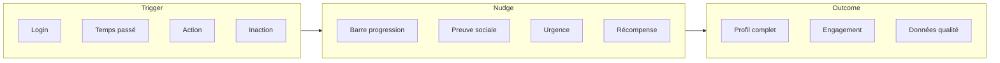
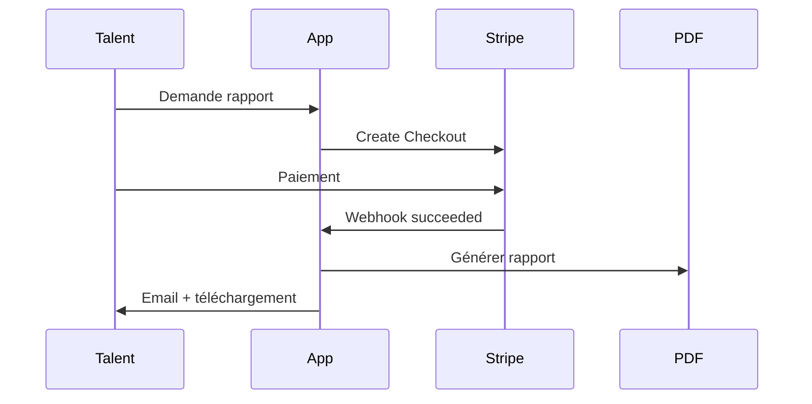
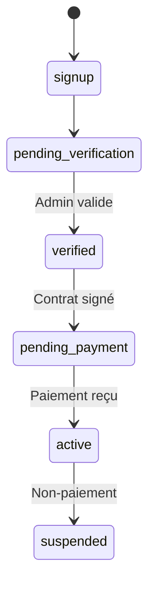

# TailorShift V8+ Product Roadmap

> **Document de référence** : `PRODUCT_ROADMAP_V8.md`
> 
> Ce document centralise la vision produit, les fonctionnalités implémentées et le backlog des évolutions futures de TailorShift.
> 
> **Dernière mise à jour** : 4 décembre 2025

---

## Vue d'Ensemble — Statut des Initiatives

| Initiative | Statut | Phase | Documentation |
|------------|--------|-------|---------------|
| **Brand Domain Validation & RBAC** | ✅ Complété | V7.1 | [Section 1](#1-brand-rbac) |
| **Compensation Collection (7 champs)** | ✅ Complété | V7.1 | [`COMPENSATION_COLLECTION_ARCHITECTURE.md`](./COMPENSATION_COLLECTION_ARCHITECTURE.md) |
| **TailorShift Academy — No Experience Path** | ✅ Complété | V7.2 | [Section 2](#2-academy) |
| **Academy Waitlist & Database** | ✅ Complété | V7.2 | [`PHASE2_ACADEMY_ARCHITECTURE.md`](./PHASE2_ACADEMY_ARCHITECTURE.md) |
| Système de Nudges & Engagement | ⏳ Backlog | V8+ | [Section 3](#3-nudges) |
| Rapports & Micropaiements | ⏳ Backlog | V8+ | [Section 4](#4-rapports) |
| Brand Assessments Personnalisés | ⏳ Backlog | V8+ | [Section 5](#5-brand-assessments) |
| Monétisation Brands | ⏳ Backlog | V8+ | [Section 6](#6-monetisation) |
| Talent Identity Verification | ⏳ Différé | V8+ | [Section 7](#7-identity) |

---

## Table des Matières

**✅ Implémenté**
1. [Brand Domain Validation & RBAC](#1-brand-rbac)
2. [TailorShift Academy — No Experience Path](#2-academy)

**⏳ Backlog & Idées Futures**
3. [Système de Nudges & Engagement](#3-nudges)
4. [Rapports & Micropaiements](#4-rapports)
5. [Brand Assessments Personnalisés](#5-brand-assessments)
6. [Monétisation Brands & Activation](#6-monetisation)
7. [Talent Identity Verification](#7-identity)
8. [Simplification UX](#8-simplification)
9. [Autres Idées](#9-autres)

---

# ✅ FONCTIONNALITÉS IMPLÉMENTÉES

---

## 1. Brand Domain Validation & RBAC {#1-brand-rbac}

> **Statut** : ✅ Complété (4 décembre 2024)
> **Migration** : [`003_brand_rbac_system.sql`](../supabase/migrations/003_brand_rbac_system.sql)

### 1.1 Domain Validation System

Validation automatique des emails lors de l'onboarding brand :

| Type de domaine | Action | Exemples |
|-----------------|--------|----------|
| **Personal** | ❌ Rejeté | gmail.com, yahoo.com, hotmail.com |
| **Luxury Brand** | ✅ Auto-validé | lvmh.com, kering.com, hermes.com |
| **Corporate** | ⏳ Admin review | autre-entreprise.com |

**Fichiers** :
- [`lib/auth/domain-validation.ts`](../lib/auth/domain-validation.ts) - Validation engine
- [`app/brand/onboarding/page.tsx`](../app/brand/onboarding/page.tsx) - Integration UI

### 1.2 Système RBAC (8 Rôles)

| Rôle | Permissions | Cas d'usage |
|------|-------------|-------------|
| `owner` | Toutes | Fondateur, CEO |
| `admin_global` | Toutes sauf ownership | Head of HR/IT |
| `admin_brand` | Gestion brand | Brand manager |
| `hr_global` | Recrutement + analytics | HR director |
| `hr_regional` | Recrutement région | Regional HR |
| `recruiter` | Recrutement basique | Store recruiters |
| `manager_store` | View + contact | Store managers |
| `viewer` | Read-only | Trainees, auditors |

**7 Permissions** : `manage_team`, `manage_brand_profile`, `create_opportunities`, `view_matches`, `contact_talents`, `view_analytics`, `manage_assessments`

**Fichiers** :
- [`lib/auth/brand-rbac.ts`](../lib/auth/brand-rbac.ts) - RBAC implementation
- [`app/brand/team/page.tsx`](../app/brand/team/page.tsx) - Team management UI

---

## 2. TailorShift Academy — No Experience Path {#2-academy}

> **Statut** : ✅ Complété (4 décembre 2024)
> **Migration** : [`004_academy_candidate_fields.sql`](../supabase/migrations/004_academy_candidate_fields.sql)
> **Architecture détaillée** : [`PHASE2_ACADEMY_ARCHITECTURE.md`](./PHASE2_ACADEMY_ARCHITECTURE.md)

### 2.1 Problème Résolu

Les talents **sans expérience retail** qui souhaitent intégrer le secteur luxe ne pouvaient pas compléter l'onboarding standard. Ils abandonnaient à Step 2.

### 2.2 Solution : Parcours Branché

```
┌─────────────────────────────────────────────────────────────────────────────┐
│                                                                             │
│  STEP 1: Identity (commun)                                                  │
│      ↓                                                                      │
│  STEP 2: Professional                                                       │
│      │                                                                      │
│      ├─── L1-L8 sélectionné ──→ Parcours Standard (6 steps)                │
│      │                            ↓                                         │
│      │                         Divisions → Preferences → Compensation       │
│      │                            → Dream Brands → Dashboard                │
│      │                                                                      │
│      └─── L0 "New to Retail" ──→ Parcours Academy (4 steps)                │
│                                    ↓                                        │
│                                 Academy Teaser → Dream Brands              │
│                                    → Dashboard Waitlist                     │
│                                                                             │
└─────────────────────────────────────────────────────────────────────────────┘
```

### 2.3 L0 — Option "New to Retail"

Nouvelle option mise en avant dans Step 2 :

```
┌─────────────────────────────────────────────────────────────────────┐
│  🌟 NEW TO RETAIL LUXURY?                                           │
│                                                                     │
│  I don't have retail experience yet, but I'm interested            │
│  in starting a career in luxury retail.                            │
│                                                                     │
│  → You'll be added to TailorShift Academy waitlist                 │
│                                                              [✓]   │
└─────────────────────────────────────────────────────────────────────┘
```

**Fichier** : [`app/talent/onboarding/steps/step-professional.tsx`](../app/talent/onboarding/steps/step-professional.tsx)

### 2.4 Academy Teaser Step

Écran présentant Academy aux talents L0 :
- Message de bienvenue
- 4 bénéfices (Training, Brand Culture, Career Prep, Connections)
- Sélection des domaines d'intérêt (Fashion, Leather, Beauty, Watches, Hospitality)
- Motivation optionnelle (texte libre)

**Fichier** : [`app/talent/onboarding/steps/step-academy-teaser.tsx`](../app/talent/onboarding/steps/step-academy-teaser.tsx)

### 2.5 Schema Base de Données

**Nouveaux champs sur `talents`** :
```sql
is_academy_candidate BOOLEAN DEFAULT FALSE
academy_status VARCHAR(30)  -- interested, waitlisted, enrolled, graduated
academy_interest_areas TEXT[]  -- fashion, leather_goods, beauty, watches_jewelry, hospitality
academy_motivation TEXT
academy_interest_declared_at TIMESTAMP
```

**Nouvelle table `academy_waitlist`** :
```sql
CREATE TABLE academy_waitlist (
  id UUID PRIMARY KEY,
  talent_id UUID REFERENCES talents(id),
  interest_areas TEXT[],
  motivation_text TEXT,
  status VARCHAR(30),  -- waitlisted, invited, accepted
  ...
);
```

### 2.6 Données Collectées

| Champ | Profil Standard | Profil Academy L0 |
|-------|-----------------|-------------------|
| Identity (nom, tel, LinkedIn) | ✅ | ✅ |
| Location | ✅ | ✅ |
| Role Level | L1-L8 | L0 |
| Store Tiers | ✅ | ❌ Skip |
| Years in Luxury | ✅ | ❌ (= 0) |
| Divisions Expertise | ✅ | ❌ Skip |
| Compensation | ✅ (7 champs) | ❌ Skip |
| Academy Interest Areas | N/A | ✅ |
| Academy Motivation | N/A | ✅ Optional |
| Dream Brands | ✅ | ✅ |

### 2.7 Prochaines Étapes (Phase 3)

| Phase | Scope | Statut |
|-------|-------|--------|
| ✅ 2A | No Experience Path + L0 option | Complété |
| ✅ 2B | Academy DB schema + waitlist | Complété |
| ⏳ 3A | Academy modules & content | Planifié |
| ⏳ 3B | Progress tracking & certifications | Planifié |
| ⏳ 3C | Dashboard Academy-wait | Planifié |
| ⏳ 3D | Admin waitlist management | Planifié |

---

# ⏳ BACKLOG & IDÉES FUTURES

---

## 3. Système de Nudges & Engagement {#3-nudges}

> **Statut** : ⏳ Backlog
> **Priorité** : Moyenne
> **Complexité** : Moyenne

### 3.1 Objectif

Incitations comportementales pour maximiser :
- Complétude des profils (Talent & Brand)
- Engagement sur la plateforme
- Qualité des données collectées

### 3.2 Framework



### 3.3 Nudges Côté Talent

| Nudge | Déclencheur | Message | Impact |
|-------|-------------|---------|--------|
| Progress Ring | Login | "Profil complet à 67%" | +20% complétion |
| Match Potential | Profil incomplet | "12 opportunités à débloquer" | +15% complétion |
| Dream Brand Alert | Nouvelle opportunité | "Hermès recrute !" | +30% réponse |
| Profile Views | Hebdomadaire | "3 recruteurs vous ont vu" | +15% engagement |

### 3.4 Gamification

- **Badges** : "Profile Master", "Quick Responder", "Top Performer"
- **Leaderboards** anonymisés
- **Streaks** : "5 jours consécutifs"
- **Unlocks** : Fonctionnalités selon complétion

---

## 4. Rapports & Micropaiements {#4-rapports}

> **Statut** : ⏳ Backlog
> **Priorité** : Haute (monétisation B2C)
> **Complexité** : Haute

### 4.1 Types de Rapports Envisagés

| Rapport | Description | Prix cible |
|---------|-------------|------------|
| **Assessment Report PDF** | Analyse 6D + recommandations | 9.90€ - 19.90€ |
| **Market Position** | Comparaison anonymisée | 14.90€ |
| **Salary Benchmark** | Fourchette personnalisée | 9.90€ |
| **Career Path Analysis** | Prédiction trajectoire | 19.90€ |
| **Brand Compatibility** | Fit avec top 10 maisons | 14.90€ |

### 4.2 Architecture Stripe



### 4.3 Modèle Freemium

| Fonctionnalité | Gratuit | Premium |
|----------------|---------|---------|
| Score global | ✅ | ✅ |
| Radar 6D basique | ✅ | ✅ |
| Analyse détaillée | ❌ | ✅ |
| Recommandations | ❌ | ✅ |
| PDF téléchargeable | ❌ | ✅ |

---

## 5. Brand Assessments Personnalisés {#5-brand-assessments}

> **Statut** : ⏳ Backlog
> **Priorité** : Moyenne
> **Complexité** : Haute

### 5.1 Vision

Permettre aux marques de créer leurs propres assessments en complément du 6D TailorShift.

### 5.2 Types d'Assessments

| Type | Description |
|------|-------------|
| Culture Quiz | Histoire, valeurs, ADN de la marque |
| Scénarios Situationnels | Mise en situation client |
| Connaissance Produit | Collections, matériaux, savoir-faire |
| Video Pitch | Réponse vidéo 60s |

### 5.3 Badges & Certifications

Les talents peuvent afficher sur leur profil les assessments marques passés :

```
🏅 Louis Vuitton Assessment    ✓ Passé le 15/11/2024
   Score: 87/100 - Niveau: Expert
```

### 5.4 Invitation Automatique

Quand une brand ouvre une position, le système invite proactivement les talents "high potential" :
- Dream Brand match ✅
- Score 6D >= 70% ✅
- Role level compatible ✅
- Location compatible ✅

---

## 6. Monétisation Brands & Activation {#6-monetisation}

> **Statut** : ⏳ Backlog
> **Priorité** : Haute
> **Complexité** : Moyenne

### 6.1 Workflow Brand



### 6.2 Statuts Brand

| Statut | Accès Dashboard | Créer Opportunités | Voir Matches | Contacter |
|--------|-----------------|-------------------|--------------|-----------|
| onboarding | Limité | ❌ | ❌ | ❌ |
| verified | Limité | ❌ | ❌ | ❌ |
| pending_payment | Limité | ❌ | ❌ | ❌ |
| active | ✅ Complet | ✅ | ✅ | ✅ |
| suspended | ❌ | ❌ | ❌ | ❌ |

### 6.3 Options de Monétisation

| Modèle | Avantages | Inconvénients |
|--------|-----------|---------------|
| Abonnement mensuel | Revenus prévisibles | Barrière à l'entrée |
| Pay-per-hire | Aligné sur valeur | Revenus variables |
| Crédits / Tokens | Flexibilité | Complexité |
| Freemium + Premium | Adoption facile | Conversion difficile |

---

## 7. Talent Identity Verification {#7-identity}

> **Statut** : ⏳ Différé
> **Priorité** : Basse (post-launch Academy)
> **Complexité** : Moyenne

### 7.1 Objectif

Vérifier l'identité des talents via email professionnel pour :
- Confirmer l'employeur déclaré
- Augmenter la confiance recruteurs
- Prévenir les fraudes

### 7.2 Flow Prévu

```
Talent entre email pro (jean@louisvuitton.com)
    ↓
Validation domaine vs employeur déclaré
    ↓
Envoi email vérification
    ↓
Clic lien → professional_email_verified = true
    ↓
Si domaine match employeur → employer_verified = true
```

### 7.3 Impact sur Matching

| Statut | Boost Score | Badge |
|--------|-------------|-------|
| Non vérifié | Base | - |
| Email vérifié | +5% | ✅ Professional Email |
| Employeur confirmé | +10% | 🏢 Verified at [Company] |

---

## 8. Simplification UX {#8-simplification}

> **Statut** : ⏳ Backlog (continu)
> **Priorité** : Continue

### 8.1 Principes

```
Complexité fonctionnelle ≠ Complexité perçue
```

- Réduire le nombre d'écrans
- Progressive disclosure
- Smart defaults
- One-click actions

### 8.2 Questions Ouvertes

- Mode "Express" (5 champs) vs "Complet" ?
- Inférer des informations (segment de marque basé sur employeur) ?
- Minimum viable pour un premier match ?

### 8.3 Actions Potentielles

- [ ] Audit UX avec analytics (Hotjar, Mixpanel)
- [ ] A/B test onboarding simplifié
- [ ] Consolidation Dashboard + Profile
- [ ] Mobile-first redesign

---

## 9. Autres Idées {#9-autres}

### 9.1 Fonctionnalités Non Priorisées

| Idée | Complexité | Impact |
|------|------------|--------|
| CV/LinkedIn Import | High | High |
| Video Intro 60s | Medium | Medium |
| Références externes | Medium | High |
| Interview Scheduling | Medium | Medium |
| Salary Calculator | Medium | High (acquisition) |
| Job Alerts | Low | Medium |
| Mobile App | Very High | High |
| AI Matching Explain | Medium | Medium |
| Internal Mobility Hub | Medium | High |

### 9.2 Intégrations Potentielles

- **HRIS** : Workday, SAP SuccessFactors
- **ATS** : Greenhouse, Lever
- **LinkedIn** : Import profil
- **Background Check** : Vérification automatisée
- **E-learning** : Partenariats formation

### 9.3 Analytics & BI

- Dashboard admin métriques clés
- Cohortes utilisateurs
- Funnel conversion
- Revenue tracking (MRR, churn, LTV)

---

## Changelog

| Date | Version | Modifications |
|------|---------|---------------|
| 2024-12-04 | 1.0 | Création initiale |
| 2024-12-04 | 1.1 | Ajout Brand Assessments personnalisés |
| 2024-12-04 | 1.2 | Ajout TailorShift Academy (planification) |
| 2024-12-04 | **2.0** | **Réorganisation complète** : séparation Implémenté/Backlog, mise à jour statuts Academy (Phase 2A/2B ✅), ajout références fichiers |

---

## Documents Liés

| Document | Description |
|----------|-------------|
| [`PHASE2_ACADEMY_ARCHITECTURE.md`](./PHASE2_ACADEMY_ARCHITECTURE.md) | Architecture détaillée Academy |
| [`BRAND_RBAC_ARCHITECTURE.md`](./BRAND_RBAC_ARCHITECTURE.md) | Système RBAC pour brands |
| [`COMPENSATION_COLLECTION_ARCHITECTURE.md`](./COMPENSATION_COLLECTION_ARCHITECTURE.md) | Collecte rémunération (7 champs) |
| [`TALENT_EXPERIENCE_ARCHITECTURE.md`](./TALENT_EXPERIENCE_ARCHITECTURE.md) | Architecture expérience talent |
| [`ASSESSMENT_MATRIX_V7.md`](./ASSESSMENT_MATRIX_V7.md) | Matrice Assessment 6D |

---

> **Note** : Ce document est évolutif. Mise à jour après chaque sprint pour refléter l'état réel des implémentations.