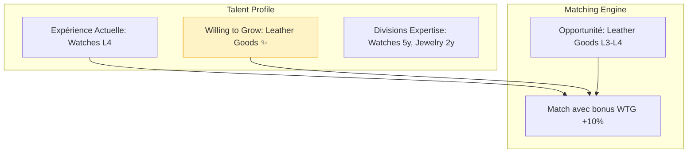
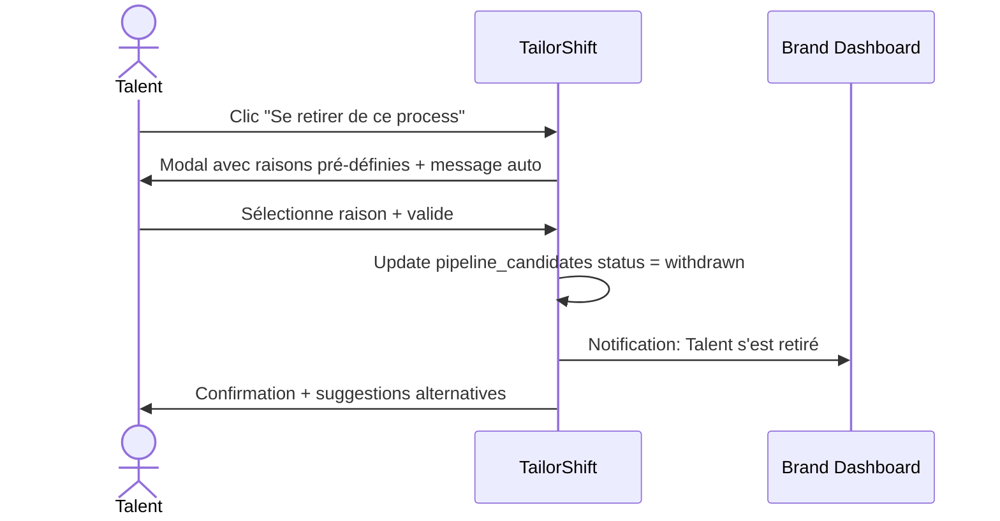
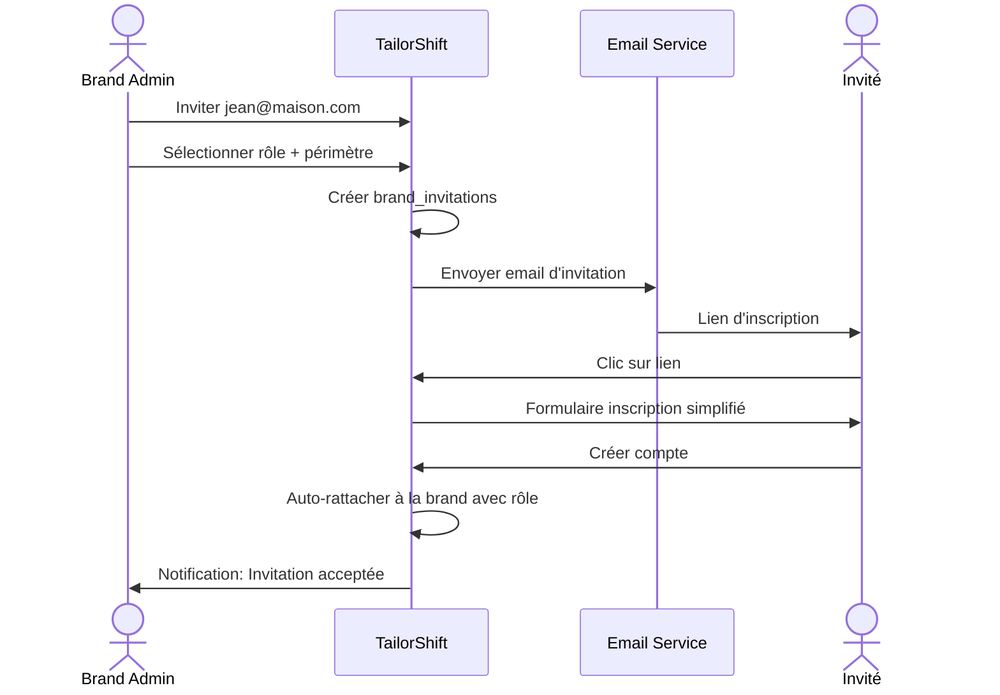
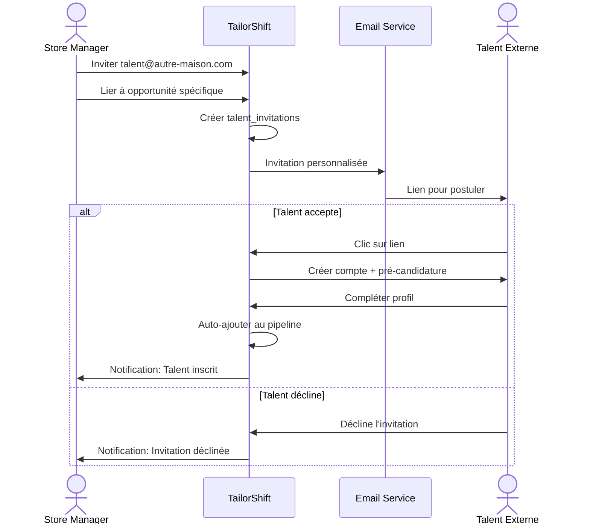

# TailorShift V8 Product Roadmap — Optimized Edition

> **Document de référence** : `PRODUCT_ROADMAP_V8.md`
> 
> Ce document centralise la vision produit V8, les fonctionnalités implémentées et le backlog des évolutions futures de TailorShift.
> 
> **Dernière mise à jour** : 4 décembre 2025
> **Version** : 3.0 (Optimized Edition)

---

## Vision V8 : Simplification & Scalabilité

```
┌─────────────────────────────────────────────────────────────────────────────┐
│                          VISION V8 TAILORSHIFT                               │
│                                                                              │
│    "Simplifier sans appauvrir — Optimiser sans complexifier"                │
│                                                                              │
│    ┌─────────────┐    ┌─────────────┐    ┌─────────────┐                    │
│    │   UX/UI     │    │   SYSTEM    │    │  DATABASE   │                    │
│    │ Simplifiée  │───▶│   Logic     │───▶│ Optimisée   │                    │
│    │             │    │ Simplifiée  │    │             │                    │
│    └─────────────┘    └─────────────┘    └─────────────┘                    │
│           │                  │                  │                            │
│           └──────────────────┼──────────────────┘                            │
│                              ▼                                               │
│                    ┌─────────────────┐                                       │
│                    │  Richesse       │                                       │
│                    │  Fonctionnelle  │                                       │
│                    │  Préservée      │                                       │
│                    └─────────────────┘                                       │
└─────────────────────────────────────────────────────────────────────────────┘
```

---

## Vue d'Ensemble — Statut des Initiatives

### ✅ Implémenté (V7.x)

| Initiative | Statut | Phase | Documentation |
|------------|--------|-------|---------------|
| Brand Domain Validation & RBAC | ✅ Complété | V7.1 | [Section 1](#1-brand-rbac) |
| Compensation Collection (7 champs) | ✅ Complété | V7.1 | [`COMPENSATION_COLLECTION_ARCHITECTURE.md`](./COMPENSATION_COLLECTION_ARCHITECTURE.md) |
| TailorShift Academy — No Experience Path | ✅ Complété | V7.2 | [Section 2](#2-academy-base) |
| Academy Waitlist & Database | ✅ Complété | V7.2 | [`PHASE2_ACADEMY_ARCHITECTURE.md`](./PHASE2_ACADEMY_ARCHITECTURE.md) |

### 🚀 Nouvelles Initiatives V8

| Initiative | Priorité | Complexité | Valeur Business | Section |
|------------|----------|------------|-----------------|---------|
| **Academy Extension — Willing to Grow** | 🔥 Haute | Moyenne | Haute | [Section 3](#3-academy-willing-to-grow) |
| **Talent Report Generation (3 niveaux)** | 🔥 Haute | Moyenne | Haute | [Section 4](#4-talent-reports) |
| **Talent Application Withdrawal** | 📊 Moyenne | Basse | Moyenne | [Section 5](#5-application-withdrawal) |
| **Brand Team Invitation System** | 🔥 Haute | Moyenne | Haute | [Section 6](#6-brand-team-invitation) |
| **External Talent Invitation** | 📊 Moyenne | Moyenne | Haute | [Section 7](#7-external-talent-invitation) |
| **UX/UI Optimization Framework** | 🔥 Critique | Haute | Très Haute | [Section 8](#8-ux-optimization) |
| **Database & System Optimization** | 🔥 Critique | Haute | Infrastructure | [Section 9](#9-system-optimization) |

### ⏳ Backlog (Post-V8)

| Initiative | Priorité | Documentation |
|------------|----------|---------------|
| Système de Nudges & Engagement | Moyenne | [Section 10](#10-nudges) |
| Rapports & Micropaiements | Haute | [Section 11](#11-micropayments) |
| Brand Assessments Personnalisés | Moyenne | [Section 12](#12-brand-assessments) |
| Monétisation Brands | Haute | [Section 13](#13-monetisation) |
| Talent Identity Verification | Basse | [Section 14](#14-identity-verification) |

---

## Table des Matières

**✅ Implémenté V7.x**
1. [Brand Domain Validation & RBAC](#1-brand-rbac)
2. [TailorShift Academy — Base (No Experience)](#2-academy-base)

**🚀 Nouvelles Fonctionnalités V8**
3. [Academy Extension — Willing to Grow](#3-academy-willing-to-grow)
4. [Talent Report Generation — 3 Niveaux](#4-talent-reports)
5. [Talent Application Withdrawal](#5-application-withdrawal)
6. [Brand Team Invitation System](#6-brand-team-invitation)
7. [External Talent Invitation](#7-external-talent-invitation)
8. [UX/UI Optimization Framework](#8-ux-optimization)
9. [Database & System Optimization](#9-system-optimization)

**⏳ Backlog Post-V8**
10. [Système de Nudges & Engagement](#10-nudges)
11. [Rapports & Micropaiements](#11-micropayments)
12. [Brand Assessments Personnalisés](#12-brand-assessments)
13. [Monétisation Brands](#13-monetisation)
14. [Talent Identity Verification](#14-identity-verification)

---

# ✅ FONCTIONNALITÉS IMPLÉMENTÉES (V7.x)

---

## 1. Brand Domain Validation & RBAC {#1-brand-rbac}

> **Statut** : ✅ Complété (4 décembre 2024)
> **Migration** : [`003_brand_rbac_system.sql`](../supabase/migrations/003_brand_rbac_system.sql)

### 1.1 Domain Validation System

Validation automatique des emails lors de l'onboarding brand :

| Type de domaine | Action | Exemples |
|-----------------|--------|----------|
| **Personal** | ❌ Rejeté | gmail.com, yahoo.com, hotmail.com |
| **Luxury Brand** | ✅ Auto-validé | lvmh.com, kering.com, hermes.com |
| **Corporate** | ⏳ Admin review | autre-entreprise.com |

### 1.2 Système RBAC (8 Rôles)

| Rôle | Permissions | Cas d'usage |
|------|-------------|-------------|
| `owner` | Toutes | Fondateur, CEO |
| `admin_global` | Toutes sauf ownership | Head of HR/IT |
| `admin_brand` | Gestion brand | Brand manager |
| `hr_global` | Recrutement + analytics | HR director |
| `hr_regional` | Recrutement région | Regional HR |
| `recruiter` | Recrutement basique | Store recruiters |
| `manager_store` | View + contact | Store managers |
| `viewer` | Read-only | Trainees, auditors |

**7 Permissions** : `manage_team`, `manage_brand_profile`, `create_opportunities`, `view_matches`, `contact_talents`, `view_analytics`, `manage_assessments`

**Fichiers** :
- [`lib/auth/brand-rbac.ts`](../lib/auth/brand-rbac.ts) — RBAC implementation
- [`app/brand/team/page.tsx`](../app/brand/team/page.tsx) — Team management UI

---

## 2. TailorShift Academy — Base (No Experience) {#2-academy-base}

> **Statut** : ✅ Complété (4 décembre 2024)
> **Migration** : [`004_academy_candidate_fields.sql`](../supabase/migrations/004_academy_candidate_fields.sql)
> **Architecture détaillée** : [`PHASE2_ACADEMY_ARCHITECTURE.md`](./PHASE2_ACADEMY_ARCHITECTURE.md)

### 2.1 Problème Résolu

Les talents **sans expérience retail** qui souhaitent intégrer le secteur luxe abandonnaient à Step 2.

### 2.2 Solution : Parcours L0 "New to Retail"

```
STEP 2: Professional
    │
    ├─── L1-L8 sélectionné ──→ Parcours Standard (6 steps)
    │
    └─── L0 "New to Retail" ──→ Parcours Academy (4 steps)
                                 → Academy Teaser → Dream Brands
                                 → Dashboard Waitlist
```

### 2.3 Schema Base de Données Academy

```sql
-- Champs sur talents
is_academy_candidate BOOLEAN DEFAULT FALSE
academy_status VARCHAR(30)  -- interested, waitlisted, enrolled, graduated
academy_interest_areas TEXT[]
academy_motivation TEXT

-- Table academy_waitlist
CREATE TABLE academy_waitlist (
  talent_id UUID REFERENCES talents(id),
  interest_areas TEXT[],
  motivation_text TEXT,
  status VARCHAR(30)  -- waitlisted, invited, accepted
);
```

---

# 🚀 NOUVELLES FONCTIONNALITÉS V8

---

## 3. Academy Extension — Willing to Grow {#3-academy-willing-to-grow}

> **Statut** : 🚀 À implémenter
> **Priorité** : Haute
> **Complexité** : Moyenne
> **Valeur** : Capture de profils expérimentés cherchant à évoluer

### 3.1 Problème Identifié

Un talent expérimenté Watches & Jewelry (L4) souhaite évoluer vers Leather Goods. Aujourd'hui, il doit :
1. Attendre qu'une opportunité cross-division apparaisse
2. Postuler sans signal clair de sa motivation
3. Être évalué uniquement sur son expérience actuelle

**Opportunité** : Labelliser et exposer ces profils "Willing to Grow" aux marques qui valorisent la mobilité inter-divisions.

### 3.2 Concept : "Willing to Grow" Label



### 3.3 User Experience — Talent Side

**Step ajouté au profil (optionnel) :**

```
┌─────────────────────────────────────────────────────────────────────┐
│  ENVIE D'ÉVOLUER VERS UNE NOUVELLE DIVISION ?                       │
│                                                                     │
│  Indiquez les divisions qui vous intéressent pour votre prochaine  │
│  étape de carrière. Les marques verront que vous êtes ouvert.      │
│                                                                     │
│  ┌─────────────────────────────────────────────────────────────┐   │
│  │  Divisions actuelles (expérience):                          │   │
│  │  ✅ Watches & Jewelry (5 ans)                               │   │
│  │  ✅ Fashion (2 ans)                                         │   │
│  └─────────────────────────────────────────────────────────────┘   │
│                                                                     │
│  ┌─────────────────────────────────────────────────────────────┐   │
│  │  🌱 Willing to Grow — Nouvelles divisions souhaitées:       │   │
│  │                                                              │   │
│  │  [ ] Fashion & Ready-to-Wear                                 │   │
│  │  [✓] Leather Goods & Accessories ←── "Je veux apprendre"    │   │
│  │  [ ] Beauty & Fragrance                                      │   │
│  │  [ ] Watches & Jewelry                                       │   │
│  │  [ ] Hospitality & Client Experience                         │   │
│  └─────────────────────────────────────────────────────────────┘   │
│                                                                     │
│  💡 Optionnel : Pourquoi cette division vous attire ?               │
│  ┌───────────────────────────────────────────────────────────────┐ │
│  │ J'ai toujours admiré l'artisanat de la maroquinerie...        │ │
│  └───────────────────────────────────────────────────────────────┘ │
│                                                                     │
└─────────────────────────────────────────────────────────────────────┘
```

### 3.4 User Experience — Brand Side

**Dans la vue candidat :**

```
┌─────────────────────────────────────────────────────────────────────┐
│  MARIE D. — Senior Sales Associate (L2)                             │
│                                                                     │
│  📍 Paris  •  5 ans expérience  •  Match: 87%                       │
│                                                                     │
│  ┌─────────────────────────────────────────────────────────────┐   │
│  │  EXPERTISE                                                   │   │
│  │  ████████████████████████ Watches & Jewelry (5y)             │   │
│  │  ██████████████           Fashion (2y)                       │   │
│  └─────────────────────────────────────────────────────────────┘   │
│                                                                     │
│  ┌─────────────────────────────────────────────────────────────┐   │
│  │  🌱 WILLING TO GROW                                          │   │
│  │                                                              │   │
│  │  → Leather Goods & Accessories                               │   │
│  │                                                              │   │
│  │  "J'ai toujours admiré l'artisanat de la maroquinerie..."   │   │
│  └─────────────────────────────────────────────────────────────┘   │
│                                                                     │
│  [Voir profil complet]  [Contacter]  [Ajouter au pipeline]         │
│                                                                     │
└─────────────────────────────────────────────────────────────────────┘
```

### 3.5 Schema Base de Données

```sql
-- Migration: 005_willing_to_grow.sql

-- Nouveaux champs sur talents
ALTER TABLE talents ADD COLUMN IF NOT EXISTS 
  willing_to_grow_divisions TEXT[] DEFAULT '{}';

ALTER TABLE talents ADD COLUMN IF NOT EXISTS 
  willing_to_grow_motivation TEXT;

ALTER TABLE talents ADD COLUMN IF NOT EXISTS 
  willing_to_grow_declared_at TIMESTAMP WITH TIME ZONE;

-- Index pour matching
CREATE INDEX idx_talents_willing_to_grow 
  ON talents USING GIN (willing_to_grow_divisions)
  WHERE array_length(willing_to_grow_divisions, 1) > 0;

-- Commentaires
COMMENT ON COLUMN talents.willing_to_grow_divisions IS 
  'Divisions the talent wants to develop into - used for extended matching';
```

### 3.6 Impact sur le Matching

```typescript
// lib/matching/willing-to-grow-scorer.ts

interface WillingToGrowScore {
  bonus: number           // 0-15%
  label: 'exact_match' | 'willing_to_grow' | 'no_match'
  motivation?: string
}

function calculateWillingToGrowBonus(
  talentDivisions: string[],        // Expérience actuelle
  willingToGrow: string[],          // Divisions souhaitées
  opportunityDivision: string       // Division de l'opportunité
): WillingToGrowScore {
  
  // Cas 1: Match exact avec expérience existante
  if (talentDivisions.includes(opportunityDivision)) {
    return { bonus: 0, label: 'exact_match' }
  }
  
  // Cas 2: Willing to Grow match
  if (willingToGrow.includes(opportunityDivision)) {
    return { 
      bonus: 10, // +10% au score de matching
      label: 'willing_to_grow',
      motivation: 'Motivation déclarée pour cette division'
    }
  }
  
  // Cas 3: Pas de match
  return { bonus: 0, label: 'no_match' }
}
```

### 3.7 Filtres Brand Dashboard

Ajout de filtres pour identifier les profils "Willing to Grow" :

| Filtre | Description |
|--------|-------------|
| `Expérience exacte` | Profils avec expérience dans la division |
| `Willing to Grow` | Profils motivés à découvrir la division |
| `Tous les profils` | Combinaison des deux |

---

## 4. Talent Report Generation — 3 Niveaux de Confidentialité {#4-talent-reports}

> **Statut** : 🚀 À implémenter
> **Priorité** : Haute
> **Complexité** : Moyenne
> **Valeur** : Monétisation B2C + Outil de candidature

### 4.1 Objectif

Permettre aux talents de générer un rapport PDF professionnel avec 3 niveaux de confidentialité pour partager avec des recruteurs ou pour usage personnel.

### 4.2 Les 3 Niveaux de Confidentialité

```mermaid
flowchart LR
    subgraph Public[🌐 PUBLIC]
        P1[Prénom + Initiale]
        P2[Niveau de rôle]
        P3[Divisions expertise]
        P4[Score 6D global]
    end
    
    subgraph Standard[📋 STANDARD]
        S1[Nom complet]
        S2[Localisation ville]
        S3[Expériences détaillées]
        S4[Scores 6D par dimension]
        S5[Dream Brands]
    end
    
    subgraph Complete[🔐 COMPLET]
        C1[Toutes les données]
        C2[Numéro téléphone]
        C3[LinkedIn]
        C4[Rémunération]
        C5[Notation interne]
    end
    
    Public --> Standard --> Complete
```



### 4.3 Matrice des Données par Niveau

| Donnée | 🌐 Public | 📋 Standard | 🔐 Complet |
|--------|:---------:|:-----------:|:----------:|
| **Identité** |
| Prénom + Initiale | ✅ | ✅ | ✅ |
| Nom complet | ❌ | ✅ | ✅ |
| Photo | ❌ | ✅ | ✅ |
| Téléphone | ❌ | ❌ | ✅ |
| Email | ❌ | ❌ | ✅ |
| LinkedIn | ❌ | ❌ | ✅ |
| **Localisation** |
| Pays | ✅ | ✅ | ✅ |
| Ville | ❌ | ✅ | ✅ |
| Mobilité géographique | ✅ | ✅ | ✅ |
| **Expérience** |
| Années d'expérience | ✅ | ✅ | ✅ |
| Niveau de rôle (L1-L8) | ✅ | ✅ | ✅ |
| Divisions expertise | ✅ | ✅ | ✅ |
| Maisons précédentes | ❌ | ✅ | ✅ |
| Dates et détails | ❌ | ✅ | ✅ |
| **Assessment 6D** |
| Score global | ✅ | ✅ | ✅ |
| Radar 6 dimensions | ❌ | ✅ | ✅ |
| Sous-scores détaillés | ❌ | ❌ | ✅ |
| Recommandations | ❌ | ❌ | ✅ |
| **Rémunération** |
| Fourchette actuelle | ❌ | ❌ | ✅ |
| Attentes | ❌ | ❌ | ✅ |
| Benchmarks marché | ❌ | ❌ | ✅ |
| **Préférences** |
| Dream Brands | ❌ | ✅ | ✅ |
| Willing to Grow | ❌ | ✅ | ✅ |
| Disponibilité | ❌ | ✅ | ✅ |

### 4.4 User Interface — Génération du Rapport

```
┌─────────────────────────────────────────────────────────────────────┐
│  📄 GÉNÉRER MON RAPPORT DE PROFIL                                   │
│                                                                     │
│  Créez un PDF professionnel à partager avec les recruteurs.        │
│                                                                     │
│  ─────────────────────────────────────────────────────────────────  │
│                                                                     │
│  NIVEAU DE CONFIDENTIALITÉ                                          │
│                                                                     │
│  ┌───────────────────┐  ┌───────────────────┐  ┌─────────────────┐ │
│  │   🌐 PUBLIC       │  │  📋 STANDARD      │  │  🔐 COMPLET     │ │
│  │                   │  │                   │  │                 │ │
│  │  Informations     │  │  Profil détaillé  │  │  Toutes les     │ │
│  │  générales        │  │  sans contact     │  │  informations   │ │
│  │                   │  │                   │  │                 │ │
│  │  Idéal pour:      │  │  Idéal pour:      │  │  Idéal pour:    │ │
│  │  Réseaux,         │  │  Candidatures     │  │  Process        │ │
│  │  networking       │  │  initiales        │  │  avancé         │ │
│  │                   │  │                   │  │                 │ │
│  │     [ ○ ]         │  │     [●]           │  │     [ ○ ]       │ │
│  └───────────────────┘  └───────────────────┘  └─────────────────┘ │
│                                                                     │
│  ─────────────────────────────────────────────────────────────────  │
│                                                                     │
│  PRÉVISUALISATION                                                   │
│  ┌─────────────────────────────────────────────────────────────┐   │
│  │                                                              │   │
│  │  [Aperçu PDF miniature]                                      │   │
│  │                                                              │   │
│  │  8 pages • Mis à jour le 4 déc. 2025                        │   │
│  │                                                              │   │
│  └─────────────────────────────────────────────────────────────┘   │
│                                                                     │
│  ─────────────────────────────────────────────────────────────────  │
│                                                                     │
│  LANGUE DU RAPPORT                                                  │
│  [🇫🇷 Français ▼]                                                   │
│                                                                     │
│                    [Prévisualiser]  [📥 Télécharger PDF]            │
│                                                                     │
└─────────────────────────────────────────────────────────────────────┘
```

### 4.5 Structure du Rapport PDF

```
┌─────────────────────────────────────────┐
│           TAILORSHIFT PROFILE           │
│                                         │
│  ┌─────┐  MARIE D.                      │
│  │Photo│  Senior Sales Associate (L2)   │
│  └─────┘  Paris, France                 │
│           5 ans expérience luxe         │
│                                         │
├─────────────────────────────────────────┤
│  📊 ASSESSMENT 6D                       │
│                                         │
│        Service Excellence               │
│              ████████ 78%               │
│        Leadership                       │
│              ██████ 62%                 │
│        [Radar chart]                    │
│                                         │
├─────────────────────────────────────────┤
│  💼 EXPÉRIENCE PROFESSIONNELLE          │
│                                         │
│  Louis Vuitton    2022-2024             │
│  Sales Associate                        │
│  - Client development...                │
│                                         │
├─────────────────────────────────────────┤
│  🎯 DIVISIONS & WILLING TO GROW         │
│                                         │
│  Expert: Watches & Jewelry              │
│  Interested: Leather Goods              │
│                                         │
├─────────────────────────────────────────┤
│  Généré par TailorShift                 │
│  4 décembre 2025                        │
└─────────────────────────────────────────┘
```

### 4.6 Implementation Technique

```typescript
// lib/reports/talent-report-generator.ts

type ReportLevel = 'public' | 'standard' | 'complete'

interface ReportConfig {
  level: ReportLevel
  language: 'fr' | 'en'
  includeAssessment: boolean
  includeSalary: boolean
}

interface ReportData {
  identity: Partial<TalentIdentity>
  experience: Partial<ExperienceBlock>[]
  assessment: Partial<AssessmentResult>
  preferences: Partial<TalentPreferences>
}

function filterDataByLevel(
  talent: Talent,
  level: ReportLevel
): ReportData {
  const filters = LEVEL_FILTERS[level]
  
  return {
    identity: pickFields(talent, filters.identity),
    experience: talent.experiences.map(e => pickFields(e, filters.experience)),
    assessment: pickFields(talent.assessment, filters.assessment),
    preferences: pickFields(talent.preferences, filters.preferences)
  }
}

async function generatePDF(
  talentId: string,
  config: ReportConfig
): Promise<Buffer> {
  const talent = await fetchTalent(talentId)
  const data = filterDataByLevel(talent, config.level)
  
  // Generate PDF with React-PDF or Puppeteer
  return renderToPDF(data, config)
}
```

### 4.7 Schema Base de Données

```sql
-- Table pour tracker les rapports générés
CREATE TABLE talent_reports (
  id UUID PRIMARY KEY DEFAULT gen_random_uuid(),
  talent_id UUID NOT NULL REFERENCES talents(id),
  level VARCHAR(20) NOT NULL,  -- public, standard, complete
  language VARCHAR(5) DEFAULT 'fr',
  generated_at TIMESTAMP WITH TIME ZONE DEFAULT NOW(),
  download_count INTEGER DEFAULT 0,
  share_token VARCHAR(100) UNIQUE,  -- Pour partage via lien
  share_expires_at TIMESTAMP WITH TIME ZONE
);
```

---

## 5. Talent Application Withdrawal {#5-application-withdrawal}

> **Statut** : 🚀 À implémenter
> **Priorité** : Moyenne
> **Complexité** : Basse
> **Valeur** : Amélioration UX + Qualité des données pipeline

### 5.1 Objectif

Permettre à un talent de se retirer d'un process de candidature de manière autonome, avec un message pré-rédigé dans la langue du compte, tout en laissant un feedback constructif.

### 5.2 Flow de Withdrawal



### 5.3 Interface Utilisateur

```
┌─────────────────────────────────────────────────────────────────────┐
│  SE RETIRER DE CETTE CANDIDATURE                                    │
│                                                                     │
│  Vous êtes sur le point de vous retirer du process pour :          │
│  Sales Associate — Dior — Paris                                     │
│                                                                     │
│  ─────────────────────────────────────────────────────────────────  │
│                                                                     │
│  RAISON DU RETRAIT (optionnel mais apprécié)                       │
│                                                                     │
│  ○  J'ai accepté une autre opportunité                              │
│  ○  Le poste ne correspond plus à mes attentes                      │
│  ○  Raisons personnelles                                            │
│  ○  Le délai de process est trop long                               │
│  ○  Autre raison                                                    │
│                                                                     │
│  ─────────────────────────────────────────────────────────────────  │
│                                                                     │
│  MESSAGE À LA MARQUE                                                │
│  ┌─────────────────────────────────────────────────────────────┐   │
│  │ Bonjour,                                                     │   │
│  │                                                              │   │
│  │ Je vous remercie pour l'intérêt porté à ma candidature.     │   │
│  │ Je souhaite me retirer de ce process car [raison].          │   │
│  │                                                              │   │
│  │ Je reste disponible pour de futures opportunités.           │   │
│  │                                                              │   │
│  │ Cordialement,                                                │   │
│  │ Marie D.                                                     │   │
│  └─────────────────────────────────────────────────────────────┘   │
│  [Personnaliser le message]                                         │
│                                                                     │
│  ─────────────────────────────────────────────────────────────────  │
│                                                                     │
│  ⚠️ Cette action est définitive pour cette opportunité.             │
│                                                                     │
│            [Annuler]               [Confirmer le retrait]           │
│                                                                     │
└─────────────────────────────────────────────────────────────────────┘
```

### 5.4 Messages Pré-rédigés par Langue

```typescript
// lib/i18n/withdrawal-messages.ts

const WITHDRAWAL_MESSAGES = {
  fr: {
    accepted_other: `Bonjour,

Je vous remercie pour l'intérêt porté à ma candidature pour le poste de {position}.

Je souhaite me retirer de ce process car j'ai accepté une autre opportunité qui correspond davantage à mon projet professionnel actuel.

Je reste toutefois disponible pour de futures opportunités au sein de votre maison.

Cordialement,
{name}`,

    position_mismatch: `Bonjour,

Je vous remercie pour l'intérêt porté à ma candidature pour le poste de {position}.

Après réflexion, je souhaite me retirer de ce process car les responsabilités du poste ne correspondent plus à mes attentes.

Je reste toutefois disponible pour de futures opportunités.

Cordialement,
{name}`,

    // ... autres raisons
  },
  
  en: {
    accepted_other: `Dear Hiring Team,

Thank you for considering my application for the {position} role.

I would like to withdraw from this process as I have accepted another opportunity that better aligns with my current career goals.

I remain open to future opportunities within your maison.

Best regards,
{name}`,
    // ...
  }
}
```

### 5.5 Schema Base de Données

```sql
-- Ajout de champs sur pipeline_candidates
ALTER TABLE pipeline_candidates
ADD COLUMN withdrawal_reason VARCHAR(50),
ADD COLUMN withdrawal_message TEXT,
ADD COLUMN withdrawn_at TIMESTAMP WITH TIME ZONE;

-- Enum pour les raisons
-- accepted_other, position_mismatch, personal_reasons, process_too_long, other
```

### 5.6 Impact Analytics

Tracking des raisons de withdrawal pour insights :

| Métrique | Usage |
|----------|-------|
| Taux de withdrawal par étape | Identifier les bottlenecks du process |
| Raisons les plus fréquentes | Améliorer les offres |
| Temps moyen avant withdrawal | Optimiser la durée des process |

---

## 6. Brand Team Invitation System {#6-brand-team-invitation}

> **Statut** : 🚀 À implémenter
> **Priorité** : Haute
> **Complexité** : Moyenne
> **Valeur** : Scalabilité des équipes brand

### 6.1 Objectif

Permettre aux administrateurs de marque d'inviter des collègues internes à rejoindre la plateforme avec un rôle et un périmètre spécifiques.

### 6.2 Flow d'Invitation



### 6.3 Interface Admin — Inviter un Membre

```
┌─────────────────────────────────────────────────────────────────────┐
│  👥 GESTION DE L'ÉQUIPE                    [+ Inviter un membre]   │
│                                                                     │
│  ─────────────────────────────────────────────────────────────────  │
│                                                                     │
│  MEMBRES ACTIFS (4)                                                 │
│                                                                     │
│  ┌───────────────────────────────────────────────────────────────┐ │
│  │ 👤 Marie D.      HR Director       admin_global    Active     │ │
│  │ 👤 Jean P.       Recruiter Paris   hr_regional     Active     │ │
│  │ 👤 Sophie M.     Store Manager     manager_store   Active     │ │
│  │ 👤 Lucas R.      Trainee          viewer          Active      │ │
│  └───────────────────────────────────────────────────────────────┘ │
│                                                                     │
│  INVITATIONS EN ATTENTE (2)                                         │
│                                                                     │
│  ┌───────────────────────────────────────────────────────────────┐ │
│  │ ✉️ paul@maison.com    recruiter    Envoyée le 3 déc.  [Relancer]│ │
│  │ ✉️ anna@maison.com    viewer       Envoyée le 2 déc.  [Annuler] │ │
│  └───────────────────────────────────────────────────────────────┘ │
│                                                                     │
└─────────────────────────────────────────────────────────────────────┘
```

### 6.4 Modal d'Invitation

```
┌─────────────────────────────────────────────────────────────────────┐
│  INVITER UN NOUVEAU MEMBRE                                    [×]  │
│                                                                     │
│  EMAIL PROFESSIONNEL *                                              │
│  ┌─────────────────────────────────────────────────────────────┐   │
│  │ prenom.nom@maison.com                                       │   │
│  └─────────────────────────────────────────────────────────────┘   │
│  ℹ️ Doit correspondre au domaine de votre maison                    │
│                                                                     │
│  ─────────────────────────────────────────────────────────────────  │
│                                                                     │
│  RÔLE *                                                             │
│  ┌─────────────────────────────────────────────────────────────┐   │
│  │ Sélectionner un rôle                                    ▼   │   │
│  ├─────────────────────────────────────────────────────────────┤   │
│  │ 👑 Admin Global — Gestion complète                          │   │
│  │ 📊 HR Global — Recrutement + analytics                      │   │
│  │ 📍 HR Régional — Recrutement régional                       │   │
│  │ 👔 Recruteur — Recrutement opérationnel                     │   │
│  │ 🏪 Manager Boutique — Vue candidats + contact               │   │
│  │ 👁️ Viewer — Lecture seule                                   │   │
│  └─────────────────────────────────────────────────────────────┘   │
│                                                                     │
│  ─────────────────────────────────────────────────────────────────  │
│                                                                     │
│  PÉRIMÈTRE (pour rôles régionaux)                                   │
│                                                                     │
│  Régions:      [France ▼] [Suisse ▼] [+ Ajouter]                   │
│  Divisions:    [Toutes ▼]                                           │
│  Boutiques:    [Toutes ▼]                                           │
│                                                                     │
│  ─────────────────────────────────────────────────────────────────  │
│                                                                     │
│  MESSAGE PERSONNALISÉ (optionnel)                                   │
│  ┌─────────────────────────────────────────────────────────────┐   │
│  │ Bienvenue dans l'équipe recrutement...                      │   │
│  └─────────────────────────────────────────────────────────────┘   │
│                                                                     │
│              [Annuler]                      [Envoyer l'invitation]  │
│                                                                     │
└─────────────────────────────────────────────────────────────────────┘
```

### 6.5 Schema Base de Données

```sql
-- Table brand_invitations (existante, à enrichir)
CREATE TABLE IF NOT EXISTS brand_invitations (
  id UUID PRIMARY KEY DEFAULT gen_random_uuid(),
  brand_id UUID NOT NULL REFERENCES brands(id) ON DELETE CASCADE,
  email VARCHAR(255) NOT NULL,
  role VARCHAR(30) NOT NULL,
  role_scope JSONB DEFAULT '{}',
  
  -- Statut
  status VARCHAR(20) DEFAULT 'pending',
  -- pending, accepted, declined, expired, cancelled
  
  -- Tracking
  invited_by UUID REFERENCES profiles(id),
  invited_at TIMESTAMP WITH TIME ZONE DEFAULT NOW(),
  expires_at TIMESTAMP WITH TIME ZONE DEFAULT (NOW() + INTERVAL '7 days'),
  
  -- Token sécurisé
  invitation_token VARCHAR(100) UNIQUE NOT NULL,
  
  -- Résultat
  accepted_at TIMESTAMP WITH TIME ZONE,
  accepted_by UUID REFERENCES profiles(id),
  
  -- Contraintes
  UNIQUE(brand_id, email)
);

-- Index
CREATE INDEX idx_invitations_token ON brand_invitations(invitation_token);
CREATE INDEX idx_invitations_status ON brand_invitations(status);
```

### 6.6 Validation du Domaine Email

**Règle critique** : L'email invité doit correspondre au domaine validé de la marque.

```typescript
// lib/auth/invitation-validation.ts

async function validateInvitationEmail(
  email: string,
  brandId: string
): Promise<{ valid: boolean; reason?: string }> {
  const brand = await getBrand(brandId)
  const emailDomain = email.split('@')[1]
  
  // Vérifier que le domaine correspond
  if (!brand.validated_domains.includes(emailDomain)) {
    return {
      valid: false,
      reason: `L'email doit appartenir au domaine ${brand.validated_domains.join(' ou ')}`
    }
  }
  
  return { valid: true }
}
```

### 6.7 Permissions pour Inviter

| Rôle | Peut inviter | Rôles disponibles |
|------|-------------|-------------------|
| `owner` | ✅ | Tous les rôles |
| `admin_global` | ✅ | Tous sauf owner |
| `admin_brand` | ✅ | hr_regional, recruiter, manager_store, viewer |
| `hr_global` | ❌ | — |
| Autres | ❌ | — |

---

## 7. External Talent Invitation {#7-external-talent-invitation}

> **Statut** : 🚀 À implémenter
> **Priorité** : Moyenne
> **Complexité** : Moyenne
> **Valeur** : Acquisition de talents ciblés

### 7.1 Objectif

Permettre aux utilisateurs brand (store managers, recruiters) d'inviter un talent externe à postuler sur une opportunité spécifique, même s'il n'est pas encore inscrit sur TailorShift.

### 7.2 Cas d'Usage

> *"Jean, Store Manager chez Hermès Paris, rencontre Marie lors d'un événement. Marie travaille chez Chanel et serait parfaite pour une opportunité. Jean l'invite à candidater via TailorShift."*

### 7.3 Flow d'Invitation Talent Externe



### 7.4 Interface — Inviter un Talent Externe

**Depuis la page opportunité :**

```
┌─────────────────────────────────────────────────────────────────────┐
│  SALES ASSOCIATE — HERMÈS PARIS               [Inviter un talent]  │
│                                                                     │
│  ─────────────────────────────────────────────────────────────────  │
│                                                                     │
│  PIPELINE (12 candidats)                                            │
│  ...                                                                │
└─────────────────────────────────────────────────────────────────────┘
```

**Modal d'invitation :**

```
┌─────────────────────────────────────────────────────────────────────┐
│  INVITER UN TALENT À POSTULER                                 [×]  │
│                                                                     │
│  Invitez un talent que vous avez rencontré à postuler sur cette    │
│  opportunité via TailorShift.                                       │
│                                                                     │
│  ─────────────────────────────────────────────────────────────────  │
│                                                                     │
│  EMAIL DU TALENT *                                                  │
│  ┌─────────────────────────────────────────────────────────────┐   │
│  │ marie.dupont@chanel.com                                     │   │
│  └─────────────────────────────────────────────────────────────┘   │
│                                                                     │
│  PRÉNOM *                           NOM (optionnel)                 │
│  ┌─────────────────────┐            ┌─────────────────────┐        │
│  │ Marie               │            │ Dupont              │        │
│  └─────────────────────┘            └─────────────────────┘        │
│                                                                     │
│  ─────────────────────────────────────────────────────────────────  │
│                                                                     │
│  MESSAGE PERSONNALISÉ                                               │
│  ┌─────────────────────────────────────────────────────────────┐   │
│  │ Bonjour Marie,                                              │   │
│  │                                                              │   │
│  │ Suite à notre rencontre lors de [événement], je souhaitais  │   │
│  │ vous inviter à découvrir cette opportunité chez Hermès.     │   │
│  │                                                              │   │
│  │ TailorShift vous permettra de postuler de manière           │   │
│  │ confidentielle et de valoriser votre parcours.              │   │
│  │                                                              │   │
│  │ Bien cordialement,                                          │   │
│  │ Jean P.                                                     │   │
│  └─────────────────────────────────────────────────────────────┘   │
│                                                                     │
│  ─────────────────────────────────────────────────────────────────  │
│                                                                     │
│  ℹ️ Le talent verra uniquement cette opportunité jusqu'à son        │
│     inscription complète. Son profil restera confidentiel.         │
│                                                                     │
│              [Annuler]                      [Envoyer l'invitation]  │
│                                                                     │
└─────────────────────────────────────────────────────────────────────┘
```

### 7.5 Email Reçu par le Talent

```
┌─────────────────────────────────────────────────────────────────────┐
│  📧 TailorShift                                                     │
│                                                                     │
│  Objet: Jean de Hermès vous invite à découvrir une opportunité     │
│                                                                     │
│  ─────────────────────────────────────────────────────────────────  │
│                                                                     │
│  Bonjour Marie,                                                     │
│                                                                     │
│  Jean P., Store Manager chez Hermès Paris, vous invite à           │
│  découvrir une opportunité sur TailorShift :                        │
│                                                                     │
│  ┌─────────────────────────────────────────────────────────────┐   │
│  │  SALES ASSOCIATE                                             │   │
│  │  Hermès — Paris 8ème                                         │   │
│  │                                                              │   │
│  │  "Suite à notre rencontre lors de [événement]..."           │   │
│  └─────────────────────────────────────────────────────────────┘   │
│                                                                     │
│              [Découvrir l'opportunité et postuler]                  │
│                                                                     │
│  ─────────────────────────────────────────────────────────────────  │
│                                                                     │
│  TailorShift est la plateforme de référence pour les carrières     │
│  dans le retail luxe. Votre profil et candidature restent          │
│  100% confidentiels.                                                │
│                                                                     │
│  Cette invitation expire dans 14 jours.                             │
│                                                                     │
│  Si vous n'êtes pas intéressé:                                      │
│  [Décliner l'invitation]                                            │
│                                                                     │
└─────────────────────────────────────────────────────────────────────┘
```

### 7.6 Schema Base de Données

```sql
-- Table talent_invitations (nouvelle)
CREATE TABLE talent_invitations (
  id UUID PRIMARY KEY DEFAULT gen_random_uuid(),
  
  -- Qui invite
  brand_id UUID NOT NULL REFERENCES brands(id),
  invited_by UUID NOT NULL REFERENCES profiles(id),
  opportunity_id UUID REFERENCES opportunities(id),
  
  -- Talent invité
  email VARCHAR(255) NOT NULL,
  first_name VARCHAR(100),
  last_name VARCHAR(100),
  personal_message TEXT,
  
  -- Statut
  status VARCHAR(20) DEFAULT 'pending',
  -- pending, viewed, accepted, declined, expired
  
  -- Tracking
  invitation_token VARCHAR(100) UNIQUE NOT NULL,
  created_at TIMESTAMP WITH TIME ZONE DEFAULT NOW(),
  expires_at TIMESTAMP WITH TIME ZONE DEFAULT (NOW() + INTERVAL '14 days'),
  viewed_at TIMESTAMP WITH TIME ZONE,
  responded_at TIMESTAMP WITH TIME ZONE,
  
  -- Résultat
  talent_id UUID REFERENCES talents(id),  -- Rempli si accepté
  
  UNIQUE(opportunity_id, email)
);

-- Index
CREATE INDEX idx_talent_inv_token ON talent_invitations(invitation_token);
CREATE INDEX idx_talent_inv_opp ON talent_invitations(opportunity_id);
```

### 7.7 Permissions

| Rôle | Peut inviter talents externes |
|------|------------------------------|
| `owner` | ✅ |
| `admin_global` | ✅ |
| `admin_brand` | ✅ |
| `hr_global` | ✅ |
| `hr_regional` | ✅ (dans son périmètre) |
| `recruiter` | ✅ (sur ses opportunités) |
| `manager_store` | ✅ (sur ses opportunités) |
| `viewer` | ❌ |

---

## 8. UX/UI Optimization Framework {#8-ux-optimization}

> **Statut** : 🚀 À implémenter
> **Priorité** : Critique
> **Complexité** : Haute
> **Valeur** : Très Haute

### 8.1 Principes Directeurs

```
┌─────────────────────────────────────────────────────────────────────┐
│          PHILOSOPHIE D'OPTIMISATION V8                              │
│                                                                     │
│       Complexité fonctionnelle ≠ Complexité perçue                 │
│                                                                     │
│   ┌───────────────┐                      ┌───────────────┐          │
│   │   AVANT       │        →             │   APRÈS       │          │
│   │               │                      │               │          │
│   │  6 écrans     │                      │  3 écrans     │          │
│   │  15 champs    │                      │  7 champs     │          │
│   │  12 clics     │                      │  5 clics      │          │
│   │               │                      │               │          │
│   │  Même data    │                      │  Même data    │          │
│   │  collectée    │                      │  collectée    │          │
│   └───────────────┘                      └───────────────┘          │
│                                                                     │
└─────────────────────────────────────────────────────────────────────┘
```

### 8.2 Audit des Parcours Critiques

| Parcours | Écrans Actuels | Cible V8 | Temps Actuel | Cible V8 |
|----------|----------------|----------|--------------|----------|
| Talent Onboarding | 6 steps | 4 steps | ~8 min | ~4 min |
| Brand Onboarding | 4 steps | 2 steps | ~5 min | ~3 min |
| Créer Opportunité | 3 écrans | 1 écran | ~10 min | ~5 min |
| Postuler | 4 clics | 2 clics | ~2 min | ~30 sec |
| Contacter talent | 3 clics | 1 clic | ~1 min | ~10 sec |

### 8.3 Stratégies d'Optimisation

#### 8.3.1 Progressive Disclosure

```
┌─────────────────────────────────────────────────────────────────────┐
│  AVANT: Tout montrer                                                │
│  ━━━━━━━━━━━━━━━━━━━━━━━━━━━━━━━━━━━━━━━━━━━━━━━━━━━━━━━━━━━━━━━━  │
│                                                                     │
│  ┌─────────────────────────────────────────────────────────────┐   │
│  │  Nom *                    Prénom *                          │   │
│  │  Email *                  Téléphone *                       │   │
│  │  LinkedIn                 Portfolio                         │   │
│  │  Adresse                  Code postal                       │   │
│  │  Ville                    Pays                              │   │
│  │  Mobilité                 Disponibilité                     │   │
│  │  ... 20 champs visibles                                     │   │
│  └─────────────────────────────────────────────────────────────┘   │
│                                                                     │
│  ═══════════════════════════════════════════════════════════════   │
│                                                                     │
│  APRÈS: Progressive Disclosure                                      │
│  ━━━━━━━━━━━━━━━━━━━━━━━━━━━━━━━━━━━━━━━━━━━━━━━━━━━━━━━━━━━━━━━━  │
│                                                                     │
│  ┌─────────────────────────────────────────────────────────────┐   │
│  │  Nom *                    Prénom *                          │   │
│  │  Email *                  Téléphone *                       │   │
│  │                                                              │   │
│  │  [+ Ajouter LinkedIn]                                       │   │
│  │  [+ Ajouter adresse complète]                               │   │
│  └─────────────────────────────────────────────────────────────┘   │
│                                                                     │
└─────────────────────────────────────────────────────────────────────┘
```

#### 8.3.2 Smart Defaults & Inférence

```typescript
// Inférer des données pour réduire la saisie

interface SmartDefaults {
  // Inférer le segment de marque depuis l'employeur
  inferBrandSegment(employer: string): BrandSegment
  
  // Inférer la division depuis le titre de poste
  inferDivision(jobTitle: string): Division[]
  
  // Inférer le niveau depuis le titre
  inferRoleLevel(jobTitle: string): RoleLevel
  
  // Suggérer la fourchette de salaire
  suggestSalaryRange(level: RoleLevel, location: string, segment: BrandSegment): SalaryRange
  
  // Pré-remplir les champs depuis LinkedIn
  autofillFromLinkedIn(linkedInUrl: string): Partial<TalentProfile>
}
```

#### 8.3.3 One-Page Forms avec Validation Live

```
┌─────────────────────────────────────────────────────────────────────┐
│  CRÉER UNE OPPORTUNITÉ                                              │
│                                                                     │
│  ┌─────────────────────────────────────────────────────────────┐   │
│  │  TITRE DU POSTE *                                           │   │
│  │  ┌───────────────────────────────────────────────────────┐  │   │
│  │  │ Sales Associate                              ✅        │  │   │
│  │  └───────────────────────────────────────────────────────┘  │   │
│  │                                                              │   │
│  │  DIVISION           NIVEAU             BOUTIQUE              │   │
│  │  [Leather ▼] ✅     [L1-L2 ▼] ✅       [Paris 8 ▼] ✅       │   │
│  │                                                              │   │
│  │  ─────────────────────────────────────────────────────────  │   │
│  │                                                              │   │
│  │  MATCH EN TEMPS RÉEL                                         │   │
│  │  ┌───────────────────────────────────────────────────────┐  │   │
│  │  │ 🎯 47 talents correspondent à ces critères            │  │   │
│  │  │    12 disponibles immédiatement                       │  │   │
│  │  │    8 avec votre maison en Dream Brand                 │  │   │
│  │  └───────────────────────────────────────────────────────┘  │   │
│  │                                                              │   │
│  │  [+ Options avancées]                                        │   │
│  └─────────────────────────────────────────────────────────────┘   │
│                                                                     │
│                                          [Publier l'opportunité]   │
|                                                                     │
└─────────────────────────────────────────────────────────────────────┘
```

### 8.4 Consolidation des Dashboards

**Problème actuel** : Dashboards talent, brand, admin séparés avec navigation complexe.

**Solution V8** : Dashboard unifié avec vues contextuelles.

```
┌─────────────────────────────────────────────────────────────────────┐
│  🏠 HOME                                        [Marie D.] [🔔 3]  │
│                                                                     │
│  ┌─────────────────────────────────────────────────────────────┐   │
│  │  TODAY'S FOCUS                                               │   │
│  │                                                              │   │
│  │  📬 3 nouvelles opportunités matchées                        │   │
│  │  💬 1 message non lu de Hermès                               │   │
│  │  📋 Profil complet à 87% — [Compléter]                       │   │
│  │                                                              │   │
│  └─────────────────────────────────────────────────────────────┘   │
│                                                                     │
│  ┌──────────────┬──────────────┬──────────────┬──────────────┐     │
│  │ Opportunités │  Messages    │   Profil     │  Assessment  │     │
│  │     12       │      2       │    87%       │   Fait ✅    │     │
│  └──────────────┴──────────────┴──────────────┴──────────────┘     │
│                                                                     │
│  [Voir mes opportunités]  [Compléter profil]  [Explorer]           │
│                                                                     │
└─────────────────────────────────────────────────────────────────────┘
```

### 8.5 Mobile-First Redesign

| Composant | Desktop | Mobile | Action V8 |
|-----------|---------|--------|-----------|
| Navigation | Sidebar | Bottom nav | ✅ Implémenter |
| Forms | Multi-colonnes | Single column | ✅ Adapter |
| Tables | Horizontal scroll | Card view | ✅ Transformer |
| Modals | Centered | Full-screen | ✅ Adapter |
| Actions | Buttons | FAB + gestures | ✅ Ajouter |

### 8.6 Métriques de Succès UX

| Métrique | Baseline Actuel | Cible V8 |
|----------|-----------------|----------|
| Onboarding completion rate | ~45% | >70% |
| Time to first action | ~12 min | <5 min |
| Pages per session | 8.2 | 5 |
| `app/talent/onboarding/steps/step-divisions-extended.tsx` | Modifier | V8.1 |
| `lib/matching/willing-to-grow-scorer.ts` | Créer | V8.1 |
