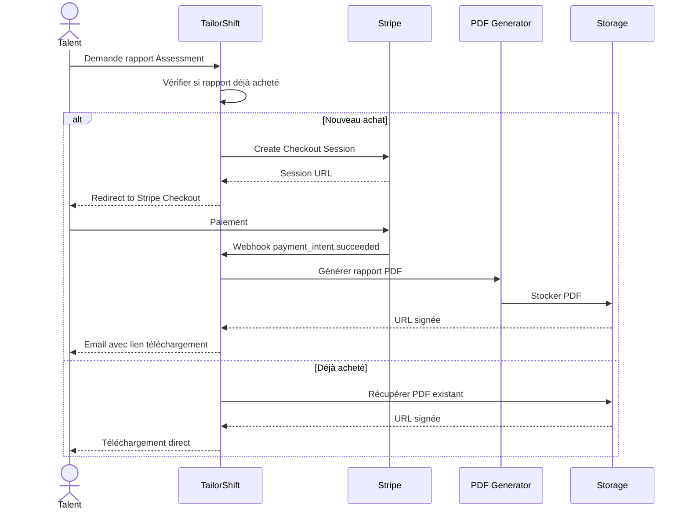
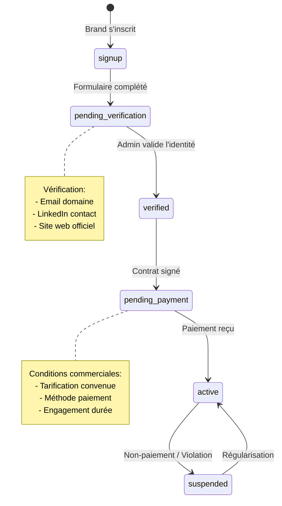

# TailorShift V8+ Product Roadmap

> **Document de référence** : `PRODUCT_ROADMAP_V8.md`
> 
> Ce document centralise les idées et fonctionnalités à développer dans les futures versions de TailorShift. Il sert de backlog produit et de base de réflexion pour les évolutions à venir.

---

## Table des Matières

1. [Simplification UX & Architecture](#1-simplification)
2. [Système de Nudges & Engagement](#2-nudges)
3. [Rapports & Micropaiements](#3-rapports)
4. [Monétisation Brands & Activation](#4-monetisation)
5. [Autres Idées](#5-autres)

---

## 1. Simplification UX & Architecture {#1-simplification}

### 1.1 Objectif

Reprendre l'ensemble de la logique du site dans une optique d'**optimisation et simplification**, tout en conservant le même niveau de richesse et de complexité fonctionnelle.

### 1.2 Principes Directeurs

```
Complexité fonctionnelle ≠ Complexité perçue
```

- **Réduire le nombre d'écrans** sans réduire les fonctionnalités
- **Progressive disclosure** : Montrer l'essentiel, cacher les détails avancés
- **Smart defaults** : Pré-remplir intelligemment pour réduire la charge cognitive
- **One-click actions** : Maximiser les actions réalisables en un clic

### 1.3 Axes d'Analyse

| Zone | Questions à se poser | Métriques |
|------|---------------------|-----------|
| Onboarding Talent | Peut-on réduire les steps ? Fusionner des écrans ? | Temps de complétion, dropout rate |
| Onboarding Brand | Même question côté brand | Idem |
| Dashboard Talent | Quelles infos sont réellement consultées ? | Heatmap, scroll depth |
| Dashboard Brand | Idem | Idem |
| Formulaire Experience | 10 dimensions StoreContext : lesquelles sont vraiment utilisées ? | Fill rate par champ |
| Assessment | 6 dimensions : peut-on raccourcir sans perdre en précision ? | Temps de complétion |

### 1.4 Actions Potentielles

- [ ] **Audit UX complet** avec analytics (Hotjar, Mixpanel)
- [ ] **A/B test** sur onboarding simplifié vs actuel
- [ ] **Consolidation des écrans** : Dashboard + Profile en une seule vue
- [ ] **Wizard vs Form** : Tester les deux approches
- [ ] **Mobile-first redesign** : Prioriser l'expérience mobile

### 1.5 Questions Ouvertes

- Faut-il un mode "Express" (5 champs) vs "Complet" (tous les champs) ?
- Peut-on inférer des informations plutôt que les demander ? (ex: segment de marque basé sur l'employeur)
- Quel est le minimum viable pour un premier match ?

---

## 2. Système de Nudges & Engagement {#2-nudges}

### 2.1 Objectif

Mettre en place des **incitations comportementales** (nudges) pour maximiser :
- La **complétude des profils** (Talent & Brand)
- L'**engagement** sur la plateforme
- La **qualité des données** collectées

### 2.2 Framework de Nudges

```mermaid
flowchart LR
    subgraph Trigger[Déclencheurs]
        Login[Login]
        Time[Temps passé]
        Action[Action réalisée]
        Inaction[Inaction détectée]
    end
    
    subgraph Nudge[Types de Nudges]
        Progress[Barre de progression]
        Social[Preuve sociale]
        Scarcity[Rareté/Urgence]
        Reward[Récompense]
        Reminder[Rappel]
    end
    
    subgraph Outcome[Résultats attendus]
        Complete[Profil complet]
        Engage[Engagement accru]
        Quality[Données de qualité]
    end
    
    Trigger --> Nudge --> Outcome
```



### 2.3 Nudges Côté Talent

| Nudge | Déclencheur | Message | Impact attendu |
|-------|-------------|---------|----------------|
| **Progress Ring** | Login | "Votre profil est complet à 67%" | +20% complétion |
| **Match Potential** | Profil incomplet | "Complétez votre expérience pour débloquer 12 opportunités" | +15% complétion |
| **Peer Comparison** | Après Assessment | "Vous êtes dans le top 15% en Clienteling" | +10% engagement |
| **Dream Brand Alert** | Nouvelle opportunité | "Hermès, votre Dream Brand #1, recrute !" | +30% réponse |
| **Expiring Opportunity** | 48h avant deadline | "Cette opportunité expire dans 48h" | +25% action |
| **Skill Gap Coach** | Post-assessment | "Améliorez votre score Leadership avec ce module" | +20% learning |
| **Profile Views** | Hebdomadaire | "3 recruteurs ont vu votre profil cette semaine" | +15% engagement |
| **Success Stories** | Onboarding | "Marie a trouvé son poste chez Dior en 3 semaines" | +10% confiance |

### 2.4 Nudges Côté Brand

| Nudge | Déclencheur | Message | Impact attendu |
|-------|-------------|---------|----------------|
| **Talent Pool Size** | Post-opportunité | "127 talents matchent avec cette offre" | +20% precision offre |
| **Response Rate** | Offre active | "Taux de réponse moyen : 72% en 48h" | Attentes réalistes |
| **Competitive Intel** | Dashboard | "3 autres marques recrutent pour ce profil" | +15% réactivité |
| **Dream Brand Stats** | Dashboard | "18 talents vous ont mis en Dream Brand" | +25% engagement |
| **Hiring Velocity** | Post-hire | "Temps moyen de recrutement : 23 jours" | Benchmark |
| **Profile Quality** | Revue candidat | "Profil vérifié, Assessment top 10%" | +30% confiance |

### 2.5 Techniques de Gamification

- **Badges & Achievements** : "Profile Master", "Quick Responder", "Top Performer"
- **Leaderboards** (anonymisés) : Position relative dans le matching
- **Streaks** : "5 jours consécutifs connecté"
- **Unlocks** : Fonctionnalités débloquées selon complétion

### 2.6 Implémentation Technique

```typescript
// lib/nudges/engine.ts

interface NudgeRule {
  id: string
  trigger: 'login' | 'action' | 'inaction' | 'time' | 'event'
  conditions: NudgeCondition[]
  message: NudgeMessage
  priority: number
  frequency: 'once' | 'daily' | 'weekly' | 'always'
  target_user_type: 'talent' | 'brand' | 'all'
}

interface NudgeCondition {
  field: string
  operator: 'lt' | 'gt' | 'eq' | 'contains' | 'missing'
  value: any
}

interface NudgeMessage {
  type: 'toast' | 'banner' | 'modal' | 'email' | 'push'
  title: string
  body: string
  cta?: { label: string; action: string }
  icon?: string
}

// Exemple de règle
const profileCompletionNudge: NudgeRule = {
  id: 'profile_completion_70',
  trigger: 'login',
  conditions: [
    { field: 'profile_completion_pct', operator: 'lt', value: 70 },
    { field: 'last_nudge_shown', operator: 'gt', value: '24h_ago' },
  ],
  message: {
    type: 'banner',
    title: 'Complétez votre profil',
    body: 'Vous êtes à {completion}%. Ajoutez votre expérience pour débloquer plus d\'opportunités.',
    cta: { label: 'Compléter', action: '/talent/profile/edit' },
    icon: 'trending_up',
  },
  priority: 80,
  frequency: 'daily',
  target_user_type: 'talent',
}
```

### 2.7 Mesure d'Impact

- **A/B Testing** systématique sur chaque nudge
- **Cohort Analysis** : Comparer comportement avec/sans nudge
- **Fatigue Monitoring** : Détecter quand les nudges deviennent contre-productifs

---

## 3. Rapports & Micropaiements {#3-rapports}

### 3.1 Vision

Proposer des **rapports premium payants** pour les talents, comme valeur ajoutée et source de revenus complémentaire.

### 3.2 Types de Rapports Envisagés

| Rapport | Description | Prix cible | Priorité |
|---------|-------------|------------|----------|
| **Assessment Report PDF** | Analyse détaillée des 6 dimensions + recommandations | 9.90€ - 19.90€ | P1 |
| **Market Position Report** | Comparaison anonymisée avec le marché | 14.90€ | P2 |
| **Salary Benchmark** | Fourchette salariale personnalisée selon profil | 9.90€ | P2 |
| **Career Path Analysis** | Prédiction de trajectoire + recommandations | 19.90€ | P3 |
| **Brand Compatibility** | Analyse de fit avec les top 10 maisons | 14.90€ | P3 |

### 3.3 Contenu du Rapport Assessment

```
┌─────────────────────────────────────────────────────────────────────┐
│                    TAILOR SHIFT                                      │
│                    ASSESSMENT REPORT                                 │
│                                                                     │
│  Préparé pour: Marie Dupont                                         │
│  Date: 4 décembre 2024                                              │
│  ID: TS-ASS-2024-0847                                               │
├─────────────────────────────────────────────────────────────────────┤
│                                                                     │
│  PROFIL 6D - VUE D'ENSEMBLE                                        │
│  ┌────────────────────────────────────────────────────────────┐    │
│  │          Product Knowledge: ████████░░ 78%                 │    │
│  │          Clienteling:       █████████░ 92%  ★ EXCELLENCE   │    │
│  │          Cultural Fluency:  ███████░░░ 71%                 │    │
│  │          Sales Performance: ████████░░ 85%                 │    │
│  │          Leadership:        █████░░░░░ 54%  ⚠ À DÉVELOPPER │    │
│  │          Operations:        ██████░░░░ 67%                 │    │
│  └────────────────────────────────────────────────────────────┘    │
│                                                                     │
│  NIVEAU GLOBAL: PROFICIENT (Top 25%)                               │
│                                                                     │
│  ─────────────────────────────────────────────────────────────────  │
│                                                                     │
│  POINTS FORTS                                                       │
│  • Excellente maîtrise du clienteling VIC                          │
│  • Forte capacité de conversion (85% sales perf)                   │
│  • Connaissance produit au-dessus de la moyenne                    │
│                                                                     │
│  AXES DE DÉVELOPPEMENT                                             │
│  • Leadership : compétences managériales à renforcer               │
│  • Operations : process et KPIs à approfondir                      │
│                                                                     │
│  RECOMMANDATIONS PERSONNALISÉES                                    │
│  1. Module "Management in Luxury Retail" (2h) → Leadership +15%    │
│  2. Certification "Store Operations Excellence" → Operations +20%  │
│                                                                     │
│  ─────────────────────────────────────────────────────────────────  │
│                                                                     │
│  MARQUES COMPATIBLES                                               │
│  Basé sur votre profil, vous matchez particulièrement avec :       │
│  • Dior (92% fit)                                                  │
│  • Louis Vuitton (89% fit)                                         │
│  • Gucci (87% fit)                                                 │
│                                                                     │
│  ─────────────────────────────────────────────────────────────────  │
│                                                                     │
│  Ce rapport est généré automatiquement par TailorShift.            │
│  www.tailorshift.co | contact@tailorshift.co                       │
└─────────────────────────────────────────────────────────────────────┘
```

### 3.4 Architecture Technique - Stripe Integration



### 3.5 Tables DB Nécessaires

```sql
-- Purchases tracking
CREATE TABLE purchases (
  id UUID PRIMARY KEY DEFAULT gen_random_uuid(),
  user_id UUID REFERENCES profiles(id),
  product_type VARCHAR(50) NOT NULL, -- 'assessment_report', 'salary_benchmark', etc.
  product_id UUID, -- Référence vers l'item spécifique si applicable
  stripe_payment_intent_id VARCHAR(255),
  stripe_checkout_session_id VARCHAR(255),
  amount_cents INTEGER NOT NULL,
  currency VARCHAR(3) DEFAULT 'EUR',
  status VARCHAR(20) DEFAULT 'pending', -- pending, completed, refunded
  metadata JSONB DEFAULT '{}',
  purchased_at TIMESTAMP WITH TIME ZONE,
  created_at TIMESTAMP WITH TIME ZONE DEFAULT NOW()
);

-- Generated reports storage
CREATE TABLE generated_reports (
  id UUID PRIMARY KEY DEFAULT gen_random_uuid(),
  purchase_id UUID REFERENCES purchases(id),
  talent_id UUID REFERENCES talents(id),
  report_type VARCHAR(50) NOT NULL,
  storage_path VARCHAR(500), -- S3 path
  generated_at TIMESTAMP WITH TIME ZONE DEFAULT NOW(),
  expires_at TIMESTAMP WITH TIME ZONE, -- URL expiration
  download_count INTEGER DEFAULT 0
);
```

### 3.6 Modèle Freemium

| Fonctionnalité | Gratuit | Premium (rapport) |
|----------------|---------|-------------------|
| Score global | ✅ | ✅ |
| Radar 6D basique | ✅ | ✅ |
| Analyse détaillée par dimension | ❌ | ✅ |
| Recommandations personnalisées | ❌ | ✅ |
| Benchmark marché | ❌ | ✅ |
| PDF téléchargeable | ❌ | ✅ |
| Marques compatibles | Top 3 | Top 10 |

---

## 4. Monétisation Brands & Activation {#4-monetisation}

### 4.1 Modèle de Validation Brand



### 4.2 Statuts Brand

```typescript
type BrandStatus = 
  | 'onboarding'           // En cours d'inscription
  | 'pending_verification' // En attente validation identité
  | 'verified'             // Identité validée, en attente contrat
  | 'pending_payment'      // Contrat signé, en attente paiement
  | 'active'               // Pleinement opérationnel
  | 'suspended'            // Suspendu (non-paiement, violation)
  | 'churned'              // Résilié
```

### 4.3 Contrôle d'Accès par Statut

| Fonctionnalité | onboarding | verified | pending_payment | active | suspended |
|----------------|------------|----------|-----------------|--------|-----------|
| Compléter profil brand | ✅ | ✅ | ✅ | ✅ | ❌ |
| Ajouter des stores | ❌ | ✅ | ✅ | ✅ | ❌ |
| Créer des opportunités | ❌ | ❌ | ❌ | ✅ | ❌ |
| Voir les talents matchés | ❌ | ❌ | ❌ | ✅ | ❌ |
| Contacter des talents | ❌ | ❌ | ❌ | ✅ | ❌ |
| Ajouter des team members | ❌ | ❌ | ✅ | ✅ | ❌ |
| Accéder au dashboard | ✅ (limité) | ✅ (limité) | ✅ (limité) | ✅ | ❌ |

### 4.4 Gestion des Sous-comptes (Team Members)

Le statut du **compte principal brand** s'applique à **tous les team members** :

```typescript
// middleware.ts - Brand status check

async function checkBrandAccess(brandId: string, requiredFeature: string) {
  const brand = await getBrandWithStatus(brandId)
  
  const featureAccess: Record<string, BrandStatus[]> = {
    'view_dashboard': ['onboarding', 'verified', 'pending_payment', 'active'],
    'create_opportunity': ['active'],
    'view_matches': ['active'],
    'contact_talent': ['active'],
    'add_team_member': ['pending_payment', 'active'],
  }
  
  const allowedStatuses = featureAccess[requiredFeature] || ['active']
  
  if (!allowedStatuses.includes(brand.status)) {
    throw new AccessDeniedError(`Brand status '${brand.status}' cannot access '${requiredFeature}'`)
  }
}
```

### 4.5 Options de Monétisation Brand

| Modèle | Description | Avantages | Inconvénients |
|--------|-------------|-----------|---------------|
| **Abonnement mensuel** | Forfait fixe / mois | Revenus prévisibles | Barrière à l'entrée |
| **Pay-per-hire** | Frais par recrutement réussi | Aligné sur valeur | Revenus variables |
| **Crédits / Tokens** | Pool de crédits prépayés | Flexibilité | Complexité comptable |
| **Freemium + Premium** | Fonctionnalités de base gratuites | Adoption facile | Conversion difficile |
| **Hybride** | Abonnement + fee par hire | Meilleur des deux | Plus complexe |

### 4.6 Interface Admin - Gestion Brands

```
┌─────────────────────────────────────────────────────────────────────┐
│  ADMIN > BRANDS > Louis Vuitton                                     │
├─────────────────────────────────────────────────────────────────────┤
│                                                                     │
│  STATUS: [🟢 Active]  [🔴 Suspendre]  [📜 Voir contrat]            │
│                                                                     │
│  ───────────────────────────────────────────────────────────────── │
│                                                                     │
│  INFORMATIONS COMMERCIALES                                         │
│  • Contrat signé le: 15/10/2024                                    │
│  • Type: Abonnement annuel                                          │
│  • Montant: 12 000€/an                                              │
│  • Prochain paiement: 15/01/2025                                   │
│  • Méthode: Virement SEPA                                          │
│                                                                     │
│  HISTORIQUE PAIEMENTS                                              │
│  ┌────────────┬──────────┬────────────┬──────────┐                │
│  │ Date       │ Montant  │ Statut     │ Réf.     │                │
│  ├────────────┼──────────┼────────────┼──────────┤                │
│  │ 15/10/2024 │ 3 000€   │ ✅ Payé    │ INV-001  │                │
│  │ 15/01/2025 │ 3 000€   │ ⏳ En att. │ INV-002  │                │
│  └────────────┴──────────┴────────────┴──────────┘                │
│                                                                     │
│  ÉQUIPE (3 membres)                                                │
│  • Jean Martin (Owner) - jean@lv.com                               │
│  • Sophie Durand (Recruiter) - sophie@lv.com                       │
│  • Pierre Blanc (Viewer) - pierre@lv.com                           │
│                                                                     │
│  ACTIVITÉ                                                          │
│  • Opportunités actives: 5                                         │
│  • Talents contactés (30j): 23                                     │
│  • Hires confirmés: 2                                              │
│                                                                     │
│  ACTIONS                                                           │
│  [📧 Envoyer rappel paiement]  [📝 Modifier contrat]  [🗑 Résilier] │
│                                                                     │
└─────────────────────────────────────────────────────────────────────┘
```

### 4.7 Tables DB Complémentaires

```sql
-- Contrats brands
CREATE TABLE brand_contracts (
  id UUID PRIMARY KEY DEFAULT gen_random_uuid(),
  brand_id UUID REFERENCES brands(id),
  contract_type VARCHAR(50), -- 'annual', 'monthly', 'pay_per_hire'
  start_date DATE NOT NULL,
  end_date DATE,
  amount_cents INTEGER,
  currency VARCHAR(3) DEFAULT 'EUR',
  billing_frequency VARCHAR(20), -- 'monthly', 'quarterly', 'annually'
  payment_method VARCHAR(50), -- 'stripe', 'sepa', 'wire_transfer'
  stripe_subscription_id VARCHAR(255),
  signed_at TIMESTAMP WITH TIME ZONE,
  signed_by UUID REFERENCES profiles(id),
  document_url VARCHAR(500),
  status VARCHAR(20) DEFAULT 'draft', -- draft, active, cancelled
  created_at TIMESTAMP WITH TIME ZONE DEFAULT NOW(),
  updated_at TIMESTAMP WITH TIME ZONE DEFAULT NOW()
);

-- Factures
CREATE TABLE brand_invoices (
  id UUID PRIMARY KEY DEFAULT gen_random_uuid(),
  brand_id UUID REFERENCES brands(id),
  contract_id UUID REFERENCES brand_contracts(id),
  invoice_number VARCHAR(50) UNIQUE,
  amount_cents INTEGER NOT NULL,
  currency VARCHAR(3) DEFAULT 'EUR',
  due_date DATE,
  paid_at TIMESTAMP WITH TIME ZONE,
  status VARCHAR(20) DEFAULT 'pending', -- pending, paid, overdue, cancelled
  stripe_invoice_id VARCHAR(255),
  pdf_url VARCHAR(500),
  created_at TIMESTAMP WITH TIME ZONE DEFAULT NOW()
);

-- Modification table brands pour inclure le statut commercial
ALTER TABLE brands ADD COLUMN status VARCHAR(30) DEFAULT 'onboarding';
ALTER TABLE brands ADD COLUMN verified_at TIMESTAMP WITH TIME ZONE;
ALTER TABLE brands ADD COLUMN verified_by UUID REFERENCES profiles(id);
ALTER TABLE brands ADD COLUMN current_contract_id UUID REFERENCES brand_contracts(id);
```

---

## 5. Autres Idées {#5-autres}

### 5.1 Fonctionnalités Futures (Non Priorisées)

| Idée | Description | Complexité | Impact |
|------|-------------|------------|--------|
| **CV/LinkedIn Import** | Parser automatique pour pré-remplir profil | High | High |
| **Video Intro** | Talents enregistrent une présentation vidéo de 60s | Medium | Medium |
| **Référencement Externe** | Demander des références à d'anciens managers | Medium | High |
| **Interview Scheduling** | Calendly-like intégré pour planifier entretiens | Medium | Medium |
| **Brand Culture Quiz** | Assessment spécifique à chaque maison | High | Medium |
| **Salary Calculator** | Outil public pour estimer sa valeur marché | Medium | High (acquisition) |
| **Job Alerts** | Notifications push/email pour nouvelles offres | Low | Medium |
| **Mobile App** | Apps natives iOS/Android | Very High | High |
| **AI Matching Explain** | Expliquer pourquoi le match est fort/faible | Medium | Medium |
| **Internal Mobility Hub** | Portail dédié aux mobilités internes | Medium | High (pour brands) |

### 5.2 Intégrations Potentielles

- **HRIS** : Workday, SAP SuccessFactors - Export candidats retenus
- **ATS** : Greenhouse, Lever - Sync opportunités
- **LinkedIn** : Import profil, vérification identité
- **Background Check** : Vérification référence automatisée
- **E-learning** : Partenariats pour modules de formation

### 5.3 Analytics & BI

- Dashboard admin avec métriques business clés
- Cohortes utilisateurs (acquisition, activation, rétention)
- Funnel conversion (signup → complet → matched → hired)
- Revenue tracking (MRR, churn, LTV)

---

## Changelog

| Date | Version | Modifications |
|------|---------|---------------|
| 2024-12-04 | 1.0 | Création initiale |

---

> **Note** : Ce document est évolutif. Ajoutez vos idées dans la section appropriée avec une date et vos initiales.