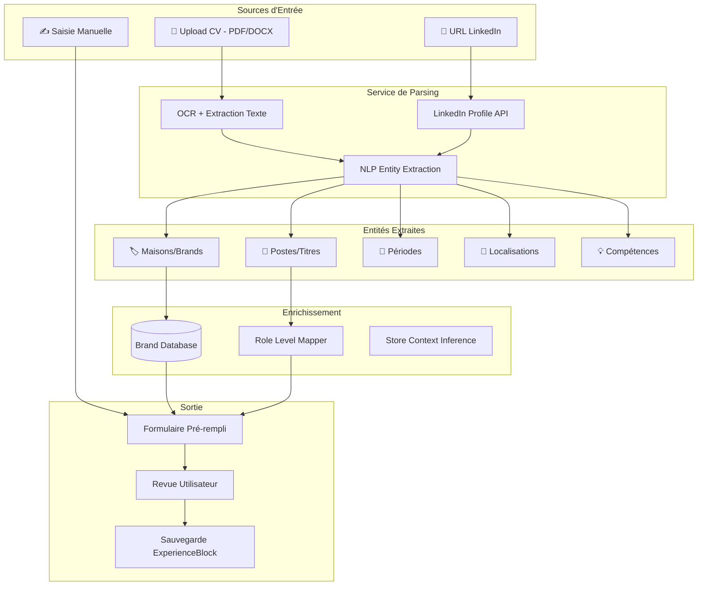
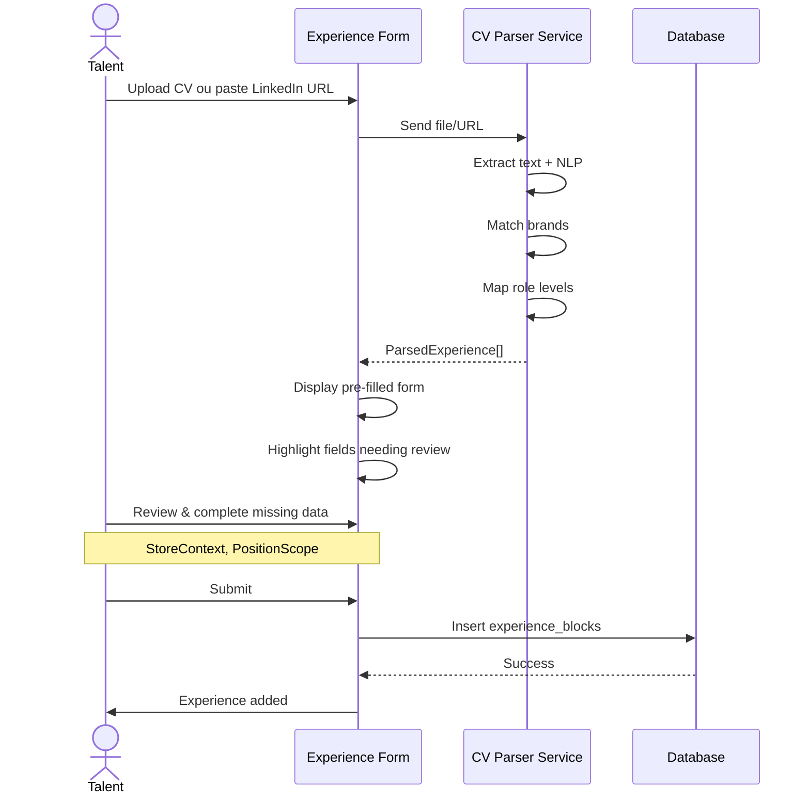
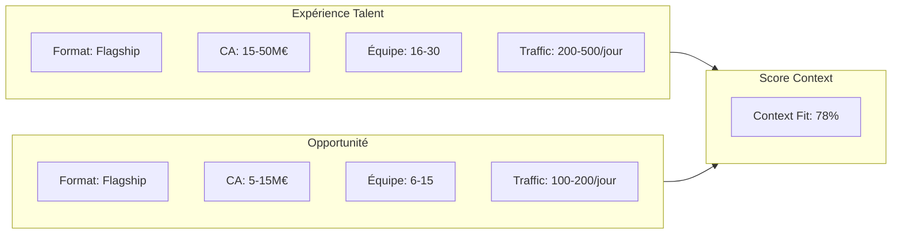
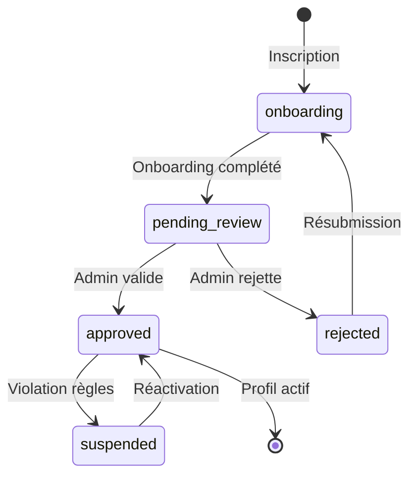
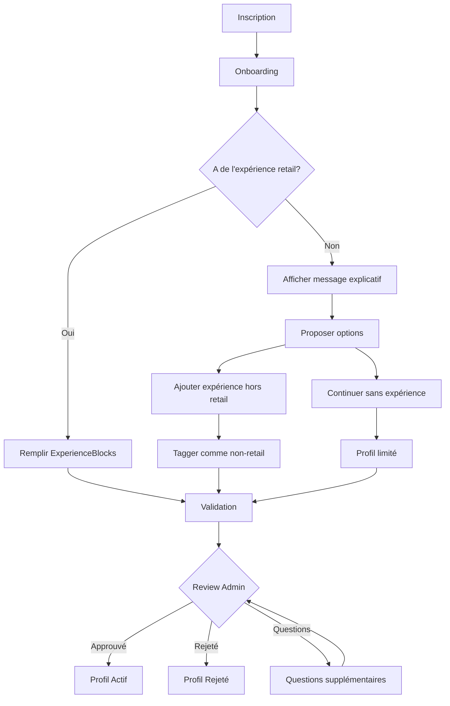

# Architecture d'Enrichissement des Profils Talents

## Table des Matières
1. [État Actuel du Modèle](#état-actuel)
2. [Architecture CV/LinkedIn Parsing](#cvlinkedin-parsing)
3. [Store Context - Les 10 Dimensions](#store-context)
4. [Workflow de Validation](#workflow-validation)
5. [Gestion des Profils Sans Expérience Retail](#sans-experience)
6. [Plan d'Implémentation](#plan-implementation)

---

## 1. État Actuel du Modèle {#état-actuel}

### 1.1 ExperienceBlock - Structure Existante

```typescript
interface ExperienceBlock {
  id: string
  talent_id: string
  block_type: 'foh' | 'boh' | 'leadership' | 'clienteling' | 'operations' | 'business'
  title: string
  company: string                          // Maison
  brand_segment: BrandSegment | null       // ultra_luxury | luxury | premium | accessible_luxury
  division: Division | null                // fashion, leather_goods, watches, etc.
  role_level: RoleLevel | null             // L1-L8
  store_tier: StoreTier | null             // T1-T5
  location: string | null
  store_context: StoreContext | null       // ← 11 DIMENSIONS (non utilisé actuellement!)
  position_scope: PositionScope | null     // ← PÉRIMÈTRE (non utilisé actuellement!)
  start_date: string
  end_date: string | null
  is_current: boolean
  responsibilities: string[]
  achievements: string[]
  skills_demonstrated: string[]
  team_size: number | null
  verified: boolean                        // Pour validation externe
}
```

### 1.2 StoreContext - 11 Dimensions DÉJÀ DÉFINIES

```typescript
interface StoreContext {
  format: string           // "flagship" | "boutique" | "corner" | "department_store"
  surface: string          // "<100m²" | "100-300m²" | "300-500m²" | ">500m²"
  team_size: string        // "1-5" | "6-15" | "16-30" | "30+"
  daily_traffic: string    // "<50" | "50-200" | "200-500" | ">500"
  revenue_scale: string    // "<1M€" | "1-5M€" | "5-15M€" | "15-50M€" | ">50M€"
  product_complexity: string // "mono-produit" | "multi-catégories" | "lifestyle"
  sku_depth: string        // "<100" | "100-500" | "500-2000" | ">2000"
  client_profile: string   // "local" | "tourist" | "mixed" | "vip_only"
  operating_hours: string  // "standard" | "extended" | "seasonal"
  org_model: string        // "centralized" | "decentralized" | "hybrid"
}
```

### 1.3 PositionScope - Périmètre du Poste

```typescript
interface PositionScope {
  management_span: string      // "IC" | "1-3" | "4-10" | "10+"
  foh_boh_split: string        // "100% FOH" | "80/20" | "50/50" | "20/80" | "100% BOH"
  responsibilities: string[]   // Liste des responsabilités clés
  reports_to: string           // Niveau hiérarchique
}
```

**PROBLÈME IDENTIFIÉ**: Ces champs existent dans le type mais NE SONT PAS collectés dans le formulaire `experience/new/page.tsx`!

---

## 2. Architecture CV/LinkedIn Parsing {#cvlinkedin-parsing}

### 2.1 Diagramme de Flux



### 2.2 Structure de Données pour le Parsing

```typescript
// lib/cv-parser/types.ts

interface ParsedExperience {
  // Extraction brute
  raw_title: string
  raw_company: string
  raw_dates: string
  raw_location: string
  raw_description: string
  
  // Mapping intelligent
  matched_brand: {
    name: string
    segment: BrandSegment
    confidence: number  // 0-100
  } | null
  
  mapped_role_level: {
    level: RoleLevel
    confidence: number
  } | null
  
  inferred_division: Division | null
  
  // À compléter par l'utilisateur
  needs_review: string[]  // Champs à valider
}

interface CVParseResult {
  source: 'cv' | 'linkedin' | 'manual'
  parsed_at: string
  experiences: ParsedExperience[]
  
  // Métadonnées extraites
  languages_detected: string[]
  total_years_luxury: number | null
  
  // Alertes
  alerts: {
    no_retail_experience: boolean
    gaps_detected: DateRange[]
    unrecognized_brands: string[]
  }
}
```

### 2.3 Brand Matching Database

```typescript
// lib/cv-parser/brand-matcher.ts

const LUXURY_BRANDS_DB = {
  // Ultra Luxury
  'hermes': { name: 'Hermès', segment: 'ultra_luxury', aliases: ['hermes', 'hermès'] },
  'chanel': { name: 'Chanel', segment: 'ultra_luxury', aliases: ['chanel'] },
  
  // Luxury
  'louis_vuitton': { 
    name: 'Louis Vuitton', 
    segment: 'luxury', 
    aliases: ['lv', 'louis vuitton', 'vuitton'],
    parent_group: 'LVMH'
  },
  'dior': { 
    name: 'Dior', 
    segment: 'luxury', 
    aliases: ['dior', 'christian dior'],
    parent_group: 'LVMH'
  },
  'gucci': { 
    name: 'Gucci', 
    segment: 'luxury',
    parent_group: 'Kering'
  },
  
  // Premium
  'ralph_lauren': { name: 'Ralph Lauren', segment: 'premium', aliases: ['rl', 'polo ralph lauren'] },
  'coach': { name: 'Coach', segment: 'premium', parent_group: 'Tapestry' },
  
  // Accessible Luxury
  'ba_sh': { name: 'ba&sh', segment: 'accessible_luxury', aliases: ['bash', 'ba and sh'] },
  'maje': { name: 'Maje', segment: 'accessible_luxury', parent_group: 'SMCP' },
  'sandro': { name: 'Sandro', segment: 'accessible_luxury', parent_group: 'SMCP' },
}

// Role title to Level mapping
const ROLE_LEVEL_MAP: Record<string, { level: RoleLevel; confidence: number }> = {
  'sales associate': { level: 'L1', confidence: 95 },
  'sales advisor': { level: 'L1', confidence: 95 },
  'conseiller de vente': { level: 'L1', confidence: 95 },
  'vendeur': { level: 'L1', confidence: 90 },
  
  'senior sales': { level: 'L2', confidence: 90 },
  'senior advisor': { level: 'L2', confidence: 90 },
  'conseiller senior': { level: 'L2', confidence: 90 },
  
  'team leader': { level: 'L3', confidence: 90 },
  'chef d\'équipe': { level: 'L3', confidence: 90 },
  'supervisor': { level: 'L3', confidence: 85 },
  
  'assistant store manager': { level: 'L4', confidence: 95 },
  'assistant manager': { level: 'L4', confidence: 90 },
  'directeur adjoint': { level: 'L4', confidence: 95 },
  
  'store manager': { level: 'L5', confidence: 95 },
  'boutique manager': { level: 'L5', confidence: 95 },
  'store director': { level: 'L5', confidence: 90 },
  'directeur de boutique': { level: 'L5', confidence: 95 },
  
  'area manager': { level: 'L6', confidence: 95 },
  'district manager': { level: 'L6', confidence: 95 },
  
  'regional director': { level: 'L7', confidence: 95 },
  'regional manager': { level: 'L7', confidence: 90 },
  'directeur régional': { level: 'L7', confidence: 95 },
  
  'vp retail': { level: 'L8', confidence: 95 },
  'vice president': { level: 'L8', confidence: 90 },
  'directeur général': { level: 'L8', confidence: 85 },
}
```

### 2.4 UX Flow - CV Import



---

## 3. Store Context - Les 10 Dimensions pour le Matching {#store-context}

### 3.1 Pourquoi c'est critique pour le matching

Le `StoreContext` permet de scorer la compatibilité entre :
- **L'expérience passée du talent** (où il a travaillé)
- **L'opportunité proposée** (contexte du poste)



### 3.2 Formulaire de Saisie Enrichi

```typescript
// Options pour chaque dimension du StoreContext

const STORE_CONTEXT_OPTIONS = {
  format: [
    { value: 'flagship', label: 'Flagship', desc: 'Boutique emblématique, expérience complète' },
    { value: 'boutique', label: 'Boutique', desc: 'Point de vente standard' },
    { value: 'corner', label: 'Corner / Shop-in-Shop', desc: 'Espace dans grand magasin' },
    { value: 'department_store', label: 'Grand Magasin', desc: 'Galeries Lafayette, Printemps...' },
    { value: 'outlet', label: 'Outlet', desc: 'Village outlet, déstockage' },
    { value: 'popup', label: 'Pop-up', desc: 'Éphémère, événementiel' },
  ],
  
  surface: [
    { value: 'xs', label: '< 50m²', desc: 'Très petit espace' },
    { value: 's', label: '50-150m²', desc: 'Petit espace' },
    { value: 'm', label: '150-300m²', desc: 'Taille moyenne' },
    { value: 'l', label: '300-500m²', desc: 'Grande boutique' },
    { value: 'xl', label: '> 500m²', desc: 'Flagship / multi-étages' },
  ],
  
  team_size: [
    { value: '1-3', label: '1-3 personnes', desc: 'Micro-équipe' },
    { value: '4-8', label: '4-8 personnes', desc: 'Petite équipe' },
    { value: '9-15', label: '9-15 personnes', desc: 'Équipe moyenne' },
    { value: '16-30', label: '16-30 personnes', desc: 'Grande équipe' },
    { value: '30+', label: '30+ personnes', desc: 'Très grande équipe' },
  ],
  
  daily_traffic: [
    { value: 'vip', label: 'Sur RDV uniquement', desc: '< 20 clients/jour, ultra-sélectif' },
    { value: 'low', label: '20-100 clients/jour', desc: 'Trafic calme' },
    { value: 'medium', label: '100-300 clients/jour', desc: 'Trafic modéré' },
    { value: 'high', label: '300-500 clients/jour', desc: 'Trafic élevé' },
    { value: 'very_high', label: '> 500 clients/jour', desc: 'Très forte affluence' },
  ],
  
  revenue_scale: [
    { value: '<1M', label: '< 1M€/an', desc: 'Petit point de vente' },
    { value: '1-5M', label: '1-5M€/an', desc: 'Taille moyenne' },
    { value: '5-15M', label: '5-15M€/an', desc: 'Performance élevée' },
    { value: '15-50M', label: '15-50M€/an', desc: 'Top performer' },
    { value: '>50M', label: '> 50M€/an', desc: 'Flagship exceptionnel' },
  ],
  
  product_complexity: [
    { value: 'mono', label: 'Mono-produit', desc: 'Une seule catégorie' },
    { value: 'focused', label: 'Focalisé', desc: '2-3 catégories principales' },
    { value: 'multi', label: 'Multi-catégories', desc: 'Large gamme' },
    { value: 'lifestyle', label: 'Lifestyle complet', desc: 'Univers de marque complet' },
  ],
  
  sku_depth: [
    { value: 'curated', label: '< 100 SKUs', desc: 'Sélection très pointue' },
    { value: 'standard', label: '100-500 SKUs', desc: 'Offre standard' },
    { value: 'wide', label: '500-2000 SKUs', desc: 'Large assortiment' },
    { value: 'extensive', label: '> 2000 SKUs', desc: 'Assortiment très profond' },
  ],
  
  client_profile: [
    { value: 'local_vip', label: 'VIP locaux', desc: 'Clientèle fidèle haut de gamme' },
    { value: 'local_mixed', label: 'Locale mixte', desc: 'Mix clientèle locale' },
    { value: 'tourist_heavy', label: 'Forte affluence touristes', desc: '> 50% touristes' },
    { value: 'balanced', label: 'Équilibré', desc: 'Mix local/touristique' },
  ],
  
  operating_hours: [
    { value: 'standard', label: 'Standard', desc: '10h-19h, lundi-samedi' },
    { value: 'extended', label: 'Horaires étendus', desc: 'Dimanche, nocturnes' },
    { value: 'mall', label: 'Centre commercial', desc: 'Aligné sur les horaires du mall' },
    { value: 'seasonal', label: 'Saisonnier', desc: 'Variations selon période' },
  ],
  
  org_model: [
    { value: 'autonomous', label: 'Autonome', desc: 'Boutique indépendante' },
    { value: 'cluster', label: 'En cluster', desc: 'Plusieurs boutiques, même ville' },
    { value: 'regional', label: 'Régional', desc: 'Rattachement régional' },
    { value: 'matrix', label: 'Matriciel', desc: 'Double reporting' },
  ],
}
```

### 3.3 Position Scope - Périmètre du Poste

```typescript
const POSITION_SCOPE_OPTIONS = {
  management_span: [
    { value: 'ic', label: 'Contributeur individuel', desc: 'Pas de management direct' },
    { value: '1-3', label: '1-3 personnes', desc: 'Petite équipe' },
    { value: '4-10', label: '4-10 personnes', desc: 'Équipe moyenne' },
    { value: '10-20', label: '10-20 personnes', desc: 'Grande équipe' },
    { value: '20+', label: '20+ personnes', desc: 'Très grande équipe' },
  ],
  
  foh_boh_split: [
    { value: '100_foh', label: '100% Vente', desc: 'Uniquement front of house' },
    { value: '80_20', label: '80% Vente / 20% Back', desc: 'Principalement vente' },
    { value: '50_50', label: '50/50', desc: 'Équilibré' },
    { value: '20_80', label: '20% Vente / 80% Back', desc: 'Principalement opérations' },
    { value: '100_boh', label: '100% Opérations', desc: 'Uniquement back of house' },
  ],
  
  reports_to: [
    { value: 'store_manager', label: 'Store Manager' },
    { value: 'assistant_manager', label: 'Assistant Manager' },
    { value: 'team_lead', label: 'Team Lead' },
    { value: 'area_manager', label: 'Area Manager' },
    { value: 'regional_director', label: 'Regional Director' },
    { value: 'hq', label: 'Siège / HQ' },
  ],
}
```

---

## 4. Workflow de Validation Admin {#workflow-validation}

### 4.1 Statuts de Profil Talent



### 4.2 Critères de Validation

```typescript
interface ValidationCriteria {
  // Critères automatiques
  auto_checks: {
    profile_completion: number          // Minimum 70%
    has_experience: boolean             // Au moins 1 experience_block
    has_retail_experience: boolean      // NEW: Au moins 1 expérience retail
    assessment_completed: boolean       // 6D Assessment fait
    no_suspicious_data: boolean         // Pas de données incohérentes
  }
  
  // Critères manuels admin
  manual_review: {
    experience_coherence: boolean       // Parcours logique
    brand_verification: boolean         // Maisons vérifiables
    identity_check: boolean             // Identité confirmée
    linkedin_match: boolean             // LinkedIn correspond au profil
  }
  
  // Flags d'alerte
  flags: {
    no_retail_experience: boolean       // ⚠️ Pas d'expérience retail
    career_gaps: boolean                // ⚠️ Trous dans le parcours
    unverifiable_brands: boolean        // ⚠️ Maisons non reconnues
    suspicious_progression: boolean     // ⚠️ Progression trop rapide
    fresh_graduate: boolean             // ℹ️ Junior < 1 an d'expérience
  }
}
```

### 4.3 Score d'Éligibilité Automatique

```typescript
// lib/validation/eligibility-scorer.ts

function calculateEligibilityScore(talent: Talent, experiences: ExperienceBlock[]): EligibilityResult {
  let score = 0
  const flags: string[] = []
  const reasons: string[] = []
  
  // 1. Expérience retail (40 points max)
  const retailExperiences = experiences.filter(e => isRetailExperience(e))
  const totalRetailYears = calculateTotalYears(retailExperiences)
  
  if (retailExperiences.length === 0) {
    flags.push('no_retail_experience')
    reasons.push('Aucune expérience retail détectée')
    score += 0
  } else if (totalRetailYears < 1) {
    flags.push('fresh_graduate')
    score += 15
    reasons.push(`Expérience retail limitée (${totalRetailYears} ans)`)
  } else if (totalRetailYears >= 3) {
    score += 40
  } else {
    score += 20 + (totalRetailYears * 10)
  }
  
  // 2. Complétude du profil (20 points)
  score += Math.min(20, talent.profile_completion_pct * 0.2)
  
  // 3. Assessment 6D (20 points)
  if (talent.assessment_summary?.overall_level) {
    score += 20
  }
  
  // 4. Qualité des expériences (20 points)
  const experienceQuality = calculateExperienceQuality(experiences)
  score += Math.min(20, experienceQuality)
  
  return {
    score: Math.round(score),
    decision: score >= 60 ? 'auto_approve' : score >= 30 ? 'manual_review' : 'auto_reject',
    flags,
    reasons,
  }
}

function isRetailExperience(exp: ExperienceBlock): boolean {
  // Détecte si l'expérience est retail (vs. e-commerce, siège, etc.)
  const retailBlockTypes: BlockType[] = ['foh', 'boh', 'clienteling', 'operations']
  const retailIndicators = [
    'boutique', 'store', 'magasin', 'retail', 'vente', 'sales',
    'conseiller', 'advisor', 'vendeur', 'shop'
  ]
  
  const titleLower = exp.title.toLowerCase()
  const hasRetailTitle = retailIndicators.some(ind => titleLower.includes(ind))
  const hasRetailBlockType = retailBlockTypes.includes(exp.block_type)
  
  return hasRetailTitle || hasRetailBlockType || exp.store_tier !== null
}
```

---

## 5. Gestion des Profils Sans Expérience Retail {#sans-experience}

### 5.1 Scénarios Possibles

| Scénario | Comportement | Action Admin |
|----------|--------------|--------------|
| **0 expérience totale** | Flag `fresh_graduate`, score faible | Validation manuelle, possibilité de rejet |
| **Expérience hors retail** (siège, e-commerce) | Flag `no_retail_experience` | Validation manuelle, questions supplémentaires |
| **Expérience retail non-luxe** (Zara, H&M) | Accepté mais segment `accessible_luxury` ou moins | Validation normale |
| **Transition de carrière** (ex finance → retail) | Flag `career_transition` | Validation manuelle, vérifier motivation |

### 5.2 Parcours UX pour Profils Sans Expérience Retail



### 5.3 Message UX pour Profils Sans Expérience

```typescript
// Composant à afficher si pas d'expérience retail détectée

const NoRetailExperienceMessage = () => (
  <Card className="border-[var(--warning)] bg-[var(--warning-light)]/20">
    <CardContent className="p-6">
      <div className="flex gap-4">
        <AlertTriangle className="w-8 h-8 text-[var(--warning)] shrink-0" />
        <div>
          <h3 className="font-semibold mb-2">
            Tailor Shift est spécialisé dans le retail luxe
          </h3>
          <p className="text-sm text-[var(--grey-600)] mb-4">
            Notre plateforme connecte les professionnels du retail avec les maisons de luxe. 
            Si vous n'avez pas d'expérience en boutique, votre profil sera soumis à 
            une validation manuelle par notre équipe.
          </p>
          
          <div className="space-y-2 mb-4">
            <p className="text-sm font-medium">Vous pouvez quand même :</p>
            <ul className="text-sm text-[var(--grey-600)] space-y-1">
              <li>• Ajouter votre expérience dans d'autres secteurs</li>
              <li>• Indiquer votre motivation pour rejoindre le retail luxe</li>
              <li>• Compléter l'assessment pour montrer vos compétences</li>
            </ul>
          </div>
          
          <div className="flex gap-3">
            <Button variant="secondary" size="sm">
              Ajouter une expérience hors retail
            </Button>
            <Button variant="ghost" size="sm">
              Continuer quand même
            </Button>
          </div>
        </div>
      </div>
    </CardContent>
  </Card>
)
```

### 5.4 Vue Admin - Filtrage des Profils Par Type

```typescript
// Filtres pour l'admin dans /admin/talents

const TALENT_FILTERS = {
  experience_type: [
    { value: 'all', label: 'Tous les profils' },
    { value: 'retail_luxury', label: '🌟 Retail Luxe confirmé' },
    { value: 'retail_other', label: '🛍️ Retail hors luxe' },
    { value: 'non_retail', label: '📊 Hors retail (siège, digital...)' },
    { value: 'no_experience', label: '🎓 Sans expérience' },
    { value: 'transition', label: '🔄 En transition de carrière' },
  ],
  
  flags: [
    { value: 'no_retail_experience', label: '⚠️ Pas d\'expérience retail' },
    { value: 'fresh_graduate', label: '📚 Junior < 1 an' },
    { value: 'career_gaps', label: '⏸️ Trous dans parcours' },
    { value: 'unverifiable_brands', label: '❓ Maisons non vérifiées' },
  ],
}
```

---

## 6. Plan d'Implémentation {#plan-implementation}

### Phase 1 - Corrections Immédiates (1-2 jours)
1. ✅ Créer `/talent/profile/edit/page.tsx`
2. ✅ Corriger lien `/talent/experience` → `/talent/experience/new`

### Phase 2 - Enrichissement Formulaire Expérience (3-5 jours)
1. Ajouter section StoreContext dans `experience/new/page.tsx`
2. Ajouter section PositionScope 
3. Ajouter détection "non-retail"

### Phase 3 - CV/LinkedIn Parsing (5-7 jours)
1. Créer `lib/cv-parser/` avec brand matching
2. Intégrer upload CV dans l'onboarding
3. Ajouter import LinkedIn (optionnel)

### Phase 4 - Validation Admin Enrichie (3-5 jours)
1. Calculateur d'éligibilité automatique
2. Ajout filtres par type d'expérience
3. Vue détaillée avec flags et alertes

### Phase 5 - Matching Amélioré (2-3 jours)
1. Intégrer StoreContext dans l'algorithme
2. Ajuster les poids selon le contexte

---

## Annexe : Mapping des Données de Rémunération

Pour intégrer avec le brief initial sur la collecte de rémunération retail luxe :

```typescript
interface EnrichedCompensationProfile extends CompensationProfile {
  // Existant
  current_base: number | null
  current_variable: number | null
  currency: string
  expectations: number | null
  
  // À ajouter (optionnel, collecté progressivement)
  variable_structure?: {
    commission_individual: boolean
    commission_rate?: number  // %
    bonus_store_ca: boolean
    bonus_qualitative: boolean
    bonus_pool: boolean
    thirteenth_month: boolean
    participation: boolean
  }
  
  benefits?: {
    staff_discount: number  // % (20-50)
    uniform_provided: boolean
    uniform_allowance?: number  // €/an
    meal_vouchers: boolean
    meal_voucher_value?: number  // €/jour
    health_insurance_level: 1 | 2 | 3  // Niveau de couverture
    phone_transport_allowance?: number  // €/mois
    private_sales_access: boolean
  }
  
  contract_type?: 'cdi' | 'cdd' | 'interim' | 'freelance'
  brand_segment?: BrandSegment  // Pour estimer les benchmarks
}
```

Cette architecture permet de capturer progressivement les données de rémunération sans bloquer l'utilisateur à l'inscription.